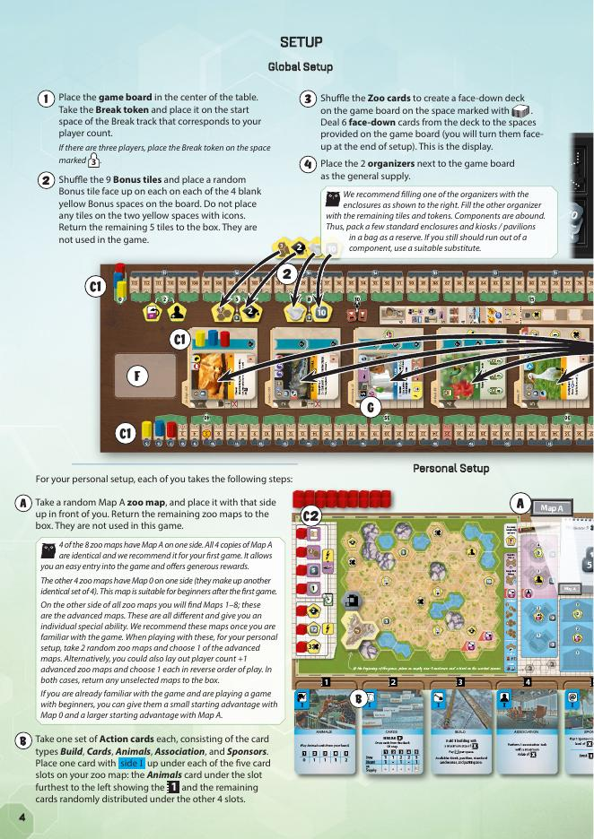
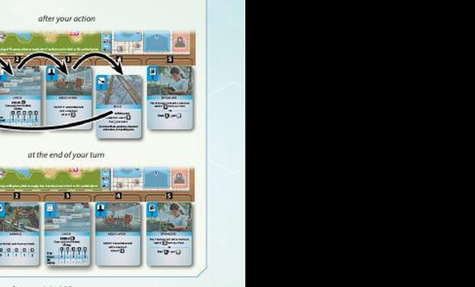
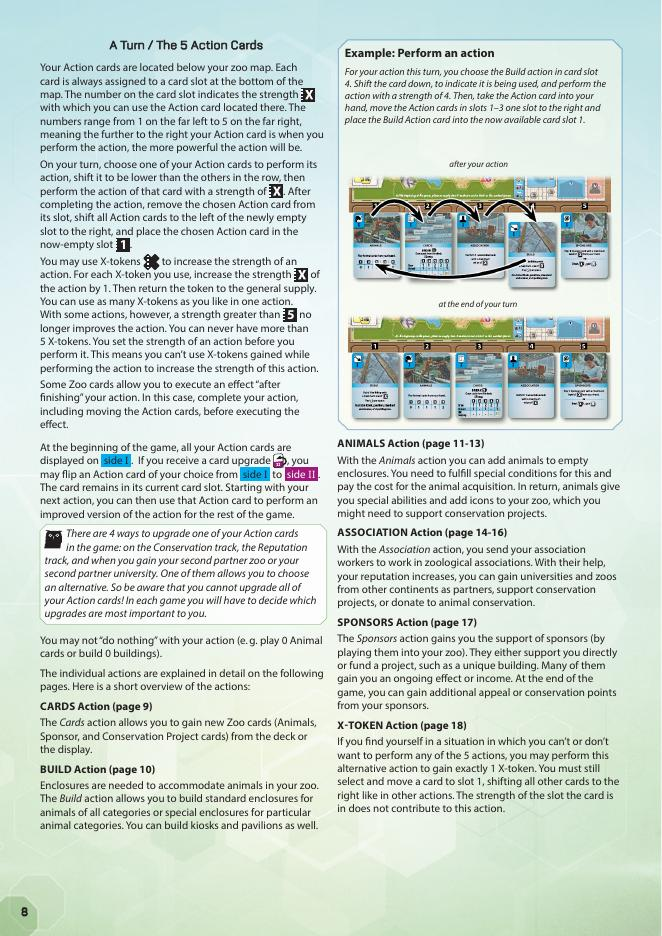
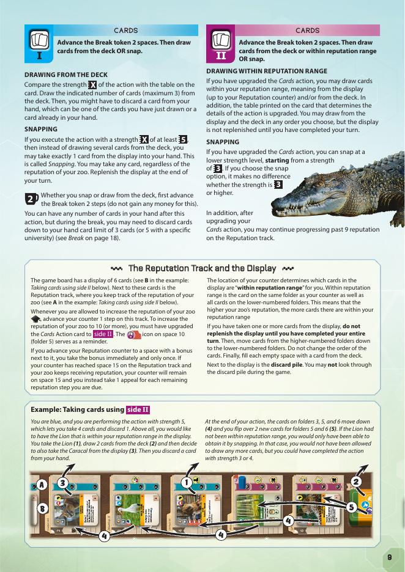
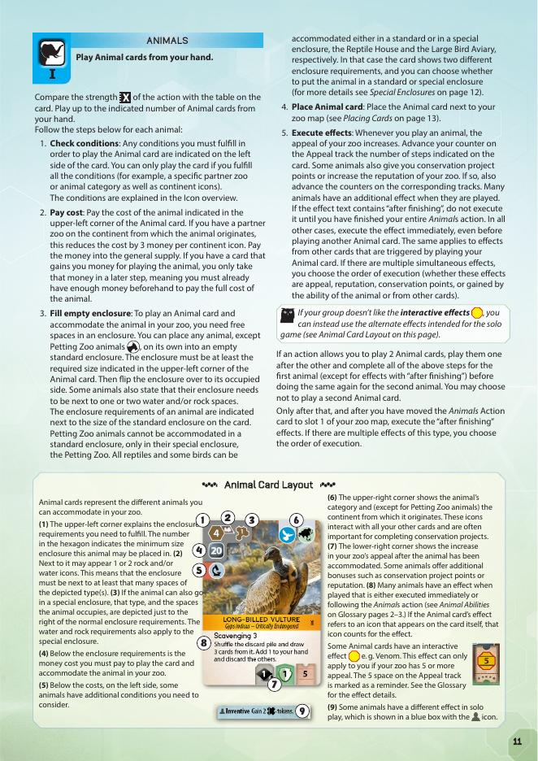
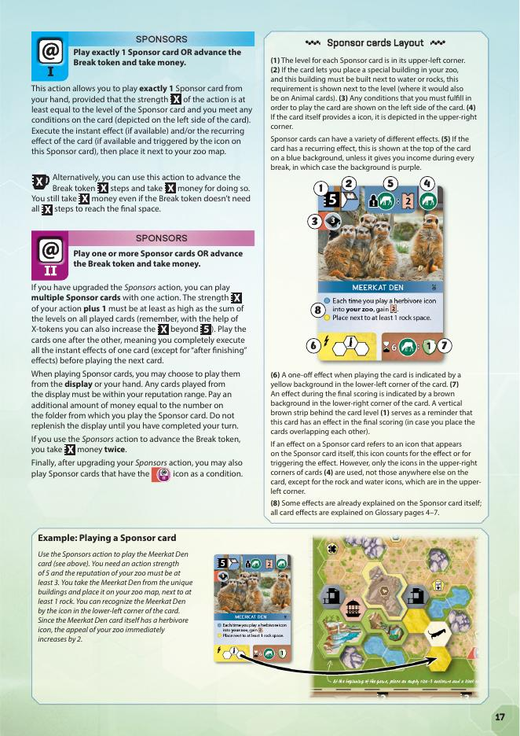

# Ark Nova + Marine Worlds — วิธีเล่น

> สรุปจาก Official Rulebook (Base Game + Marine Worlds Expansion) ไม่มีเติมเอง

---

## Table of Contents
- [Overview](#overview)
- [How to Win](#how-to-win)
- [Setup](#setup)
- [Game Structure](#game-structure)
- [5 Action Cards](#5-action-cards)
- [Kiosk and Pavilion](#kiosk-and-pavilion)
- [Conservation Track Milestones](#conservation-track-milestones)
- [Break](#break)
- [End of Game](#end-of-game)
- [Solo](#solo)
- [What's New](#whats-new)
- [Setup Changes](#setup-changes)
- [Aquariums — กรงสัตว์ทะเล](#aquariums-กรงสัตว์ทะเล)
- [Reef Dwellers](#reef-dwellers)
- [Wave Icon](#wave-icon)
- [New University](#new-university)
- [Alternate Action Cards](#alternate-action-cards)
- [Bonus Tile บน Reputation Space 15](#bonus-tile-บน-reputation-space-15)
- [Solo (Marine Worlds)](#solo-marine-worlds)
- [Summary](#summary)

---

## Overview

1–4 คนแข่งกันสร้างสวนสัตว์ โดยสะสม **Appeal** (ความนิยม) และ **Conservation Points** (คะแนนอนุรักษ์)
สอง counter วิ่งมาหากัน — เมื่อมาพบกัน เกมจบ ใครมี **Victory Points** มากสุด = ชนะ

---

## How to Win

```
เมื่อเกมจบ:
  Target Number = Appeal ต่ำสุดในช่อง Scoring area เดียวกับ Conservation counter
  Victory Points = Appeal ของคุณ - Target Number

ใครมี VP สูงสุด (บวก) = ชนะ
Tiebreaker: ใครสนับสนุน Conservation Project มากกว่า
```

> 2 counter ต้องข้ามกันถึงจะได้คะแนนบวก — นั่นคือเป้าหมายหลักของเกม

---

## Setup



### Global Setup

**1.** วาง Game board ตรงกลางโต๊ะ วาง **Break token** ที่ช่องเริ่มตามจำนวนผู้เล่น

**2.** สุ่ม Bonus tiles **4 อัน** วางหงายบน Bonus spaces สีเหลือง (ว่างเปล่า) ที่เหลือ 5 อันเก็บกล่อง

**3.** สับ Zoo cards → วางกองคว่ำ จั่ว **6 ใบ** วางคว่ำในช่อง Display (จะพลิกหงายตอนจบ Setup)

**4.** วาง Organizer 2 อันข้างบอร์ดเป็น General supply

**5.** วาง Association board ข้างบอร์ด

- **5a.** วาง Partner zoo **1 อันต่อทวีป** + University **1 อันต่อชนิด** บน Association board
- **5b.** สับ Base Conservation Project cards → วางหงาย **3 ใบ** (4 ใบถ้า 4 ผู้เล่น) ใต้บอร์ด

> เกม 2 ผู้เล่น: วาง Blocking tokens บน Conservation Project cards (ซ้าย/กลาง/ขวา) และ Donation area ซ้าย 3 ช่อง

**6.** สุ่ม Starting player

### Personal Setup (Each Player)

**A.** รับ Zoo map **Map A** วางหน้าตัวเอง (ที่เหลือเก็บกล่อง)

**B.** รับ Action cards ชุดตัวเอง **5 ใบ** — วาง **Animals card ที่ slot 1** (ซ้ายสุด), ที่เหลือสุ่ม 4 slots ที่เหลือ

**C.** วาง Counter บน **Appeal track** ตามลำดับ (ผู้เล่น 1=0, 2=1, 3=2, 4=3), **Conservation** และ **Reputation** เริ่มที่ 0 ทั้งหมด

**C2.** วาง Player tokens **7 อัน** บนขอบซ้าย Zoo map, Workers **1 active** (บน notepad) + 3 นอนใต้กระดาน

**D.** รับเงิน **25 money**

**E.** จั่ว Final Scoring cards **2 ใบ** (เก็บซ่อน)

**F.** จั่ว Zoo cards **8 ใบ** → เลือกเก็บ **4 ใบ** ทิ้ง 4 ใบลง Discard pile (ซ่อนจากคนอื่น)

**G.** เมื่อทุกคนเลือกไพ่ครบแล้ว → พลิก Display ทั้ง 6 ใบ **หงายพร้อมกัน**

## Game Structure

ไม่มีรอบตายตัว — ผู้เล่นสลับกัน **ทีละ Turn** จน Break เกิด หรือเกมจบ

### Your Turn



```
1. เลือก Action card 1 ใบ
2. เลื่อนไพ่นั้นให้ต่ำกว่าชุดอื่น
3. ทำ Action ด้วย strength = เลขของ slot นั้น
4. เลื่อน Action card ที่ใช้ไปที่ slot 1
   (ไพ่ที่อยู่ซ้ายของช่องว่าง เลื่อนขวาทั้งหมด)
```

**X-tokens:** ใช้เพิ่ม strength ได้ (1 token = +1) สูงสุด 5 อัน

> **ย้ำสำคัญ:** ห้ามเลือก Action แล้ว "ไม่ทำอะไรเลย" — ต้องทำ action จริงๆ เสมอ (เช่น เล่นสัตว์ 0 ตัวไม่ได้)

**Upgrade Action card:** พลิกเป็น Side II ได้ 4 ครั้งตลอดเกม จาก:
- Conservation track ช่อง 2
- Reputation track
- Partner Zoo ที่ 2
- University ที่ 2

---

## 5 Action Cards





### CARDS Action
เลื่อน Break token **+2 ช่อง** แล้วเลือก:

| Strength | ทำอะไร |
|---|---|
| 1 | จั่ว 1 ใบ ทิ้ง 1 ใบ |
| 2 | จั่ว 2 ใบ ทิ้ง 1 ใบ |
| 3–4 | จั่ว 2 ใบ |
| **5+** | **Snap** — หยิบ 1 ใบจาก Display ได้เลย (ไม่จำกัด Reputation) |

**Side II:** Snap ตั้งแต่ Strength 3, จั่วจาก Display ได้ตาม Reputation range, Reputation ขึ้นเกิน 9 ได้

> **ย้ำสำคัญ (Display):** ถ้าหยิบไพ่จาก Display ระหว่าง Action → **ห้ามเติมไพ่ใหม่จนกว่าจะจบ Turn** ทั้งหมดก่อน

---

### BUILD Action
**Side I:** สร้าง **1 อาคาร** ขนาดสูงสุด **3 ช่อง** ราคา = ขนาด × 2

อาคารที่สร้างได้: Kiosk, Pavilion, Standard enclosure (1–5 ช่อง), Petting Zoo

กฎสำคัญ:
- ต้องชิดอาคารที่มีอยู่ (อย่างน้อย 1 ด้าน)
- Kiosk ต้องห่างจาก Kiosk อื่นอย่างน้อย 3 ช่อง
- Enclosure วางด้าน "empty" หงาย

**Side II:** สร้างหลายอาคาร รวมไม่เกิน **6 ช่อง** + สร้าง Reptile House / Large Bird Aviary ได้
คลุมครบทุกช่อง Zoo map = **Appeal +7 ทันที**

---

### ANIMALS Action



**Side I:**

| Strength | เล่นได้ |
|---|---|
| 1–3 | 1 ใบ |
| 4–5 | 2 ใบ |

**ขั้นตอนต่อสัตว์ 1 ตัว:**
1. ตรวจเงื่อนไข (Partner Zoo / animal category)
2. จ่ายค่า (ลด **3 money ต่อ continent icon** ถ้ามี Partner Zoo ทวีปนั้น)
3. วางใน Enclosure ว่างขนาดพอ → พลิก enclosure เป็นด้าน occupied
4. ขยับ Appeal + รับ CP / Reputation (ถ้ามี)

**Side II:** เล่นจาก Display ได้ (จ่ายค่า folder เพิ่ม), Strength ≥ 5 = +1 Reputation ก่อนทำ action

---

### ASSOCIATION Action
**Side I:** ทำ **1 task** โดยวาง Worker บน Association board

| Task | Strength | ผล |
|---|---|---|
| เพิ่ม Reputation | 2 | +2 Reputation |
| รับ Partner Zoo | 3 | ลด cost สัตว์จากทวีปนั้น -3 money ต่อ icon |
| รับ University | 4 | +Reputation, +research icons, hand limit อาจเป็น 5 |
| Conservation Project | 5 | สนับสนุน project → ได้ CP + Reputation |

Worker rules: task แรก = 1 worker, task ซ้ำ = 2 workers, มี 3 แล้ว = ทำไม่ได้จน Break

> **ย้ำสำคัญ (Conservation Project):** แต่ละคนสนับสนุน project เดียวกัน **ได้แค่ครั้งเดียว** ตลอดเกม — ถ้ามี token ของคุณอยู่แล้วห้ามวางซ้ำ
> ถ้า project ถูกทิ้ง (เกินจำนวนที่บอร์ดรับได้) → token บนนั้นคืน Supply ไม่ใช่ Zoo map

**Side II:** ทำได้หลาย tasks (รวม strength ไม่เกิน strength ของ action) + **Donation** 1 ครั้งต่อ action = +1 CP

---

### SPONSORS Action



**Side I:** เล่น **1 Sponsor card** (strength ≥ level ของไพ่)
**หรือ** เลื่อน Break token X ช่อง → รับ X money

**Side II:** เล่นหลายใบ (strength+1 ≥ ผลรวม level), เล่นจาก Display ได้
Alternative: รับ X money **สองเท่า**

---

### X-TOKEN
ใช้ Action card ใดก็ได้ → รับ **X-token 1 อัน** (มีได้สูงสุด 5)

---

## Kiosk and Pavilion
- **Kiosk:** ทุก Break รับ +1 money ต่ออาคารที่ติดกัน
- **Pavilion:** สร้างแล้วได้ **Appeal +1 ทันที** (ครั้งเดียว)

---

## Conservation Track Milestones

| ช่อง | ได้อะไร |
|---|---|
| **2 CP** | อัพเกรด Action card 1 ใบ **หรือ** เปิดใช้ Worker เพิ่ม |
| **5 CP** | รับ 5 money **หรือ** Bonus tile |
| **8 CP** | รับ 5 money **หรือ** Bonus tile |
| **10 CP** | ทุกคนทิ้ง Final Scoring card 1 ใบ |

> **ย้ำสำคัญ:** ถ้าไม่มีใครถึง 10 CP เลยก่อนเกมจบ → ทุกคนต้องทิ้ง Final Scoring card 1 ใบ **ก่อนนับคะแนน** — อย่าลืมทำขั้นตอนนี้

---

## Break

เกิดเมื่อ Break token ถึงปลาย track — ทำ Turn ปัจจุบันให้เสร็จก่อน แล้วทำตามลำดับ:

```
1. ทิ้งไพ่ให้เหลือ ≤ hand limit (ปกติ 3 ใบ)
2. คืน Multiplier/Venom/Constriction tokens บน Action cards
3. คืน Workers ทั้งหมดกลับ notepad → เติม Partner Zoo + University บน Association board
4. ทิ้ง Display folder 1–2 → เลื่อนไพ่ลง → เติมจาก deck
5. รับรายได้:
   a. เงินตาม Appeal track
   b. +1 money ต่ออาคารที่ติด Kiosk แต่ละอัน
   c. bonus income จาก Sponsor cards / zoo map
6. คืน Break token ไปช่องเริ่มต้น
```

---

## End of Game

**Trigger:** Conservation counter และ Appeal counter อยู่ใน Scoring area เดียวกัน หรือข้ามกัน
- จบตอนท้าย Turn → ผู้เล่นอื่นได้อีก 1 Turn
- จบระหว่าง Break → ทุกคนได้อีก 1 Turn

**Final Scoring:**
1. ใช้ Final Scoring cards (1–4 CP ต่อใบ)
2. ใช้ไพ่ที่มี end-of-game icon
3. VP = Appeal - Target Number → สูงสุด = ชนะ

---

## Solo

- ตั้งแบบ 3 ผู้เล่น ไม่มีสีอื่น
- แทน Break token ด้วย **Solo tile** (7 tokens ซ้าย)
- เริ่ม Appeal **20** (มือใหม่แนะนำ), 10 หรือ 0 สำหรับคนเก่ง
- จบ Turn → ย้าย token บนสุดจากซ้ายไปขวา → เมื่อ token สุดท้ายย้าย = Break
- เกมจบหลัง **6 breaks** → ชนะถ้า VP ≥ 0

---
---

# Marine Worlds Expansion

---

## What's New
1. **Sea Animals** + **Aquariums** (กรงสัตว์ทะเล)
2. **University ใหม่** (ค้นหาสัตว์จาก deck)
3. **Alternate Action cards** (draft 2 ใบก่อนเริ่ม)
4. **Reef Dweller mechanic**
5. **Wave icon** บนไพ่บางใบ

---

## Setup Changes

**Global:**
- ใช้ **Association board ใหม่**
- วาง Generic University (icon ≫) บน Association board
- วาง Bonus tile **+1** ข้างช่อง Appeal บน Reputation track space 15

**Personal (ทำก่อน Step อื่น):**
**Draft Alternate Action cards:**
1. จั่ว 3 ใบสุ่ม → เก็บ 1 ส่งซ้าย 2
2. รับ 2 จากขวา → เก็บ 1 ส่งซ้าย 1
3. มี 3 ใบ → ทิ้ง 1 เก็บ 2
4. แทน Standard Action cards 2 ใบด้วยที่ draft ได้

ใช้ **counters** และ **player tokens** รุ่น Marine Worlds แทนของเดิม

---

## Aquariums

| ประเภท | ขนาด | เงื่อนไข |
|---|---|---|
| Small Aquarium | 2 ช่อง | ต้องอยู่ติด water space |
| Large Aquarium | 5 ช่อง | ต้องอยู่ติด water space |

- มีได้คนละ **1 Small + 1 Large** รวม 2 อัน
- สร้างได้ด้วย Build **Side I** (ไม่ต้องอัพเกรด)
- Aquarium มี water icon → นับเป็น water space ให้สัตว์อื่นได้ด้วย

### Reading Sea Animal Icons

| ไอคอน | ความหมาย |
|---|---|
| เลขแดงในกรง Aquarium | ต้องอยู่ใน Aquarium เท่านั้น |
| มีทั้ง Aquarium + standard | เลือกได้ว่าจะวางที่ไหน |
| เลขสีปกติ + rock space | Aquarium ต้องอยู่ติด rock space ด้วย |

เลขในไอคอน Aquarium = จำนวน player tokens ที่ต้องวางใน Aquarium นั้น

---

## Reef Dwellers

สัตว์ทะเลบางตัวมี **Reef Dweller icon** มุมขวาบนไพ่

**กฎ:** เมื่อเล่น Reef Dweller ใดก็ตาม → **trigger Reef Dweller effect ของ Reef Dwellers ทุกตัวในสวนสัตว์** รวมตัวที่เพิ่งเล่น

- Reef Dweller effect = ข้อความที่มี coral icon นำหน้า `(1a)`
- ข้อความที่ไม่มี coral = ability ปกติ `(2)`
- เลือกลำดับ effects เองได้

---

## Wave Icon

ปรากฏบน Sea Animal และ Sponsor cards บางใบ

- **ไม่มีผลตอนเล่นไพ่**
- **มีผลตอนเติม Display:** ถ้าไพ่ที่เข้า folder 1 มี Wave icon → **ทิ้งทันที** แล้วเติมใหม่ ทำซ้ำจนไม่มี Wave icon ใน folder 1

---

## New University

รับได้พร้อมกับ Partner Zoo ใน Association action **ถ้า:**
1. Generic University (≫) ยังอยู่บน Association board
2. คุณยังไม่มี University ใหม่ใดเลย

**ประโยชน์ 3 อย่าง:**
1. +1 animal icon ตามที่ university นั้นมี
2. จั่วไพ่จาก deck จน Animal/Sponsor มี icon นั้น → เก็บ สอดที่เหลือใต้ deck
3. +1 research icon

แต่ละ Break = รับ University ใหม่ได้แค่ **1 คน**; Generic University กลับบอร์ดหลัง Break

---

## Alternate Action Cards

ไพ่ Action ใหม่มี layout ต่างออกไป:
- เลข slot เป็น **0–4** แทน 1–4
- มี **bonus เล็กน้อย** เพิ่มเติม เช่น:
  - Cards บางรุ่น: จ่าย 2 money → วาง Action card กลับ slot 1 ได้ฟรี
  - Build บางรุ่น: ความแรง X+1 แทน X ปกติ
  - Animals บางรุ่น: Side I ลดต้นทุนสัตว์แรก / Side II เพิ่ม Appeal

---

## Bonus Tile on Reputation Space 15

เมื่อ Reputation ถึง space 15 และ Bonus tile ยังอยู่:
เลือก: รับ **Bonus tile** หรือ **+1 Appeal**

---

## Solo (Marine Worlds)

เริ่ม solo ที่ Appeal 10 หรือ 20 → ใช้ tile ด้าน **35 หรือ 45**
(หมายถึง Appeal สูงสุดของเกมนี้คือ 35 หรือ 45 แทน 25)

---

## Summary

```
BASE GAME:
  แต่ละ Turn: เลือก Action card → ทำ action ด้วย strength ของ slot
  Break เมื่อ Break token เต็ม: ทิ้งไพ่ → คืน workers → รับรายได้
  จบเมื่อ Appeal counter + Conservation counter มาพบกัน
  VP = Appeal - Target Number → สูงสุด = ชนะ

MARINE WORLDS เพิ่ม:
  สัตว์ทะเล → ต้องสร้าง Aquarium (ไม่ใช่ standard enclosure)
  Reef Dwellers → เล่นตัวใดก็ trigger ทุกตัวในสวนสัตว์
  Wave icon → ไพ่เข้า folder 1 ถูกทิ้งและเติมใหม่
  University ใหม่ → จั่วหาสัตว์ที่ต้องการจาก deck
  Alternate Action cards → draft 2 ใบก่อนเริ่มเกม
```
