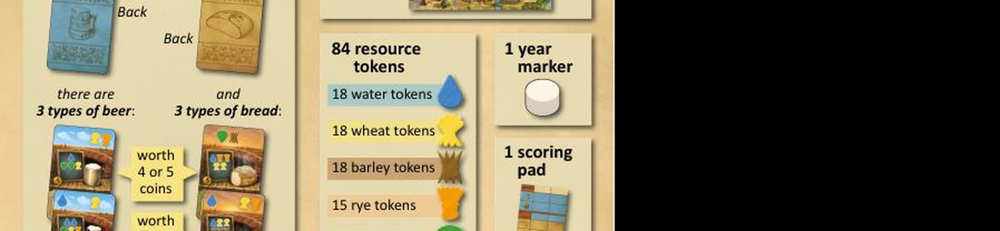
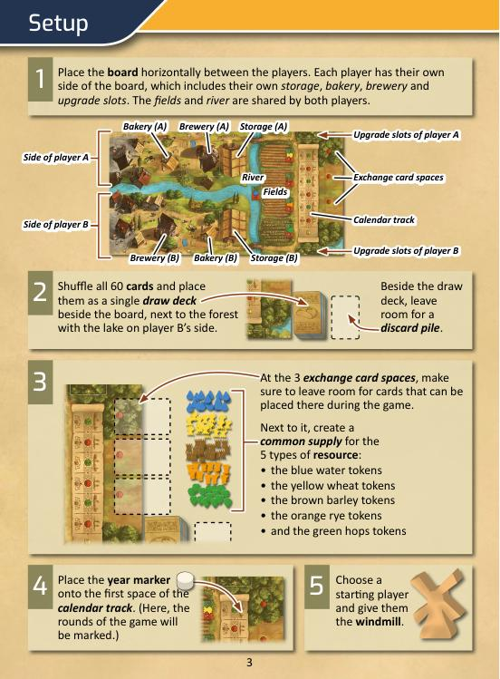
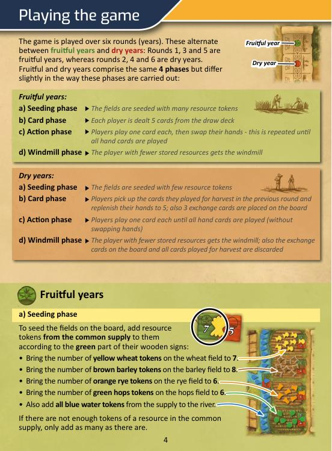
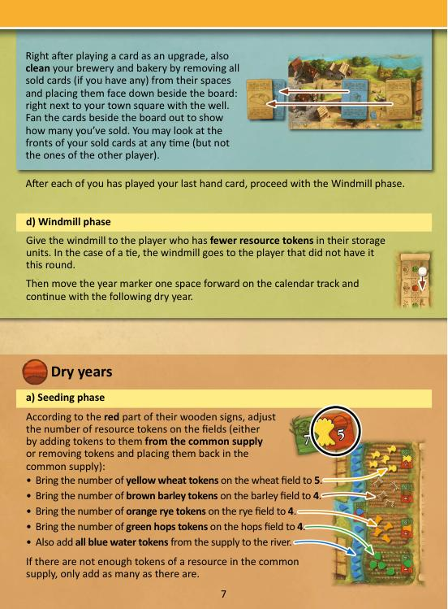
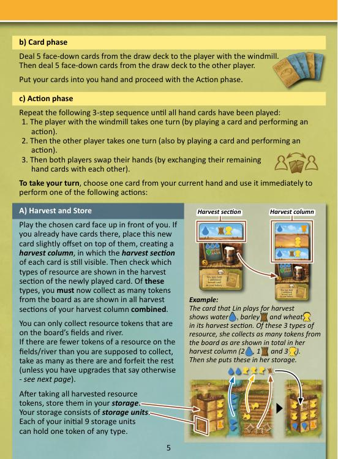
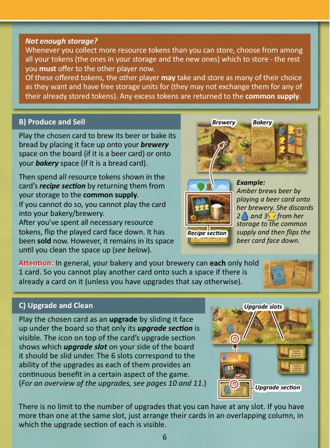
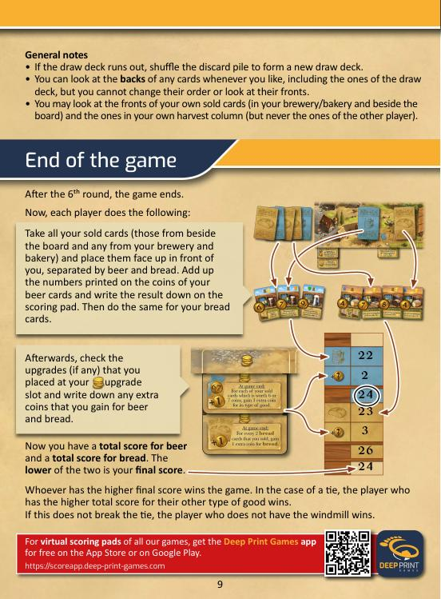

# Beer & Bread — วิธีเล่น

> สรุปจาก Official Rulebook ไม่มีเติมเอง

---

## Table of Contents
- [Overview](#overview)
- [ของในกล่อง](#ของในกล่อง)
- [Board Layout](#board-layout)
- [Setup](#setup)
- [Game Structure](#game-structure)
- [Fruitful Year (Rounds 1, 3, 5)](#fruitful-year-rounds-1-3-5)
- [Dry Year (Rounds 2, 4, 6)](#dry-year-rounds-2-4-6)
- [3 Actions Per Turn](#3-actions-per-turn)
- [Final Scoring](#final-scoring)
- [Upgrades Overview](#upgrades-overview)
- [Card Visibility Rules](#card-visibility-rules)
- [Summary](#summary)

---

## Overview

2 คนเป็นหมู่บ้านคู่แข่ง แข่งกันผลิต **เบียร์** และ **ขนมปัง** เพื่อขายเอาเงิน
แต่ต้องสมดุลทั้งสองอย่าง เพราะ **คะแนนสุดท้าย = ผลรวมที่น้อยกว่า** ระหว่างเบียร์กับขนมปัง

---

## Components



- ไพ่ 60 ใบ (เบียร์ 30 / ขนมปัง 30) — มูลค่า 4–9 เหรียญต่อใบ
- บอร์ด 1 อัน
- Resource tokens 84 อัน:
  - น้ำ (น้ำเงิน) 18
  - ข้าวสาลี (เหลือง) 18
  - ข้าวบาร์เลย์ (น้ำตาล) 18
  - ฮ็อปส์ (เขียว) 15
  - ข้าวไรย์ (ส้ม) 15
- Year marker 1 อัน
- กังหัน (Starting player marker) 1 อัน
- Scoring pad 1 อัน

---

## Board Layout

```
แต่ละคนมีฝั่งของตัวเอง:
  ช่อง Storage    — เก็บ Resource (เริ่มต้น 9 ช่อง)
  ช่อง Brewery    — วางไพ่เบียร์ที่กำลังผลิต
  ช่อง Bakery     — วางไพ่ขนมปังที่กำลังอบ
  ช่อง Upgrade    — ใส่ Upgrade cards (6 ประเภท)

พื้นที่กลาง (ใช้ร่วมกัน):
  Fields          — มีทุ่งข้าวสาลี, บาร์เลย์, ไรย์, ฮ็อปส์
  River           — มีน้ำ
  Exchange spaces — 3 ช่อง สำหรับไพ่แลก (ปีแล้ง)
```

---

## Setup



**1.** วาง Board แนวนอนระหว่างผู้เล่น — แต่ละคนมีฝั่ง Storage, Bakery, Brewery และ Upgrade slots ของตัวเอง, Fields และ River ใช้ร่วมกัน

**2.** สับไพ่ทั้ง **60 ใบ** รวมเป็นกองจั่วเดียว วางข้างบอร์ด (เว้นที่สำหรับ Discard pile)

**3.** เว้นที่ว่างสำหรับ **Exchange card spaces 3 ช่อง** — วาง Common supply ของ Resource ทั้ง 5 ชนิดไว้ข้างๆ

**4.** วาง **Year marker** ที่ช่องแรกของ Calendar track

**5.** เลือก Starting player ด้วยวิธีใดก็ได้ → มอบ **กังหัน (Windmill)** ให้

## Game Structure



**6 รอบ (ปี)** สลับกันระหว่าง ปีอุดม และ ปีแล้ง:

```
รอบ 1 — ปีอุดม
รอบ 2 — ปีแล้ง
รอบ 3 — ปีอุดม
รอบ 4 — ปีแล้ง
รอบ 5 — ปีอุดม
รอบ 6 — ปีแล้ง → จบเกม
```

แต่ละรอบมี **4 Phase** เหมือนกัน แต่รายละเอียดต่างกันตามปี

---

## Fruitful Year (Rounds 1, 3, 5)

### Phase a — Seeding
เติม Resource จาก Supply ลงทุ่งให้ครบ:
- ข้าวสาลี → 7 อัน
- บาร์เลย์ → 8 อัน
- ไรย์ → 6 อัน
- ฮ็อปส์ → 6 อัน
- น้ำ → เทน้ำจาก Supply ทั้งหมดลงแม่น้ำ

### Phase b — Card Phase
แจก 5 ใบให้คนถือกังหันก่อน แล้วแจก 5 ใบให้อีกคน

### Phase c — Action Phase
วนซ้ำจนไพ่ในมือหมด:
1. คนถือกังหันเล่นไพ่ 1 ใบ
2. อีกคนเล่นไพ่ 1 ใบ
3. **สองคนสลับไพ่ในมือกัน**

### Phase d — Windmill Phase
ให้กังหันแก่คนที่มี Resource ใน Storage น้อยกว่า
(เสมอกัน → คนที่ไม่ได้ถือในรอบนี้รับไป)
เลื่อน Year marker ไปหนึ่งช่อง

---

## Dry Year (Rounds 2, 4, 6)



### Phase a — Seeding
ปรับ Resource ในทุ่งให้เป็น:
- ข้าวสาลี → 5 อัน
- บาร์เลย์ → 4 อัน
- ไรย์ → 4 อัน
- ฮ็อปส์ → 4 อัน
- น้ำ → เทน้ำจาก Supply ทั้งหมดลงแม่น้ำ

### Phase b — Card Phase
1. แต่ละคนหยิบไพ่ที่เล่นเพื่อ Harvest ในรอบก่อนกลับมาใส่มือ
2. จั่วเพิ่มจนครบ 5 ใบ (คนถือกังหันทำก่อน)
3. วางไพ่จากกองจั่ว 3 ใบหงายบน Exchange spaces บนบอร์ด

### Phase c — Action Phase
สลับกันเล่นไพ่จนหมดมือ **ไม่สลับไพ่กัน**

> **พิเศษ:** แทนการเล่นไพ่จากมือ สามารถแลกไพ่มือกับ Exchange card บนบอร์ดได้ก่อนเล่น
> (วางไพ่มือลงบนช่อง Exchange แล้วเอาไพ่นั้นมาเล่นทันที ห้ามเก็บใส่มือ)

### Phase d — Windmill Phase
- ให้กังหันแก่คนที่มี Resource น้อยกว่า
- ทิ้ง Exchange cards 3 ใบและไพ่ Harvest ทั้งหมดรอบนี้ลง Discard
- เลื่อน Year marker → ถ้าถึงช่องสุดท้าย = จบเกม

---

## 3 Actions Per Turn

แต่ละ Turn เลือกเล่นไพ่ 1 ใบเพื่อทำ **1 ใน 3 Action:**

---



### Action A — Harvest and Store

วางไพ่หงายหน้าตัวเอง ซ้อนกันเป็น **Harvest Column** (เห็นส่วน Harvest ของทุกใบ)

นับ Resource ทุกประเภทที่ปรากฏใน Harvest Column ทั้งหมด → เก็บจากทุ่ง/แม่น้ำ

- ถ้าทุ่งมีไม่พอ → เก็บเท่าที่มี ส่วนที่เหลือหาย
- ใส่ใน Storage (9 ช่องเริ่มต้น ช่องละ 1 token)

**Storage เต็ม:**
เลือกว่าจะเก็บ token ไหน (จากที่มีอยู่ + ที่เก็บใหม่)
token ที่ไม่เก็บ → **ต้องเสนอให้คู่ต่อสู้ก่อน**
คู่ต่อสู้รับได้เท่าที่มีช่องว่าง ส่วนที่เหลือคืน Supply

> **ย้ำสำคัญ:** คู่ต่อสู้ **ห้ามแลก** token ที่มีอยู่แล้วกับ token ที่ถูกเสนอ — รับได้เฉพาะช่องว่างเท่านั้น

---

### Action B — Produce and Sell



วางไพ่เบียร์บน Brewery หรือไพ่ขนมปังบน Bakery

จ่าย Resource ตาม Recipe บนไพ่คืน Supply ทั้งหมด
- ถ้าไม่มี Resource พอ → **เล่นไพ่นี้ไม่ได้**

พลิกไพ่คว่ำ = ขายแล้ว

> ปกติ Brewery และ Bakery จุได้แค่ **1 ไพ่** ต่อช่อง
> (เพิ่มได้ถ้ามี Upgrade)

---

### Action C — Upgrade and Clean

สอดไพ่ใต้บอร์ด ให้เห็นเฉพาะ **Upgrade section** ตรงช่องที่ icon กำหนด

ทันทีหลังอัพเกรด → **ทำความสะอาด** Brewery และ Bakery:
- นำไพ่ที่ขายแล้ว (คว่ำ) ออกจากทั้งสองช่อง
- วางคว่ำไว้ข้างตัวเอง (กางออกให้เห็นว่าขายไปกี่ใบ)

---



## Final Scoring

หลังรอบที่ 6 จบ:

1. รวมไพ่ที่ขายทั้งหมด (ข้างตัว + ที่ยังอยู่ใน Brewery/Bakery)
2. แยกเป็น **เบียร์** และ **ขนมปัง**
3. รวมเลขเหรียญบนไพ่เบียร์ทั้งหมด = คะแนนเบียร์
4. รวมเลขเหรียญบนไพ่ขนมปังทั้งหมด = คะแนนขนมปัง
5. เช็ค Upgrade คะแนน (ถ้ามี) → บวกเพิ่ม

```
คะแนนสุดท้าย = ตัวเลขที่น้อยกว่า ระหว่างเบียร์กับขนมปัง
```

ใครมีคะแนนสุดท้ายสูงกว่า = **ชนะ**

**Tiebreaker:**
1. ใครมีคะแนนรวม (อีกประเภท) สูงกว่า
2. คนที่ไม่ถือกังหัน = ชนะ

---

## Upgrades Overview

| ประเภท Slot | ให้อะไร |
|---|---|
| **Harvest** | เก็บ Resource พิเศษ เช่น เก็บจาก Supply ได้เมื่อทุ่งหมด |
| **Storage** | ช่อง Storage เพิ่ม (รวมถึงช่องน้ำพิเศษ) |
| **Year/Card** | จั่วไพ่พิเศษ เลือกทิ้งไพ่ Harvest ได้ |
| **Brewing/Baking** | จุไพ่ใน Brewery/Bakery ได้มากขึ้น หรือแทน Resource ในสูตรได้ |
| **Scoring** | บวกเหรียญพิเศษให้เบียร์หรือขนมปังปลายเกม |
| **Cleaning** | ได้ bonus ตอนล้าง Brewery/Bakery |

> ถ้ามี Upgrade ซ้ำกัน → bonus รวมกัน

---

## Card Visibility Rules

- ดูด้านหลังของไพ่ทุกใบได้ตลอดเวลา (รวมถึงกองจั่ว) แต่ห้ามดูด้านหน้าหรือเปลี่ยนลำดับ
- ดูด้านหน้าของ **ไพ่ขายของตัวเอง** (ข้างตัว + ใน Brewery/Bakery) ได้
- ดูด้านหน้าของ **ไพ่ใน Harvest Column ของตัวเอง** ได้
- **ห้ามดูด้านหน้าของไพ่คู่ต่อสู้** ทุกกรณี

> ถ้า Deck หมด → สับ Discard pile ทำ Deck ใหม่

---

## Summary

```
6 ปี สลับปีอุดม/ปีแล้ง
แต่ละ Turn เล่นไพ่ 1 ใบ → เก็บเกี่ยว / ผลิตขาย / อัพเกรด
ปีอุดม: สลับไพ่ในมือกันหลังแต่ละคนเล่น
ปีแล้ง: ไม่สลับ แต่แลก Exchange card ได้

จบเกม → นับเหรียญจากเบียร์ที่ขาย + ขนมปังที่ขาย
คะแนนสุดท้าย = ตัวเลขที่น้อยกว่า
→ ต้องสมดุลทั้งสองอย่าง ไม่ใช่เน้นแค่อย่างเดียว!
```
