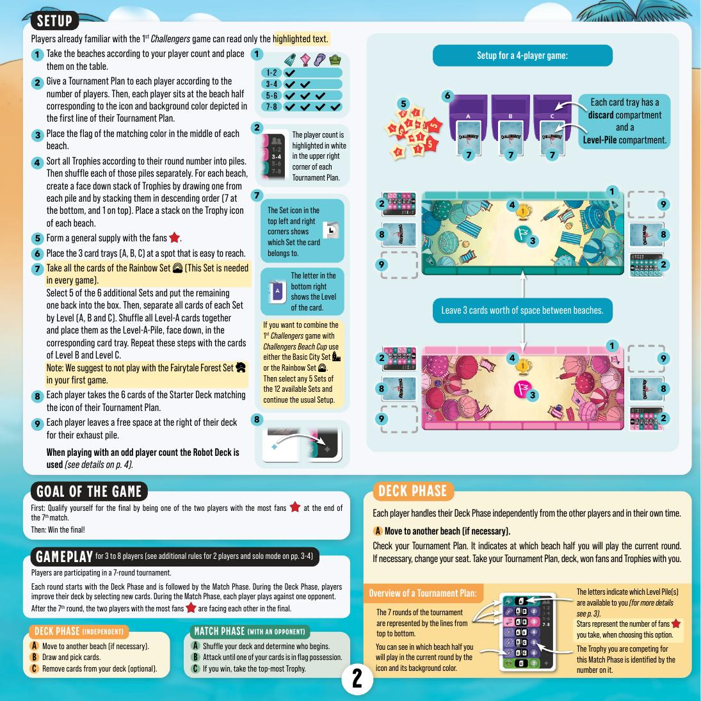
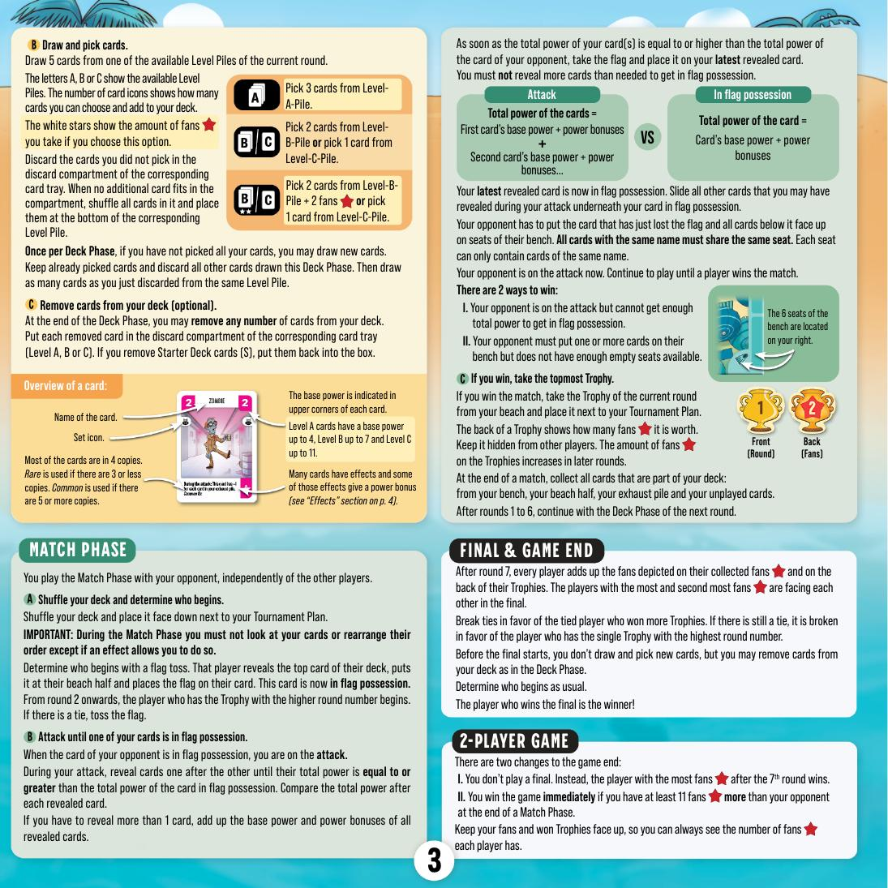
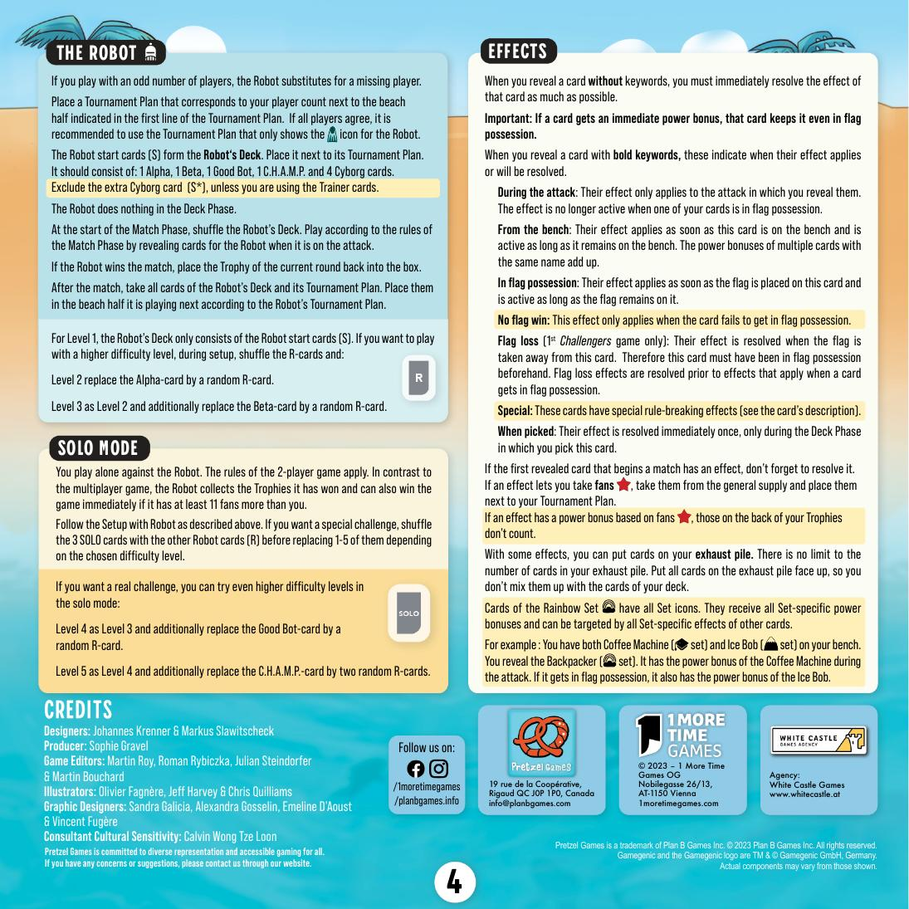

# Challengers! Beach Cup — วิธีเล่น

> สรุปจาก Official Rulebook (EN_ChallengersBC_RulesBooklet)

---

## Table of Contents
- [Overview](#overview)
- [Components](#components)
- [Setup](#setup)
- [Game Structure](#game-structure)
- [Deck Phase](#deck-phase)
- [Match Phase](#match-phase)
- [Final & Game End](#final-game-end)
- [2-Player Rules](#2-player-rules)
- [Card Effects](#card-effects)
- [Reading Your Tournament Plan](#reading-your-tournament-plan)

---

## Overview

- **ผู้เล่น:** 2–8 คน (มี Solo mode)
- **ธีม:** แข่งแย่งธง (Capture the Flag) ในทัวร์นาเมนต์ 7 รอบ
- **เป้าหมาย:** เป็น 1 ใน 2 คนที่มี Fan มากที่สุดหลังรอบ 7 แล้วชนะ Final

---

## Components

| ของ | จำนวน |
|---|---|
| Beaches (แผ่นสนาม) | 4 |
| Tournament Plans | 9 |
| Starter Decks (6 ใบต่อชุด) | 8 ชุด |
| Rainbow Set | 20 ใบ |
| Additional Sets (40 ใบต่อ Set) | 6 Sets |
| Card Trays A/B/C | 3 อัน |
| Trophies | 28 |
| Fans | 40 |
| Flags | 4 |
| Robot Deck | 20 ใบ |

**6 Additional Sets:** Fairytale Forest, Toy Store, Mountain Top, Secret Base, University, Beach Club

---

## Setup



### 1. Place Beach Boards
วาง Beach บนโต๊ะตามจำนวนผู้เล่น เว้นระยะห่างระหว่าง Beach ประมาณ 3 ใบไพ่

### 2. Distribute Tournament Plans
แต่ละคนรับ Tournament Plan 1 แผ่น (เลือกตามจำนวนผู้เล่น) → นั่งที่ฝั่ง Beach ที่ตรงกับ **icon และสีพื้นหลัง** บรรทัดแรกของแผน

### 3. Place Flags
วาง Flag สีที่ตรงกันไว้กลาง Beach แต่ละอัน

### 4. Prepare Trophies
- เรียงตามเลขรอบ (1–7) → สับแยกกันแต่ละกอง
- ดึงจากกองละ 1 ใบ ซ้อนกันแบบ 7 ล่างสุด, 1 บนสุด
- วางกองไว้บน Trophy icon ของ Beach (1 กองต่อ Beach)

### 5. Set Up Fan Supply
รวมไว้เป็นกองกลางโต๊ะ

### 6. Place Card Trays
วาง Card Trays A, B, C ตรงกลางโต๊ะให้ทุกคนเอื้อมถึง

### 7. Build Level Piles A/B/C
- ใช้ **Rainbow Set ทั้งหมด** (ใช้ทุกเกม) + **เลือก 5 จาก 6 Additional Sets** (เก็บ 1 กลับกล่อง)
- แต่ละไพ่มีตัวอักษร **A, B หรือ C** ที่มุมล่างขวา = Level ของไพ่ใบนั้น
- แยกไพ่ทั้งหมดตาม Level:
  - ไพ่ Level A ทั้งหมด → สับรวมกัน → วางคว่ำใน **Tray A**
  - ไพ่ Level B ทั้งหมด → สับรวมกัน → วางคว่ำใน **Tray B**
  - ไพ่ Level C ทั้งหมด → สับรวมกัน → วางคว่ำใน **Tray C**

```
แต่ละ Tray มี 2 ช่อง:
┌──────────────┬──────────────┐
│  Level-Pile  │   Discard    │
│  (กองจั่ว)  │  (กองทิ้ง)  │
└──────────────┴──────────────┘
เมื่อ Discard เต็ม → สับแล้ววางใต้ Level-Pile
```

| Tray | Base Power สูงสุด |
|---|---|
| A | 4 |
| B | 7 |
| C | 11 |

> **ครั้งแรก:** แนะนำอย่าใช้ Fairytale Forest Set

### 8. Give Out Starter Decks
แต่ละคนรับ Starter Deck 6 ใบที่ตรงกับ icon ใน Tournament Plan ของตัวเอง

### 9. Leave Space for Exhaust Pile
เว้นที่ว่างทางขวาของ Deck ไว้สำหรับ Exhaust Pile

---

## Game Structure

```
รอบ 1 ถึง 7:
  └─ Deck Phase   (ปรับปรุง Deck)
  └─ Match Phase  (แข่งกับคู่ต่อสู้)

หลังรอบ 7:
  └─ Final: 2 คนที่มี Fan มากสุด → แข่งกัน → ผู้ชนะ = ชนะเกม
```

---

## Deck Phase

### A. Move Seats (if needed)
ดู Tournament Plan ว่ารอบนี้ต้องอยู่ที่ Beach ไหน ถ้าต้องย้าย → พา Tournament Plan, Deck, Fans และ Trophies ไปด้วย

### B. Draw and Pick Cards
1. **จั่ว 5 ใบ** จาก Level Pile ที่มีสิทธิ์ใช้ในรอบนั้น (ดูตัวอักษรใน Tournament Plan)
2. **เลือกไพ่** ตามจำนวนที่ Tournament Plan กำหนด เช่น:
   - หยิบ 3 ใบจาก Level-A
   - หรือ หยิบ 2 ใบจาก Level-B / หยิบ 1 ใบจาก Level-C
   - ตัวเลือกที่มี ★ = ได้ Fan เพิ่มแทน
3. ไพ่ที่ **ไม่เลือก** → ทิ้งใน Discard compartment ของ Tray นั้น
4. **Re-draw (ใช้ได้ 1 ครั้งต่อรอบ):** ถ้ายังเลือกไม่ครบ สามารถทิ้งไพ่ที่จั่วมาแล้วไม่ชอบทั้งหมด (เก็บที่เลือกแล้วไว้) แล้วจั่วใหม่เท่ากับที่ทิ้ง จาก Pile เดิม

### C. Remove Cards (optional)
- ตัดไพ่ออกจาก Deck ได้กี่ใบก็ได้
- ทิ้งลง Discard compartment ของ Level ที่ตรงกัน
- **Starter Deck cards (S)** → เก็บกลับกล่อง ไม่ใส่ Tray

---

## Match Phase



### A. Prepare and Determine First Player
- **สับ Deck** วางคว่ำหน้าไว้
- **ห้ามดูไพ่หรือเรียงลำดับ** ยกเว้น effect อนุญาต
- หาตัวเริ่ม:
  - **รอบ 1:** ทอย Flag
  - **รอบ 2 เป็นต้นไป:** คนที่มี Trophy เลขรอบสูงกว่าเริ่มก่อน (เสมอ = ทอย Flag)
- ผู้เริ่ม → พลิกไพ่บนสุด วางที่ฝั่งของตัวเอง → **วาง Flag ลงบนไพ่นั้น** = ไพ่นั้น "ครอบครองธง"

### B. Fight for the Flag

**เมื่อคู่ต่อสู้ถือธง = ตาคุณโจมตี**

```
พลิกไพ่ทีละใบ → บวก Power สะสม
  ↓
Power รวมของคุณ ≥ Power ไพ่ที่ถือธง?
  → ใช่: ได้ธง!
  → ยัง: พลิกต่อ
```

**เมื่อได้ธง:**
- วาง Flag บนไพ่ล่าสุดที่พลิก
- ไพ่ที่พลิกก่อนหน้า (ถ้ามี) → สอดไว้ใต้ไพ่ที่ถือธง
- คู่ต่อสู้นำไพ่ที่เพิ่งเสียธง + ไพ่ใต้ทั้งหมด → วางหงายบน **Bench**

**กฎ Bench:**
- มีทั้งหมด **6 ที่นั่ง** อยู่ทางขวาของผู้เล่น
- ไพ่ชื่อเดียวกันต้องอยู่ที่นั่งเดียวกัน
- แต่ละที่นั่งมีได้แค่ไพ่ **ชื่อเดียว**

> **ย้ำสำคัญ:** พลิกเฉพาะไพ่ที่จำเป็นพอให้ได้ธงเท่านั้น — ห้ามพลิกเกินกว่านั้น

จากนั้น **คู่ต่อสู้โจมตีบ้าง** → วนไปเรื่อยๆ จนกว่าจะมีคนชนะ

### 2 Ways to Win a Match

| แบบ | เงื่อนไข |
|---|---|
| **Power ไม่พอ** | คู่ต่อสู้พลิกหมดมือแล้วยัง Power ไม่ถึง |
| **Bench เต็ม** | คู่ต่อสู้ต้องวางไพ่บน Bench แต่ไม่มีที่นั่งว่าง |

### C. Take a Trophy
- ถ้าชนะ → รับ **Trophy บนสุด** ของ Beach นั้น
- Trophy มีหน้า (เลขรอบ) และหลัง (จำนวน Fan) → **เก็บซ่อนด้านหลังไว้**
- รอบหลังๆ Trophy มี Fan มากขึ้น

**หลัง Match ทุกครั้ง:** เก็บไพ่ทั้งหมดกลับ — จาก Bench, Beach, Exhaust Pile และที่ยังไม่ได้พลิก

---

## Final & Game End

หลังรอบ 7 → **นับ Fan ทั้งหมด:** Fan tokens + Fan หลัง Trophy

- **2 คนที่มี Fan มากสุด** ไปเล่น Final
- **เสมอ:** ดูคนที่ชนะ Trophy มากกว่า → ยังเสมอ: ดู Trophy เลขรอบสูงสุด
- ก่อน Final: **ห้ามจั่วไพ่ใหม่** แต่ตัดออกได้
- ผู้ชนะ Final = **ชนะเกม**

---

## 2-Player Rules

- **ไม่มี Final** — คนที่มี Fan มากกว่าหลังรอบ 7 ชนะ
- **ชนะทันที** ถ้ามี Fan มากกว่า **11** หลัง Match Phase ใดก็ได้
- เปิด Fan และ Trophy ให้เห็นตลอดเกม

---

## Card Effects



| Keyword | เมื่อไหร่ใช้ |
|---|---|
| *(ไม่มี keyword)* | ทำทันทีเมื่อพลิก |
| **During the attack** | ใช้แค่ระหว่างโจมตีนั้น / หายเมื่อได้ธง |
| **From the bench** | ใช้ตลอดที่ไพ่อยู่บน Bench (ซ้ำชื่อ = Power รวมกัน) |
| **In flag possession** | ใช้ตลอดที่ถือธง |
| **No flag win** | ใช้เมื่อพลิกแล้วไม่ได้ธง |
| **When picked** | ใช้ทันทีตอนหยิบในช่วง Deck Phase |
| **Special** | อ่านบนไพ่ — มีกฎพิเศษเฉพาะใบ |

**หมายเหตุ:** ไพ่แรกที่เริ่ม Match อย่าลืม resolve effect ด้วย

> **ย้ำสำคัญ:** ถ้า effect ให้ power bonus ทันที (immediate) — ไพ่นั้นเก็บ power bonus ไว้แม้จะอยู่ใน flag possession แล้ว

**Rainbow Set:** มีทุก Set icon → ได้รับ power bonus จากทุก Set และถูก target ได้จากทุก Set-specific effect

---

## Reading Your Tournament Plan

```
┌──────────────────────────────────────┐
│  รอบ 1: [icon สี]   A        ★★    │
│  รอบ 2: [icon สี]   A B      ★★    │
│  รอบ 3: [icon สี]   A B      ★★    │
│  ...                                  │
│  รอบ 7: [icon สี]   A B C    ★★★   │
└──────────────────────────────────────┘
```

| สัญลักษณ์ | ความหมาย |
|---|---|
| Icon + สีพื้นหลัง | ฝั่ง Beach ที่นั่งรอบนั้น |
| ตัวอักษร A/B/C | Level Pile ที่จั่วได้รอบนั้น |
| ★ | Fan ที่ได้ถ้าเลือก option นั้น |
| ตัวเลข | Trophy ที่แข่งชิงรอบนั้น |
