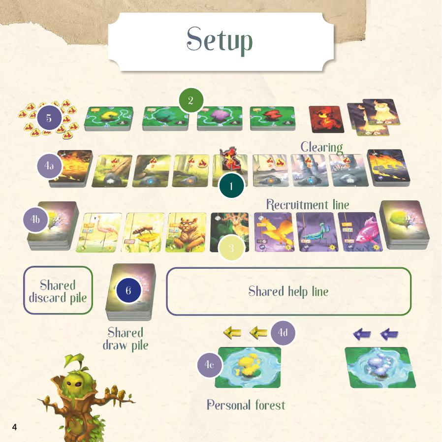
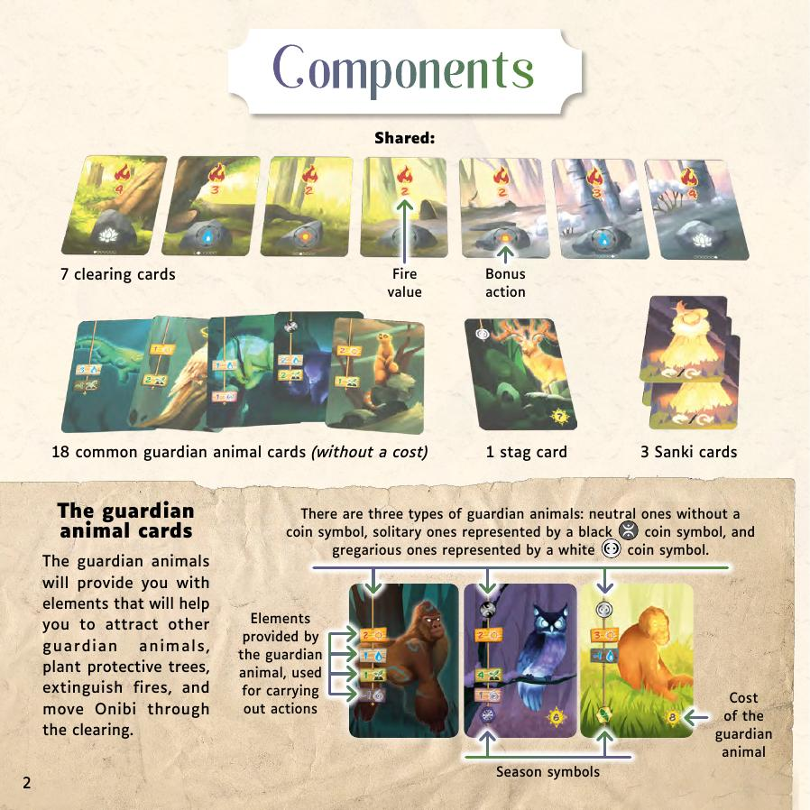
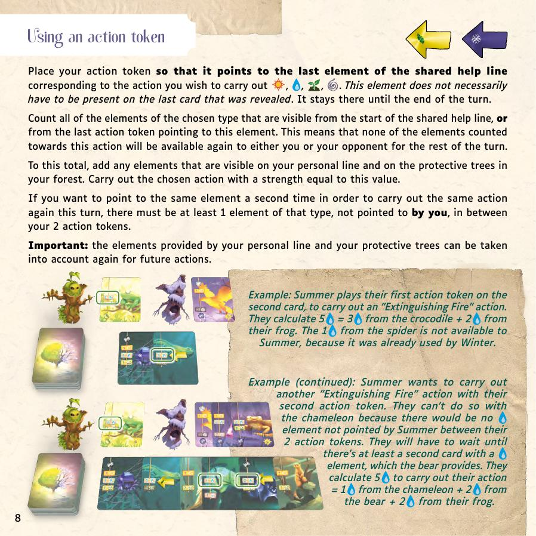
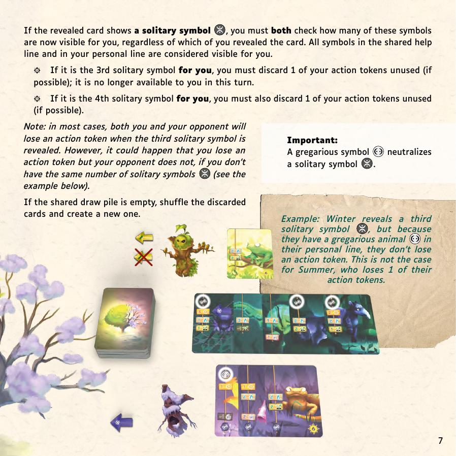
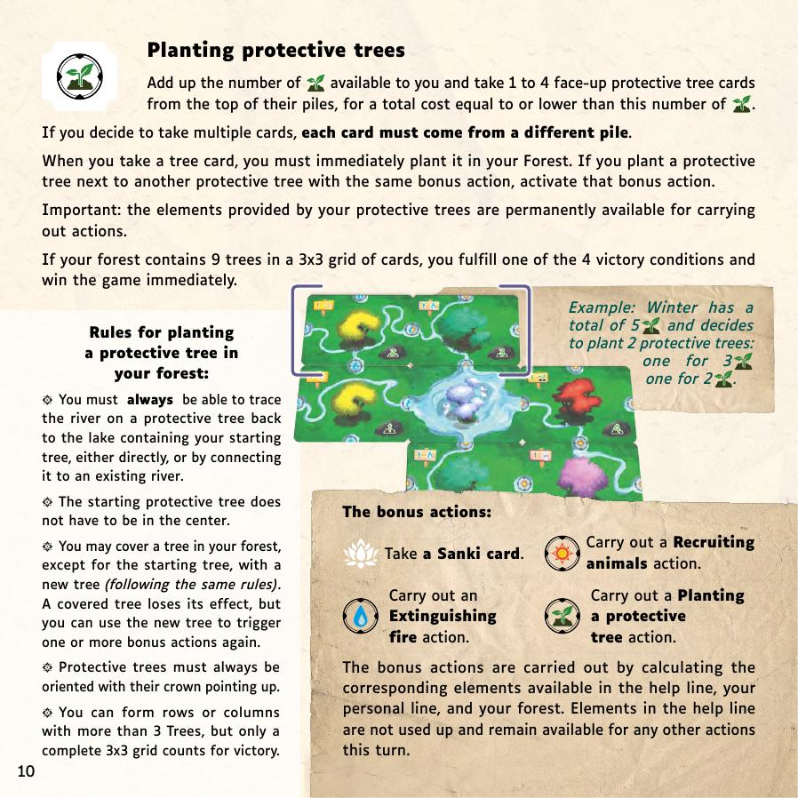
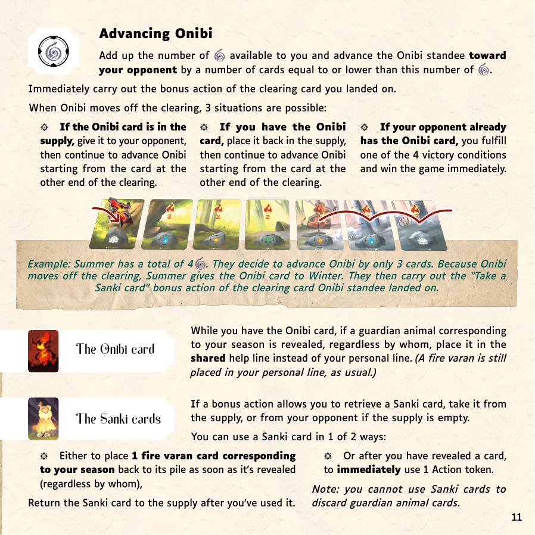
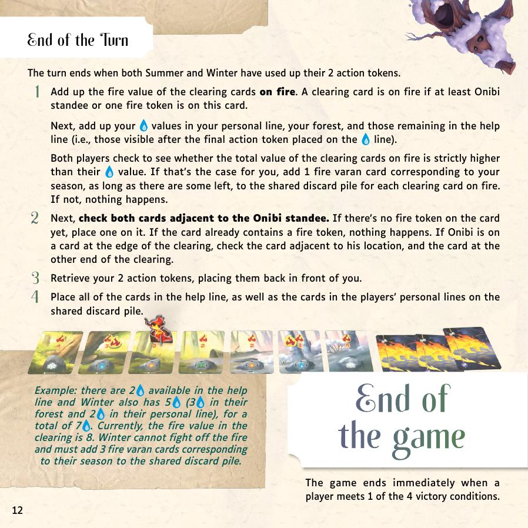

# Living Forest Duel — วิธีเล่น

> สรุปจาก Official Rulebook ไม่มีเติมเอง

---

## Table of Contents
- [Overview](#overview)
- [Victory Conditions](#victory-conditions)
- [Components](#components)
- [Setup](#setup)
- [การสลับ Turn และ Help Line — อ่านตรงนี้ให้ชัดก่อน](#การสลับ-turn-และ-help-line-อ่านตรงนี้ให้ชัดก่อน)
- [ตัวอย่าง 1 Turn แบบจับมือเดิน](#ตัวอย่าง-1-turn-แบบจับมือเดิน)
- [Option A — Reveal a Card](#option-a-reveal-a-card)
- [Option B — Place a Token](#option-b-place-a-token)
- [⚠️ Solitary Symbol Rule](#solitary-symbol-rule)
- [The 4 Actions](#the-4-actions)
- [Bonus Actions](#bonus-actions)
- [Special Cards](#special-cards)
- [End of Turn](#end-of-turn)
- [Example Action (Help Line)](#example-action-help-line)
- [Summary](#summary)

---

## Overview

เกมนี้มีแถวไพ่ตรงกลางโต๊ะที่สะสมขึ้นเรื่อยๆ ระหว่างเล่น
ไพ่แต่ละใบมีสัญลักษณ์บนหน้า — **สัญลักษณ์พวกนี้คือ "พลัง"** ที่ใช้ทำสิ่งต่างๆ

แต่ละ Turn สองคนสลับกันทำทีละครั้ง ทำได้แค่ **1 อย่าง** ต่อครั้ง:
```
ทางเลือก 1 → พลิกไพ่ใหม่ 1 ใบวางต่อแถวกลาง (สะสมพลัง)
ทางเลือก 2 → ใช้ Token วาง เพื่อ "ใช้พลัง" ในแถวทำ Action
```

พอทั้งสองคนหมด Token → จบ Turn → ล้างแถว → เริ่มใหม่

---

## Victory Conditions

| # | เงื่อนไข |
|---|---|
| 1 | เก็บ **Fire token ≥ 8** อัน |
| 2 | แถวเกณฑ์ทหารมีแต่ **ไพ่ Season ตัวเองล้วน** (Stag ต้องหมดด้วย) |
| 3 | ปลูกต้นไม้ครบ **9 ต้น ในกริด 3×3** |
| 4 | เลื่อน Onibi ออกจากสนามไปฝั่งคู่ต่อสู้ **ขณะที่เขาถือ Onibi card** |

---

## Components

**ของกลาง:**
- ไพ่ Clearing 7 ใบ — เรียงเป็นสนาม มี Onibi (ลูกไฟ) วางอยู่
- Fire tokens — แผ่นไฟ
- ไพ่ต้นไม้ 24 ใบ (4 ชนิด ชนิดละ 6)
- ไพ่ common guardian animal 18 ใบ
- ไพ่ Stag 1 ใบ
- ไพ่ Sanki 3 ใบ + Onibi card 1 ใบ

**ของแต่ละคน:**
- ไพ่สัตว์ guardian 15 ใบ (Season ตัวเอง)
- ไพ่ Fire Varan 7 ใบ
- ไพ่ต้นไม้เริ่มต้น 1 ใบ
- Token แอ็กชัน 2 อัน

---

## Setup



**1.** วาง Clearing cards 7 ใบเรียงต่อกันเป็นภาพพาโนรามา (ค่าไฟลดแล้วเพิ่ม) — วาง Onibi standee ที่ **ใบกลาง** และวาง Fire token **1 อันบนแต่ละใบที่ติดกันทั้งสองข้าง**

**2.** แยก Protective tree cards 24 ใบออกเป็น **4 กองตามชนิด** (ชนิดละ 6 ใบ) สับแต่ละกองแยกกัน วางหงายไว้เหนือ Clearing

**3.** วาง Stag card ใต้ใบกลางของ Clearing เพื่อเริ่มต้น Recruitment line

**4.** ทั้งสองคนเลือกว่าใครเล่นเป็น Winter ใครเล่นเป็น Summer แล้วแต่ละคนทำ:

- **4a.** วาง Fire Varan cards 7 ใบของ Season ตัวเอง **หงาย** ที่ปลาย Clearing ฝั่งของตัวเอง
- **4b.** สับ Guardian animal cards 15 ใบเป็นกองคว่ำ แล้วพลิก **3 ใบบนสุด** วางต่อจาก Stag — ถ้าราคารวม 3 ใบ **≤ 12** ให้เอาใบถูกสุดไปวางใต้กอง แล้วพลิกใหม่ 1 ใบ ทำซ้ำจนราคา **> 12**
- **4c.** วาง Starting protective tree card หน้าตัวเอง = เริ่มต้น Forest
- **4d.** วาง Action tokens 2 อัน หน้าตัวเอง

**5.** วาง Fire tokens ที่เหลือ, Onibi card และ Sanki cards 3 ใบ รวมเป็น Shared supply

**6.** สับ Common guardian animal cards 18 ใบ วางคว่ำตรงกลางโต๊ะ = **Shared draw pile**

> Summer เริ่มก่อนใน Turn แรก

---

## Turn Structure — Read This First

### What Is a "Turn"?

Turn = ช่วงเวลาที่**ทั้งสองคน**เล่นสลับกันไปเรื่อยๆ จนกว่าจะหมด Token ทั้งคู่

```
ภายใน 1 Turn:

  Summer ทำ 1 ครั้ง
  Winter ทำ 1 ครั้ง
  Summer ทำ 1 ครั้ง
  Winter ทำ 1 ครั้ง
  ...วนไปเรื่อยๆ...
  จนทั้งสองคนหมด Token
  → จบ Turn → ล้างแถวกลาง → เริ่ม Turn ใหม่
```

### Each Micro-Action: Choose One

```
A: พลิกไพ่ 1 ใบจากกองจั่วกลาง วางในแถว
   (ไม่เสีย Token)

B: วาง Token 1 อัน ลงแถวกลาง เพื่อใช้สัญลักษณ์ทำ Action
   (เสีย Token 1 อัน)
```

### No Tokens = Stop

- เริ่มต้นมี **2 Token** ต่อคน
- เมื่อ Token หมด → **หยุดทุกอย่าง** ไม่ว่าจะพลิกไพ่หรือทำ Action
- ถ้าคุณหมดก่อน → คู่ต่อสู้เล่นต่อคนเดียวจนกว่าเขาจะหมดด้วย

---

## Example Turn — Step by Step

> เริ่ม Turn: Summer มี 💎💎 (2 Token), Winter มี 💎💎 (2 Token), แถวกลางว่าง

| ลำดับ | ใคร | ทำอะไร | Token ที่เหลือ |
|---|---|---|---|
| 1 | **Summer** | พลิกไพ่ → ได้ common 🐊💧💧💧 → วางแถวกลาง | S:💎💎 W:💎💎 |
| 2 | **Winter** | พลิกไพ่ → ได้ Winter 🦉🍃🍃 → วางแถวส่วนตัว Winter | S:💎💎 W:💎💎 |
| 3 | **Summer** | พลิกไพ่ → ได้ common 🐸💧💧 → วางแถวกลาง | S:💎💎 W:💎💎 |
| 4 | **Winter** | **วาง Token** ชี้ที่ 🐊 → นับ 💧💧💧+💧💧=5 → ดับไฟ 5 | S:💎💎 W:💎 |
| 5 | **Summer** | **วาง Token** ชี้ที่ 🐸 → 💧💧 (💧💧💧ถูก Winter ใช้แล้ว) → ดับไฟ 2 | S:💎 W:💎 |
| 6 | **Winter** | **วาง Token** → ทำ Action | S:💎 W:0 ❌ |
| 7 | **Summer** | **วาง Token** → ทำ Action | S:0 ❌ W:0 ❌ |

> **ทั้งคู่หมด Token → จบ Turn!**
> → เช็คไฟ → ล้างแถวกลางทั้งหมด → คืน Token 2 อันต่อคน
> → Turn ใหม่เริ่มโดย **Winter** (เพราะ Summer เล่นล่าสุด)

---

## Option A — Reveal a Card



จั่วไพ่บนสุดจากกองจั่วกลาง วางตามนี้:

| ไพ่ที่ได้ | วางที่ไหน |
|---|---|
| ไพ่ common หรือ Stag | วางต่อ **แถวกลาง** (ทั้งคู่ใช้ได้) |
| ไพ่ Season **ตัวเอง** | วางใน **แถวส่วนตัวฝั่งคุณ** (คุณใช้คนเดียว) |
| ไพ่ Season **คู่ต่อสู้** | วางใน **แถวส่วนตัวฝั่งคู่ต่อสู้** (เขาใช้คนเดียว) |

> กองจั่วหมด → สับ Discard ทำกองใหม่

---

## Option B — Place a Token

วาง Token ชี้ไปที่ **ไพ่ใบใดก็ได้ในแถวกลาง** ที่มีสัญลักษณ์ที่ต้องการ

### How to Count Symbols

```
นับจากต้นแถวกลาง → ถึงไพ่ที่ Token ของคุณชี้
(ถ้ามี Token วางอยู่แล้วในแถว → เริ่มนับจาก Token นั้นไป)

+ สัญลักษณ์จากแถวส่วนตัวของคุณ
+ สัญลักษณ์จากต้นไม้ในป่าของคุณ
= ความแรงของ Action
```



**จำให้ขึ้นใจ:**
- สัญลักษณ์แถวกลางที่นับแล้ว → **หมดไป** คู่ต่อสู้ใช้ไม่ได้
- สัญลักษณ์แถวส่วนตัว + ป่า → **ไม่หมด** ใช้ได้อีกใน Action ถัดไป

### Placing Your 2nd Token (Same Type)
ต้องมีไพ่ที่มีสัญลักษณ์นั้น **อย่างน้อย 1 ใบที่ยังไม่ถูกชี้** คั่นระหว่าง Token ทั้งสองอัน

---

## ⚠️ Solitary Symbol Rule

ทุกครั้งที่พลิกไพ่ **ทั้งสองคนต้องเช็คพร้อมกัน**

นับเหรียญดำในแถวของตัวเอง (แถวกลาง + แถวส่วนตัว):
- **เห็นครั้งที่ 3** → ทิ้ง Token แอ็กชัน 1 อัน ทันที
- **เห็นครั้งที่ 4** → ทิ้ง Token แอ็กชัน อีก 1 อัน

มีเหรียญขาว (Gregarious) ในแถวตัวเอง → **หักล้างเหรียญดำ** ได้ 1 อัน



> คนหนึ่งอาจเสีย Token แต่อีกคนไม่เสีย ถ้ามีเหรียญขาวต่างกัน

---

## The 4 Actions

---

### Extinguish Fire


**หลักการ:** นับ 💧 ที่ใช้ได้ → เลือกหยิบ Fire token จากสนาม รวมค่าไม่เกินจำนวน 💧 นั้น

**ค่าของ Fire token:**
แต่ละใบ Clearing card บอกค่าไฟของตัวเองไว้ (2, 3 หรือ 4)
ดูตัวเลขบน Clearing card ที่ Fire token วางอยู่ — นั่นคือค่าของ token นั้น

**หยิบกี่อันก็ได้** ตราบที่ค่ารวมไม่เกิน 💧 ที่มี
ตัวอย่าง: มี 💧 = 7 → หยิบ token ค่า 3 + ค่า 4 = 7 ✓, หรือ token ค่า 2 + ค่า 4 = 6 ✓

> ⚠️ Token ที่หยิบต้องมาจาก **Clearing ที่มี Fire token อยู่** เท่านั้น ไม่ใช่สนามทั้งหมด

**มี Fire token ≥ 8 อัน → ชนะทันที**

---

### Recruit Animals


**หลักการ:** นับ 🍃 ที่ใช้ได้ → เลือกหยิบไพ่จากแถวเกณฑ์ทหาร รวมราคาไม่เกินจำนวน 🍃 นั้น

**หยิบได้ทุกประเภท:** ไพ่ Season ตัวเอง, Season คู่ต่อสู้, หรือ Stag
แต่ทำกับมันต่างกัน:

| ไพ่ที่หยิบ | วางที่ไหน |
|---|---|
| Season **ตัวเอง** | → แถวส่วนตัวฝั่งคุณ (ได้ใช้สัญลักษณ์นั้นทันที) |
| Season **คู่ต่อสู้** หรือ Stag | → ทิ้งลง Discard กลาง (เอาออกจากแถวได้ แต่ไม่ได้ประโยชน์) |

**หลังหยิบแล้ว — เติมช่องว่าง:**
ดึงไพ่จาก **กองส่วนตัวของตัวเอง** มาแทนตำแหน่งที่หายไป
ถ้ากองส่วนตัวหมดแล้ว → ปล่อยว่าง ไม่ต้องเติม

**ทำไมหยิบไพ่คู่ต่อสู้:** เพื่อเอามันออกจากแถว แล้วเติมด้วยไพ่ Season ตัวเอง
ทำให้แถวค่อยๆ เป็นไพ่ Season ตัวเองมากขึ้น

**ชนะเมื่อ:** แถวเกณฑ์ทหารมีแต่ไพ่ Season ตัวเองล้วน **และ Stag ถูกเกณฑ์ออกไปแล้วด้วย**

> ⚠️ Stag เป็น Neutral ไม่นับว่าเป็น Season ใคร ต้องเกณฑ์ Stag ออกก่อน ถึงจะชนะได้

---

### Plant Protective Trees




**หลักการ:** นับ 🌱 ที่ใช้ได้ → เลือกหยิบไพ่ต้นไม้ 1–4 ใบ รวมราคาไม่เกินจำนวน 🌱 นั้น

**ถ้าหยิบหลายใบ:** แต่ละใบต้องมาจาก **กองต่างชนิดกัน** (4 กอง 4 ชนิด)

**วางต้นไม้ในป่าทันที** ทุกใบที่หยิบ

**กฎการวาง:**
- เส้นแม่น้ำบนต้นไม้ใหม่ต้องต่อเชื่อมกลับไปถึง **ทะเลสาบบนต้นไม้เริ่มต้น** ได้
  (ต่อตรงหรือผ่านต้นที่มีอยู่แล้วก็ได้)
- ต้นไม้ต้องหงาย **ยอดขึ้น** เสมอ
- ทับต้นไม้เดิมในป่าได้ (ยกเว้นต้นเริ่มต้น) — ต้นที่ถูกทับสูญเสีย effect แต่ยังนับพื้นที่
- ต้นไม้เริ่มต้น **ไม่จำเป็นต้องอยู่กลาง** กริด

**Bonus action จากการวาง:**
ถ้าวางต้นใหม่ **ติดกับต้นที่มี Bonus action เดียวกัน** → ทำ Bonus action นั้นทันที
(ต้องติดกันจริงๆ ด้านใดด้านหนึ่ง ไม่ใช่แค่ใกล้ๆ)

**ต้นไม้ในป่าให้สัญลักษณ์ถาวร:**
ทุกต้นที่ปลูกให้สัญลักษณ์แก่คุณตลอดเกม — บวกเข้า Action ทุกครั้งที่นับ

> ⚠️ แถวมากกว่า 3 ต้นได้ แต่ **ต้องครบ 3×3 เต็มๆ** ถึงจะชนะ — แถวยาว 9 ต้นไม่นับ

**ครบ 9 ต้น กริด 3×3 → ชนะทันที**

---

### Advance Onibi




**หลักการ:** นับ ☀️ ที่ใช้ได้ → เลื่อน Onibi standee ไปทางคู่ต่อสู้ **ไม่เกิน** จำนวน ☀️ นั้น
(เลื่อนน้อยกว่าจำนวน ☀️ ที่มีก็ได้)

**ทุกช่องที่ Onibi หยุด** → ทำ Bonus action ของ Clearing card ใบนั้น **ทันที**
(เฉพาะช่องที่ **หยุด** ไม่ใช่ช่องที่ผ่าน)

**เมื่อ Onibi เลื่อนออกนอกสนามไปฝั่งคู่ต่อสู้:**

```
กรณี A: Onibi card อยู่กองกลาง
  → ส่ง Onibi card ให้คู่ต่อสู้ถือ
  → เลื่อน Onibi ต่อจากปลายอีกด้านหนึ่ง (วนกลับมา)

กรณี B: คุณถือ Onibi card อยู่
  → คืน Onibi card ไปกองกลาง
  → เลื่อน Onibi ต่อจากปลายอีกด้านหนึ่ง

กรณี C: คู่ต่อสู้ถือ Onibi card อยู่
  → ชนะทันที!
```

> ☀️ ที่เหลือหลังออกสนามยังใช้ได้ — เลื่อนต่อจากปลายอีกด้านได้จนครบจำนวน ☀️

---

## Bonus Actions

**เกิดขึ้นเมื่อ:**
- ปลูกต้นไม้ชิดต้นที่มีสัญลักษณ์ Bonus action เดียวกัน
- Onibi หยุดบน Clearing card ที่มี Bonus action

**ทำได้ 4 อย่าง:**
- หยิบ Sanki card
- ทำ Action เกณฑ์สัตว์ (นับ 🍃 ใหม่)
- ทำ Action ดับไฟ (นับ 💧 ใหม่)
- ทำ Action ปลูกต้นไม้ (นับ 🌱 ใหม่)

**กฎสำคัญของ Bonus action:**
สัญลักษณ์ในแถวกลางที่ใช้ใน Bonus action **ไม่หมดไป** — ยังคงอยู่ให้ใช้ใน Action ปกติต่อไป
ต่างจาก Action ปกติที่สัญลักษณ์แถวกลางหมดหลังใช้

---

## Special Cards

---

### Onibi Card — The Penalty Card


**ใครถือ Onibi card = เสียเปรียบ**

ปกติ ไพ่สัตว์ Season ตัวเอง → วางแถวส่วนตัว (คุณใช้คนเดียว)
แต่ **ถ้าถือ Onibi card อยู่** → ไพ่สัตว์ Season ตัวเองที่พลิกออกมา (โดยใครก็ตาม) **ต้องวางแถวกลางแทน** คู่ต่อสู้ก็ใช้สัญลักษณ์นั้นได้เหมือนกัน

> ข้อยกเว้น: **Fire Varan** ยังวางแถวส่วนตัวตามปกติ ไม่โดนผล Onibi card

**Onibi card เปลี่ยนมือยังไง?**

ตัว Onibi standee (ลูกไฟบนสนาม) วิ่งไปทางคู่ต่อสู้ได้จาก Action ☀️
เมื่อ Onibi เลื่อน **ออกนอกสนาม** ด้านคู่ต่อสู้ → เกิด 3 กรณี:

```
กรณี 1: Onibi card อยู่ในกองกลาง
  → ส่ง Onibi card ให้คู่ต่อสู้ถือ
  → เลื่อน Onibi ต่อจากปลายอีกด้านหนึ่งของสนาม

กรณี 2: คุณถือ Onibi card อยู่
  → คืน Onibi card ไปกองกลาง
  → เลื่อน Onibi ต่อจากปลายอีกด้านหนึ่ง

กรณี 3: คู่ต่อสู้ถือ Onibi card อยู่
  → ชนะเกมทันที!
```

**สรุปง่ายๆ:** Onibi card วนเวียนระหว่างคู่ต่อสู้และกองกลาง
ถ้าเลื่อน Onibi ออกสนามได้ตอนคู่ต่อสู้ถือ card อยู่ = ชนะ

---

### Sanki Cards


**ได้มาจากไหน:** Bonus action (ตอนปลูกต้นไม้ชิดกัน หรือ Onibi ลงจอด Clearing)
ถ้า Supply หมด → หยิบจากคู่ต่อสู้ได้

**ใช้ได้ 2 แบบ เลือก 1:**

#### แบบที่ 1 — ช่วย Fire Varan

**เมื่อไหร่:** ตอนที่ไพ่ Fire Varan ของ Season ตัวเองถูกพลิกขึ้นมา (โดยใคร)
**ทำอะไร:** แทนที่จะปล่อยให้ไปอยู่ในแถว (แล้วหายไปกับ Discard ตอนจบ Turn) → ส่ง Fire Varan กลับกองของตัวเอง
**หลังใช้:** คืน Sanki card ไปกองกลาง

> ทำไมต้องใช้: Fire Varan ของคุณมีจำกัด 7 ใบ ถ้าหมดจะไม่มีใบเหลือจ่ายตอนจบ Turn เมื่อไฟลาม

#### แบบที่ 2 — Token ฟรี

**เมื่อไหร่:** หลังจากที่คุณพลิกไพ่ 1 ใบแล้ว (ทางเลือก A)
**ทำอะไร:** ใช้ Token แอ็กชัน 1 อัน **ทันทีต่อเลย** ในตาเดียวกัน (เหมือนได้ทำ 2 อย่างในตาเดียว)

> ใช้ Sanki ไม่ได้เพื่อทิ้งไพ่ Guardian animal

---

## End of Turn



ทั้งสองคนทำ **4 ขั้น** นี้พร้อมกัน ทีละขั้น ตามลำดับ

---

### Step 1 — Fire Check

**เข้าใจ "ติดไฟ" ก่อน:**
Clearing card ที่นับว่า "ติดไฟ" คือใบที่มี **Onibi standee อยู่บน** หรือ **มี Fire token วางอยู่**

**Step A — Count Fire Value:**
รวมตัวเลขบน Clearing cards ทุกใบที่ติดไฟ
(ตัวเลขพวกนั้นคือ 2, 3 หรือ 4 อยู่บนการ์ด)

**Step B — Count Your 💧:**

แต่ละคนนับแยกกัน แต่ใช้ข้อมูลเดียวกัน:

```
💧 รวม = 💧 ในแถวส่วนตัวของคุณ   ← ใช้ได้คนเดียว
       + 💧 บนต้นไม้ในป่าของคุณ  ← ใช้ได้คนเดียว
       + 💧 ที่เหลือในแถวกลาง    ← ทั้งสองคนนับตัวเลขเดียวกัน
```

> **💧 ในแถวกลางที่ "เหลือ"** = 💧 หลัง Token สุดท้ายที่ถูกวางชี้ไปที่ 💧 ในแถว (ของคนใดคนหนึ่ง)
> ถ้าไม่มีใครใช้ Token เพื่อดับไฟเลยใน Turn นั้น = นับ 💧 ทั้งหมดในแถวกลาง

**ทั้งสองคนนับตัวเลขนี้เหมือนกัน แต่แยกบวกกับของตัวเอง:**

| | Summer | Winter |
|---|---|---|
| แถวกลาง | +2 | +2 (เท่ากัน) |
| แถวส่วนตัว | +3 | +2 |
| ป่า | +1 | +3 |
| **รวม** | **6** | **7** |

→ Summer เช็คกับค่าไฟด้วย 6, Winter เช็คด้วย 7 แยกกัน

**Step C — Compare:**

| ผล | ต้องทำอะไร |
|---|---|
| ค่าไฟรวม **>** 💧 ของคุณ | ทิ้ง Fire Varan **1 ใบต่อ 1 Clearing ที่ติดไฟ** ลง Discard กลาง |
| ค่าไฟรวม **≤** 💧 ของคุณ | ไม่ต้องทำอะไร |

> ตัวอย่าง: มี 3 Clearing ติดไฟ ค่ารวม = 8, 💧 ของคุณ = 5
> → 8 > 5 → ทิ้ง Fire Varan **3 ใบ** (ใบละ Clearing)

---

### Step 2 — Fire Spreads

ดู Clearing cards **2 ใบ** ที่อยู่ชิดกับ Onibi standee ทั้งสองข้าง:

- **ยังไม่มี Fire token** → วาง Fire token ลงบนใบนั้น 1 อัน
- **มี Fire token อยู่แล้ว** → ไม่ต้องทำอะไร

**กรณี Onibi อยู่ที่ปลายสนาม:**
ดูใบที่ติดกันข้างเดียว (ปลายอีกด้านของสนามไม่มีใบข้าง) + ดูใบที่ **ปลายอีกฝั่งสนาม** ด้วย

---

### Step 3 — Retrieve Tokens

แต่ละคนรับ **Token แอ็กชัน 2 อัน** กลับมาวางหน้าตัวเอง
(ถ้าเสีย Token จากกฎเหรียญดำระหว่าง Turn → ก็ยังได้คืน 2 อันเท่าเดิม)

---

### Step 4 — Clear All Lines

เก็บไพ่ **ทุกใบ** ที่อยู่ใน:
- แถวกลาง (Shared help line)
- แถวส่วนตัวของทั้งสองคน

→ ทิ้งทั้งหมดลง **Shared discard pile** กองกลาง

> หลังล้างแล้ว Turn ใหม่เริ่มทันที โดยคนที่ไม่ได้เล่นล่าสุด

---

## Example Action (Help Line)

สมมติ **Help line** มีไพ่อยู่แล้ว 3 ใบ:
```
[ ใบ 1: 💧💧 ] [ ใบ 2: 🍃🍃 ] [ ใบ 3: 💧 ]
```
แถวส่วนตัวของ Summer มี: `🐸 💧💧`
ป่าของ Summer มี: `🌲 💧`

**Summer ต้องการดับไฟ → วาง Token ชี้ที่ใบ 3**

นับ 💧:
- จากแถวกลาง: ใบ 1 (💧💧) + ใบ 3 (💧) = 3 (ใบ 2 ไม่มี 💧 ก็ข้ามไป)
- จากแถวส่วนตัว: +2
- จากป่า: +1
- รวม = **6 💧**

→ Summer หยิบ Fire token จากสนาม รวมค่าไม่เกิน 6 ได้

หลังจากนี้ 💧 จากแถวกลางหมดไปแล้ว แต่ 💧 จากแถวส่วนตัวและป่า **ยังอยู่** สำหรับ Action ถัดไป

---

## Summary

```
ตาใคร:
  พลิกไพ่ 1 ใบเพิ่มแถวกลาง
  หรือ วาง Token ใช้สัญลักษณ์ในแถวทำ Action

จบเมื่อทั้งคู่ไม่มี Token → เช็คไฟ → ล้างแถว → เริ่มใหม่

ชนะ: ไฟ 8 / แถวเกณฑ์เป็นฝั่งตัวเอง / ป่า 3×3 / Onibi วิ่งผ่านคู่ต่อสู้ที่ถือ Onibi card
```
