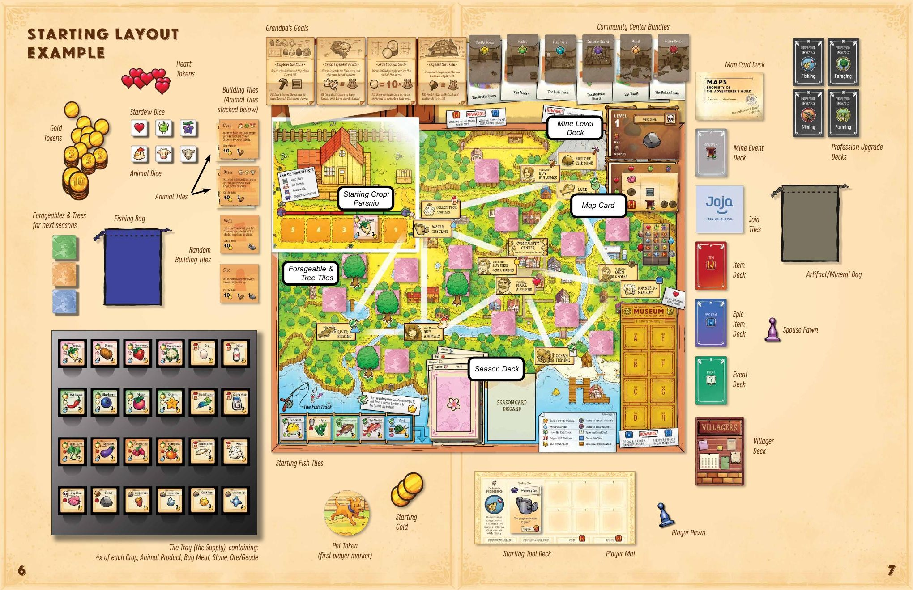

# Stardew Valley: The Board Game — คู่มือเล่นฉบับสมบูรณ์

> **Cooperative 1–4 คน** — ทุกคนชนะหรือแพ้พร้อมกัน
> สรุปจาก Official Rulebook พร้อมเกร็ดช่วยเล่น

---

## Table of Contents

- [เกมนี้คืออะไร](#เกมนี้คืออะไร)
- [ชนะและแพ้](#ชนะและแพ้)
- [Setup](#setup)
- [โครงสร้างเกมและ Turn](#โครงสร้างเกมและ-turn)
- [Phase 1 — Season Card](#phase-1--season-card)
- [Phase 2 — Planning](#phase-2--planning)
- [Phase 3 — Action Phase](#phase-3--action-phase)
- [Actions ทั้งหมด](#actions-ทั้งหมด)
- [End of Turn Effects](#end-of-turn-effects)
- [Community Center](#community-center)
- [Grandpa's Goals](#grandpas-goals)
- [Inventory](#inventory)
- [Movement และ Foraging](#movement-และ-foraging)
- [เล่นให้ Smooth](#เล่นให้-smooth)

---

## เกมนี้คืออะไร

ทุกคนเป็นชาวบ้านใน Stardew Valley ที่ต้องช่วยกันทำฟาร์ม ตกปลา ลงเหมือง และสร้างความสัมพันธ์กับคนในเมือง ทั้งหมดนี้เพื่อกู้ **Community Center** คืนจากบริษัท Joja ก่อนสิ้นปี

เกมดำเนินผ่าน **Season Cards** ที่พลิกทีละใบ แต่ละใบบอกว่าเกิดอะไรขึ้น แล้วทีมก็ตัดสินใจว่าใครจะไปทำอะไร ก่อนลงมือทีละคน เกมเป็นการแข่งกับเวลา — Season Deck มีไพ่จำกัด เมื่อหมด = หมดปี = Joja ชนะ

---

## ชนะและแพ้

**ชนะ (Honest Farmer — standard):**
ทำ **Grandpa's Goals 4 ข้อ** และกู้ **Community Center ครบ 6 ห้อง** ก่อน Season Deck หมด

**แพ้:** Season Deck หมดก่อนทำครบ

| Mode | เงื่อนไขชนะ | เหมาะสำหรับ |
|---|---|---|
| **Seedling** | Goals 4 ข้อ | เล่นครั้งแรก |
| **Honest Farmer** | Goals 4 ข้อ + Community Center 6 ห้อง | เล่นปกติ |
| **Artisan** | Goals + 6 ห้อง + ไม่มี Joja Tile เหลือ | เล่นจนชำนาญ |

---

## Setup



**1.** วางบอร์ด วาง Stardew Dice (3 ลูก), Animal Dice (3 ลูก), Spouse Pawn ไว้ข้าง
สับแล้ววางกองคว่ำ: **Villagers, Items, Epic Items, Events, Mine Events, Joja Tiles**

**2.** วาง Tile Tray ข้างบอร์ด
→ ใส่ **Artifacts & Minerals ทั้งหมด** ลงถุงเทา
→ ใส่ **Fish tiles ทั้งหมด** ลงถุงน้ำเงิน

**3.** วาง **Parsnip 1 อัน** (Spring Crop) ในช่องนา **2** — พืชเริ่มต้นของทีม

**4.** ผสม Spring Forageable tiles 11 ใบ → วางคว่ำในช่อง Foraging spot ทุกช่อง
วาง Spring Tree tiles 4 ใบในช่อง Tree spots (หงายด้าน leaf)

**5.** จั่ว Fish tiles **5 ใบ** จากถุงน้ำเงิน → วางใน Fish Track เติมจาก **ขวาไปซ้าย** เสมอ

**6.** เรียง Mine Level cards 1–12 (1 บนสุด) วางหงาย
สับ Map cards → พลิก 1 ใบวางหงายข้างๆ

**7.** สร้าง Season Deck วางคว่ำ
*(เกมแรก: ใช้ Standard Season Cards 16 ใบ แยกตาม Season สุ่มลำดับในแต่ละ Season แล้วซ้อนกัน Spring→Summer→Fall→Winter)*

**8.** แต่ละ Community Center Room (6 ห้อง):
จั่ว Bundle card **1 ใบที่ตรงกับห้องนั้น** วางคว่ำ — ยังไม่รู้ว่าต้องส่งอะไร

**9.** สับ Goal cards → พลิก **4 ใบ** วางหงายที่ Grandpa's Letter — ทั้งทีมเห็นตั้งแต่ต้น

**10.** สร้างกอง Animal tiles แยก Coop/Barn
วาง Coop Building tile บนกอง Coop, วาง Barn Building tile บนกอง Barn
สุ่ม Building tiles เพิ่มอีก **2 ใบ** วางข้างๆ

**11.** แต่ละคนเลือก **Player Mat** (Profession) → รับตัวหมาก
เลือก **Starting Tool Deck 1 ชุด** วาง Level 0 หงายบน Mat

**12.** เลือก Starting Player → รับ **Pet Token**
ทีมรับ **Gold รวมกัน 3 อัน** — *ไม่ใช่คนละ 3 ทั้งทีมมีแค่ 3 Gold ตอนเริ่ม*

**13.** จั่ว Season Card แรก ทำตามที่สั่ง → เริ่ม Planning Phase

> Stone, Gold, Heart tokens ไม่จำกัดโดย components — ถ้าหมดให้ใช้ของแทนได้เลย

---

## โครงสร้างเกมและ Turn

```
ทุก Turn ทำตามลำดับนี้เสมอ:

  ① Season Phase   → พลิก Season Card ทำตามที่สั่ง
  ② Planning Phase → ทีมคุยกัน วางหมาก แลกของ
  ③ Action Phase   → ทีละคน ลงมือทำ 2 Actions
```

**ตัวอย่าง Turn จริงๆ:**

Season Card พลิก: ฝนตก — พืชทุกต้นเลื่อนขึ้น 1 ช่อง Parsnip หลุดออกนา Starting Player รับเข้า Inventory ทันที

ทีมคุย: *"Lin ไปซื้อเมล็ดใหม่ Sam ลงเหมืองหา Ore Alex ทำเพื่อน + เปิด Bundle"*

→ Lin: ซื้อ Potato 2 ต้น ปลูกช่อง 3 และ 4 แล้วขาย Parsnip รับ Gold
→ Sam: ลงเหมือง 2 ครั้ง ได้ Iron Ore + Stone
→ Alex: เดินไป Town หยิบ Forageable ระหว่างทาง ทำเพื่อนรับ Heart แล้วไป Community Center เปิด Bundle

---

## Phase 1 — Season Card

พลิก **Season Card บนสุด** จาก Deck ทำตามสัญลักษณ์ก่อนทำ Planning:

| สัญลักษณ์ | เกิดอะไร | ระวัง |
|---|---|---|
| ☔ **Rain** | พืชทุกต้นเลื่อนขึ้น 1 ช่อง หลุดออกนา = Starting Player รับ | เช็ค Inventory ให้พอรับ |
| ⭐ **Quality Crop** | เลือกพืช 1 ต้นพลิกเป็น Quality side | เลือกตัวที่ใกล้เก็บที่สุด |
| 🐟 **Fish Move** | ทิ้ง Fish tiles **2 อันขวาสุด** เลื่อนที่เหลือไปขวา เติมใหม่จากถุง | Legendary Fish ไม่ถูกทิ้ง คืนถุงแทน |
| 🎁 **Gift** | ทุกคนเลือก Villager 1 คน ใช้ Gift Ability | ใช้ได้เฉพาะ Villager ที่เป็นเพื่อนแล้ว |
| 🏢 **Joja** | จั่ว Joja Tile วางตามที่ระบุ | บางอัน block action บางอันลดผล |
| 🦅 **Crow** | ทิ้ง Crop 1 ต้นในนาสีที่ระบุ (เขียว/แดง) | ช่องนา 3 เป็นทั้งเขียวและแดง |
| 📦 **Shipping Bin** | ทีมขายของได้ตอนนี้ | โอกาสดีขายก่อน Inventory เต็ม |
| ⚡ **Event** | Starting Player จั่ว Event Card | Event บางอันดี บางอันแย่ |

### Season End Card — จบ 1 ฤดู

เมื่อพลิกแล้วเจอ Season End Card:

1. เปลี่ยน Forageables + Trees เป็นของ Season ใหม่
2. ทุกคนจั่ว Profession Upgrade 2 ใบ ดูแล้วเก็บ 1 ใบ *(มีได้สูงสุด 2 ใบ)*
3. พลิก Season Card ถัดไปแล้วทำตามปกติ

---

## Phase 2 — Planning

ทีมคุยกันอย่างเต็มที่ ไม่จำกัดเวลา แต่ละคนวางหมากที่ตำแหน่งที่เลือก

**กฎสำคัญ:**
- แลกหรือให้ของกันได้ **ตอนนี้เท่านั้น** — ระหว่าง Action Phase ห้าม
- **Gold และ Heart tokens เป็นของทีม** วางรวมกลางโต๊ะ
- วางหมากที่ไหนก็ได้ เปลี่ยนใจหลังวางได้ แต่เปลี่ยน Location ต้องเดิน

---

## Phase 3 — Action Phase

เริ่มจาก Starting Player ทีละคน แต่ละคนทำ **2 Actions** เลือก 1 แบบ:

```
แบบ A: Action  →  Action         (ไม่ขยับ ทำที่เดิม 2 ครั้ง)
แบบ B: Action  →  เดิน 1 ช่อง  →  Action   (ทำ 2 ที่ต่างกัน)
```

ระหว่างเดิน (แบบ B เท่านั้น): หยิบ Forageable หรือ Tree tile ได้ฟรี 1 อัน

หลังจบ Actions ทั้งหมด → กลับ Farmhouse → เลือกทำ **End of Turn Effect 1 ประเภท** ซ้ำได้

> วางหมากตอน Planning Phase ≠ การเดิน — ไม่ Forage ได้

---

## Actions ทั้งหมด

### 🌾 Water Crops *(Farm)*

เลื่อน **Crop tiles ทุกต้น** ในนา 1 ช่องไปทางขวา พร้อมกันทั้งหมด
ต้นที่หลุดออกจากช่องขวาสุด = **เก็บเกี่ยวแล้ว** เข้า Inventory ทันที

**นาทำงานอย่างไร:**

```
← ปลูก                                     เก็บเกี่ยว →
[ช่อง 5][ช่อง 4][ช่อง 3][ช่อง 2][ช่อง 1][ ออก! ]
                                              ↑
                                          รดน้ำมาถึงนี่ = ได้เก็บ
```

ตัวเลขบน Crop tile = **ช่องที่ปลูก** ไม่ใช่จำนวนครั้งที่ต้องรด
- Parsnip (ปลูกช่อง 2) → รดน้ำ **2 ครั้ง** จึงเก็บได้
- Potato (ช่อง 4) → รดน้ำ **4 ครั้ง**
- Pumpkin (ช่อง 6) → รดน้ำ **6 ครั้ง** *(ใช้เวลานาน)*

**สิ่งที่ต้องรู้:**
- เลื่อนทุกต้นพร้อมกัน เลือกไม่ได้
- Inventory เต็ม → เลือกทิ้งก่อนรับของใหม่
- พืช **ไม่เหี่ยวตาย** เมื่อเปลี่ยน Season ค้างในนาได้ไม่จำกัด
- ฝน (Season Card Rain) = เลื่อนพืชฟรี ไม่ต้องใช้ Action นี้

> วางแผนก่อนปลูก: ถ้า Season ใกล้จบ (เหลือ 2–3 เทิร์น) ปลูกช่อง 2–3 เท่านั้น ช่อง 5–6 จะเก็บไม่ทัน

---

### 🐄 Collect from Animals *(Farm)*

ทอย **Animal Dice 3 ลูก** แต่ละลูกมี icon สัตว์แต่ละชนิด

**วิธีนับผลผลิต:**
แต่ละสัตว์ที่ทีมมีจะผลิต **1 อัน ต่อลูกเต๋าที่ตรงกับ icon ของมัน**

```
ตัวอย่าง: มีวัว 2 ตัว + แกะ 1 ตัว
ทอยได้: 🐄 🐄 🐑

วัว 2 ตัว × ลูกเต๋าวัว 2 ลูก = Milk 4 อัน
แกะ 1 ตัว × ลูกเต๋าแกะ 1 ลูก = Wool 1 อัน
รวมได้: Milk 4, Wool 1
```

**สัตว์ด้าน Happy → ผลผลิตเป็น Quality:**
- ปลด Happy ได้ด้วย End of Turn Effect "Pet Animals" (ทิ้ง Hearts ตาม tile)
- ของ Quality มีค่ามากกว่าสำหรับ Bundle และ Goal
- สัตว์ Happy **ยังคงผลิตซ้ำได้** ทุกเทิร์นโดยไม่ต้อง Pet อีก จนกว่าจะถูก flip กลับ

**ผลผลิตแต่ละชนิด:**

| สัตว์ | ต้องการ | ผลิตอะไร |
|---|---|---|
| Chicken | Coop | Egg |
| Duck | Coop | Duck Egg |
| Rabbit | Coop | Rabbit's Foot |
| Cow | Barn | Milk |
| Goat | Barn | Goat Milk |
| Sheep | Barn | Wool |
| Pig | Barn | Truffle |

> Dinosaur และสัตว์พิเศษอื่นๆ จะแสดงบน tile เอง

---

### 🐓 Buy Animals *(Marnie's Ranch)*

จ่าย Gold ตามราคาบน Animal Tile ดู **Animal Tiles ที่วางไว้ข้างบอร์ด**
ซื้อได้หลายตัวใน Action เดียวถ้า Gold พอ

**ต้องมี Building ก่อนเสมอ:**

| Building | สัตว์ที่ซื้อได้ |
|---|---|
| **Coop** | Chicken, Duck, Rabbit, Dinosaur |
| **Barn** | Cow, Goat, Sheep, Pig |

**แต่ละ Animal Tile แสดง:**
- ราคาที่ต้องจ่าย (Gold)
- Icon ของสัตว์ (ใช้ match กับ Animal Dice)
- Resource ที่ผลิตเมื่อ Collect
- Building ที่ต้องการ
- จำนวน Hearts ที่ต้องใช้เพื่อ flip เป็น Happy

**สิ่งที่ต้องรู้:**
- ซื้อสัตว์แล้วได้ทันที วางลง Animal Tiles ของทีมเลย
- Goal "Have 2 Animals per player" นับจำนวนสัตว์รวมของทีม
- สัตว์ไม่มีลิมิตจำนวนสูงสุด ซื้อได้เท่าที่ต้องการ (ถ้ามี Gold)

> ซื้อสัตว์ที่ผลิตของตรงกับ Bundle ที่ต้องการก่อน เช่น Fish Tank Bundle ต้องการปลา ไม่ต้องซื้อวัว

---

### 🌱 Buy & Plant Seeds *(Town — Pierre's)*

**ซื้อเมล็ด:** จ่าย 1 Gold ต่อเมล็ด → ปลูกลงช่องนาทันที
**ขายของ:** ขายสิ่งที่มีใน Inventory ได้กี่อันก็ได้ (ทำทั้งซื้อและขายใน Action เดียว)

**กฎการปลูก:**
- ปลูกได้เฉพาะ Crop ของ **Season ปัจจุบัน** — Spring Crop ปลูกได้แค่ Spring
- ตัวเลขบน Crop tile = **ช่องนาที่ต้องปลูก** ต้องใส่ให้ตรงช่อง
- 1 ช่อง = 1 Crop ห้ามซ้อน
- ช่องนาที่ว่างเท่านั้นที่ปลูกได้

**Crops แต่ละ Season:**
Crop Tiles ใน Tile Tray จัดแยกตาม Season — ดูที่หลัง tile หรือสีขอบ

**การขาย:**
ขายที่ Pierre's ได้ทุกอย่างจาก Inventory รับ Gold ตามราคาบน tile
นอกจากนี้ยังขายได้เมื่อ **Season Card แสดง Shipping Bin** *(ไม่เสีย Action)*

> ถ้า Inventory เหลือน้อยและ Season กำลังจะจบ ขายสิ่งที่ Bundle ไม่ต้องการออกก่อน เพื่อเพิ่ม Gold สำหรับ Vault Bundle

---

### 💛 Make a Friend *(Town)*

พลิก Villager Card บนสุด → ดูว่าจะให้ของหรือไม่
ถ้าให้: ได้ Heart tokens + เก็บ Villager Card ไว้เป็นเพื่อน
ถ้าไม่ให้: ทิ้ง Villager Card ไป

**อ่าน Villager Card:**
- **รูปบนไพ่** = Loved gifts (ให้ได้ +2 Hearts)
- **ข้อความ Hated** = ของที่ให้ไม่ได้
- **Birthday icon** = Season ที่เป็นวันเกิด
- **Gift Ability** = สิ่งที่เกิดเมื่อ Season Card แสดง 🎁

| ระดับ | เงื่อนไข | Hearts ที่ได้ |
|---|---|---|
| **Loved** | ของที่มีรูปบนไพ่ | 2 |
| **Liked** | ของทั่วไป (ไม่ใช่ Hated) | 1 |
| **Birthday bonus** | Season ปัจจุบันตรงกับวันเกิด | +1 เพิ่มจากข้างบน |
| **Hated** | ระบุชัดบนไพ่ | ให้ไม่ได้ |

**ของที่ให้เป็น Gift ไม่ได้เสมอ (ไม่ว่าจะเป็น Villager ใด):**
Trash, Stone, Bug Meat, ของที่มี No Gift icon บนไพ่

**Gift Ability:**
เมื่อ Season Card แสดงสัญลักษณ์ 🎁 → ทุกคนเลือก Villager 1 คนจากเพื่อนของตัวเอง ใช้ Gift Ability นั้น
ตัวอย่าง Gift Abilities: ให้ Gold 2, ให้ Item, เลื่อน Crop 1 ต้น ฯลฯ (ดูบนแต่ละ Villager Card)

**สิ่งที่ต้องรู้:**
- ทีมทำเพื่อนรวมกันได้ ไม่ต้องทุกคนมีเพื่อนครบ
- Goal "Have 3 Friends per player" นับจากจำนวน Villager Cards ทั้งทีม
- เลือกทำเพื่อนกับ Villager ที่ Gift Ability ช่วย Goal หรือ Bundle ที่กำลังต้องการ

> ถ้าพลิก Villager แล้วไม่ดีเลย (Gift Ability ไม่เป็นประโยชน์ + ต้องให้ของที่หายาก) → ทิ้งแล้วพลิกใหม่ใน Turn ถัดไปได้

---

### 🏛️ Reveal & Donate to Bundles *(Community Center)*

ทำได้ที่ Community Center Location บนบอร์ด ทำได้ 2 อย่างใน Action เดียว:

**1. เปิด Bundle (Reveal):**
ทิ้ง Heart tokens จำนวนเท่ากับจำนวนผู้เล่น → พลิก Bundle Card ของห้องนั้นหงาย
*ตอนนี้ถึงจะรู้ว่าห้องนี้ต้องบริจาคอะไร*

ถ้า Bundle ที่เปิดแล้วไม่ถูกใจ → จ่าย Hearts อีกรอบ เอา Bundle นั้นออก แทนด้วย Bundle ใหม่ของห้องเดิม
⚠️ **Progress ที่บริจาคไปแล้วจะหายไปทั้งหมด**

**2. บริจาค (Donate):**
วาง Resource จาก Inventory ลงบน Bundle Card ที่เปิดแล้ว
- บริจาคได้แม้ยังไม่ครบ ทิ้งไว้รอได้
- คนอื่นในทีมก็บริจาคเพิ่มได้ใน Turn ถัดไป
- Bundle ครบ = **นับจำนวนเท่ากับผู้เล่น** (เกม 3 คน = ต้องบริจาค 3 ครั้ง)

**เมื่อ Bundle สมบูรณ์:**
Resource ที่บริจาคไปคืนลงกองกลาง → ห้องกู้คืน → รับ Item reward ทันที
- Bundle 5 ห้องแรก = **Item Card** *(มอบให้ผู้เล่นคนใดก็ได้)*
- Bundle ห้องสุดท้าย (ห้องที่ 6) = **Epic Item Card** *(ของหายากที่สุด)*

**สิ่งที่ต้องรู้:**
- 1 ห้องมีหลาย Bundle ให้เลือก แต่ต้องทำให้ครบแค่ 1 Bundle ต่อห้อง
- เลือก Bundle ที่ง่ายกว่าสำหรับทีมก็ได้ (จ่าย Hearts เปลี่ยนได้)
- ของที่บริจาคจะค้างบน Bundle Card จนกว่าจะครบหรือถูก replace

> เปิด Bundle ก่อน ถึงจะรู้ว่าต้องหาอะไร อย่ารอสะสม Hearts เยอะค่อยเปิด — ยิ่งรู้เร็วยิ่งดี

---

### 💎 Open Geodes *(Forge — Clint's)*

ทอย **Stardew Die 1 ลูกต่อ Geode 1 อัน** ทำกี่อันก็ได้ใน Action เดียว
ดูผลจาก **Geode Chart** บนบอร์ดว่าได้อะไร

| ผลจาก Chart | ได้อะไร | สิ่งที่ต้องทำ |
|---|---|---|
| **Stone** | Stone tile 1 อัน | รับทันที |
| **Ore** | Ore ชนิดที่ระบุ | **พลิก Geode tile เป็นด้าน Ore** แทนที่จะทิ้ง — เก็บได้เลย |
| **Mineral** | Mineral tile 1 อัน | จั่วจากถุงเทา |
| **Artifact** | Artifact tile 1 อัน | จั่วจากถุงเทา |
| **Item** | Item Card 1 ใบ | จั่วจากกอง Item |

**Geode มีหลายชนิด** แต่ละชนิดให้ Ore ต่างกันเมื่อพลิก — เช็คหลัง tile ก่อนว่าชนิดนี้ให้อะไร

**Minerals และ Artifacts ใช้ทำอะไร:**
- บริจาค Museum ที่ Gunther's → ได้ Heart tokens
- บาง Bundle ต้องการ Mineral หรือ Artifact
- Goal "Donate 2 items to Museum" นับ Mineral + Artifact

> เปิด Geodes ทั้งหมดที่มีก่อน แล้วค่อยเดิน A → B ไปบริจาค Museum ได้เลยในเทิร์นเดียว

---

### 🏺 Donate to Museum *(Forge — Gunther's)*

บริจาค Artifact หรือ Mineral จาก Inventory ลง Museum บนบอร์ด
บริจาคกี่ใบก็ได้ใน Action เดียว ได้ **1 Heart ต่อใบที่บริจาค**

**กฎการวาง tile:**
- ดูตัวอักษร **A–H** บนด้านซ้ายของ tile → วางลง slot ที่ตรงกันเท่านั้น
- slot ละ 1 tile ห้ามซ้อน
- Tile ที่มี **"?"** → วางลง slot ว่างช่องไหนก็ได้

**Museum มี 8 slots แบ่งเป็น 2 คอลัมน์:**

```
คอลัมน์ซ้าย: A B C D     คอลัมน์ขวา: E F G H
เติมครบ 4 ใบ = Epic Item  เติมครบ 4 ใบ = Epic Item
```

Epic Item เป็นของที่ทรงพลังที่สุดในเกม ถือได้ไม่จำกัด และส่งต่อกันได้

**แผนที่ดี:**
เปิด Geodes ให้ได้ Mineral/Artifact แล้วบริจาคทันทีใน Action ถัดไป (แบบ A+A ที่ Forge)
ไม่ต้องแบกกลับไปค้างใน Inventory

> Goal "Donate 2 items to Museum per player" นับจากจำนวนที่บริจาคจริง ไม่ใช่จำนวน slot ที่เติม

---

### 🔨 Buy Buildings *(Mountain — Robin's)*

จ่าย **Wood + Stone + Gold** ตามที่ระบุบน Building Tile แต่ละชิ้น
ดู Building Tiles ที่วางอยู่ข้างบอร์ดว่ามีอะไรและต้องจ่ายเท่าไร

**Buildings หลักที่ต้องสร้าง:**

| Building | เปิดให้ทำอะไร |
|---|---|
| **Coop** | เลี้ยงสัตว์เล็กได้: Chicken, Duck, Rabbit, Dinosaur |
| **Barn** | เลี้ยงสัตว์ใหญ่ได้: Cow, Goat, Sheep, Pig |

**Buildings อื่นๆ (สุ่ม 2 ใบตอน Setup):**
แต่ละเกมจะมี Building tiles สุ่มมา 2 อันเพิ่ม ดูที่วางไว้ข้างบอร์ด บางอันให้ bonus พิเศษ

**สิ่งที่ต้องรู้:**
- Building ต้องสร้างก่อนถึงจะ Buy Animals ชนิดนั้นได้
- Goal "Build 1 Building per player" นับ Coop และ Barn ด้วย
- Wood ได้จาก Tree tiles (Forage ระหว่างเดิน)
- Stone ได้จากเหมือง

> ถ้า Goal ต้องการสัตว์ ให้สร้าง Coop/Barn เป็นอันดับแรกที่ Mountain ก่อนที่อื่น — สัตว์ให้ทั้ง Resources + Progress Goals

---

### ⛏️ Explore the Mine *(Mountain)*

ทอย **Stardew Dice 2 ลูก** → เลือกเองว่าลูกไหนเป็น **แถว (row)** และลูกไหนเป็น **คอลัมน์ (column)**
ดูผลที่ตำแหน่ง row+column ตัดกันบน **Map Card ปัจจุบัน**

**วิธีอ่าน Map Card:**
Map Card เป็นตาราง icon สัญลักษณ์ต่างๆ แต่ละช่องคือผลที่ได้จากการทอย
เลือก combination ที่ให้ผลดีที่สุดสำหรับตอนนั้น

| ผลที่ได้ | ทำอะไร | รายละเอียด |
|---|---|---|
| **Stone** | รับ Stone tile | บางช่องให้ 2 อัน |
| **Bug Meat** | รับ Bug Meat tile | ใช้สำหรับ Crab Pot Fishing |
| **Ore** | รับ Ore ตาม Mine Level | ดู Mine Level Card ปัจจุบันว่าชั้นนี้มี Ore อะไร |
| **Geode** | รับ Geode ตาม Mine Level | เหมือน Ore ดู Mine Level Card |
| **Staircase** | **ลงชั้นถัดไป** | เปิด Mine Level Card ใหม่ + สับ Map Card ใหม่ |
| **Item** | รับ Item Card | จั่วจากกอง Item |
| **Monster** | รับผลกรรม | ดู Monster Ability บน Mine Level Card ปัจจุบัน |
| **Mine Event** | จั่ว Mine Event Card | ทำตามที่สั่ง |

**Mine Level Cards — ระบบชั้นเหมือง:**

```
Level  1–3  → ได้ Copper Ore, Geode ธรรมดา
Level  4–7  → ได้ Iron Ore, Frozen Geode
Level  8–10 → ได้ Gold Ore, Magma Geode
Level 11–12 → ได้ Iridium Ore, Omni Geode
```

*ยิ่งลึกยิ่งได้ Ore และ Geode ที่มีค่ากว่า แต่ Monster แรงขึ้น*
*ลงถึง Level 12 = Goal "Reach bottom of Mine" สำเร็จ*

**วิธีลงชั้น:**
1. **ทอยได้ Staircase** บน Map Card → ลงทันที
2. **End of Turn Effect "Build Staircase"** → ทิ้ง Stone จำนวนเท่ากับผู้เล่น ลงได้โดยไม่ต้องทอย

> กลยุทธ์เหมือง: สะสม Stone จาก Action ปกติ แล้ว Staircase ทุกคืนเพื่อลงชั้น — ประหยัด Action ได้มาก แต่ต้องให้คนหนึ่งในทีมรับผิดชอบขุด Stone สม่ำเสมอ

---

### 🎣 Go Fishing *(River / Ocean / Lake)*

ทอย **Stardew Dice 3 ลูก** แต่ละลูกให้ 1 สัญลักษณ์: **Heart ♥ / Junimo 🌀 / Stardrop ⭐**

**Fish Track** มีปลา 5 ช่อง วางจากขวาไปซ้าย แต่ละ tile แสดงสัญลักษณ์ที่ต้องการ
ปลาที่จับได้ต้องอยู่ใน **Location เดียวกับที่คุณยืน** (สีของ tile ตรงกับ Location)

**วิธีจับปลา:**
```
ทอยได้: ♥ ♥ 🌀

Fish A ต้องการ ♥♥  → ใช้ลูกที่ 1+2 จับได้ Fish A
Fish B ต้องการ 🌀   → ใช้ลูกที่ 3 จับได้ Fish B
→ จับได้ 2 ตัวในทีเดียว
```
*ลูกเต๋า 1 ลูก ใช้กับปลา 1 ตัวเท่านั้น ห้ามแบ่ง*

**ชนิดพิเศษ:**

| ชนิด | วิธีได้ | สิ่งที่ต้องรู้ |
|---|---|---|
| **Legendary Fish** | ทอยเหมือนปกติ | ไม่ถูกทิ้งจาก Fish Move — คืนถุงแทน / ขาย-บริจาค-ให้ Gift = ทิ้งปกติ |
| **Crab Pot Fish** | ทิ้ง Bug Meat 1 = ได้ 1 ตัว (ไม่ต้องทอย) | ทำได้พร้อมกันกับการทอยจับปลาปกติ |
| **Trash** | ถ้าจับปลาไม่ได้เลย | หยิบได้ 1 อัน — ทิ้งได้ตลอดเวลา ไม่มีค่า แต่เคลียร์ช่องใน Fish Track |
| **Treasure Chest** | จับปลาที่อยู่ **ติดซ้าย** ของ Chest tile | ทิ้ง Chest tile รับ Item Card ทันที |

**หลัง Action จบ:** เลื่อน tile ที่เหลือไปขวา เติมช่องว่างจากถุงน้ำเงิน

**Location แต่ละที่จับปลาได้ต่างกัน:**
- **River** (ฟาร์ม) — ปลาน้ำจืด สีน้ำตาล
- **Ocean** (ทางใต้) — ปลาทะเล สีน้ำเงิน
- **Lake** (ภูเขา) — ปลาทะเลสาบ สีเขียว

> Goal "Catch Legendary Fish" — จับแล้วนับทันที ไม่ต้องเก็บไว้ในเกม
> Bug Meat จากเหมืองมีประโยชน์มากสำหรับ Crab Pot — อย่าทิ้งทันทีถ้ามี Fishing Goal

---

## End of Turn Effects

กลับ Farmhouse เลือก **1 ประเภท** ทำได้ไม่จำกัดครั้ง (ทำซ้ำประเภทเดิมหลายรอบได้):

---

### 🪜 Build Staircase

**วิธีทำ:** ทิ้ง Stone จำนวนเท่ากับจำนวนผู้เล่น → ลง Mine 1 ชั้น
เปิด Mine Level Card ใหม่ + สับ Map Card ใหม่

**ทำซ้ำได้:** ถ้ามี Stone พอ ลงได้หลายชั้นในคืนเดียว

**ทำไมใช้:** ลงเหมืองโดยไม่เสีย Action ในเช้าวันถัดไป เร็วกว่าการทอยหา Staircase บน Map Card มาก

> ถ้า Goal ต้องลงถึง Level 12 ให้กำหนดให้คนหนึ่งในทีมขุด Stone สม่ำเสมอ แล้ว Staircase ทุกคืน

---

### 🐾 Pet Animals

**วิธีทำ:** ทิ้ง Heart tokens ตามจำนวนที่ระบุบน Animal Tile → พลิกสัตว์ตัวนั้นเป็นด้าน **Happy**

จำนวน Hearts ต้องการต่างกันแต่ละสัตว์ — ดูบน tile

**ผล Happy:** สัตว์ที่ Happy ให้ผลผลิต **Quality** เมื่อ Collect from Animals
ของ Quality มีค่ามากกว่าปกติสำหรับขาย Bundle และ Goal บางอัน

**ทำซ้ำได้:** Pet สัตว์หลายตัวได้ในคืนเดียว ถ้า Hearts พอ

---

### 🏭 Remove Joja

**วิธีทำ:** ทิ้ง **Heart 1 อัน หรือ Gold 5** → ลบ Joja Tile ออกจาก Location ใดก็ได้

Joja Tiles เมื่อวางแล้วจะบล็อกหรือลด Action ของ Location นั้น
ถ้า Joja บล็อก Location ที่ทีมใช้บ่อย ควร Remove ออกก่อน

**จำเป็นใน Artisan mode:** ต้อง Remove Joja ทั้งหมดก่อนชนะได้

> Heart ถูกกว่า (1) แต่ Heart มีค่าอื่นด้วย (เปิด Bundle) ถ้า Heart สำรองพอให้ใช้ Heart แทน Gold

---

### 🔧 Upgrade Starting Tool

**วิธีทำ:** ทิ้ง Resource ตามที่ระบุบน Tool Card Level ปัจจุบัน → พลิกขึ้น Level ถัดไป

Starting Tool เริ่มที่ **Level 0** แต่ละ Level ให้ความสามารถเพิ่มขึ้น
เช่น Watering Can Level สูงกว่า = รดน้ำได้หลายต้นพร้อมกัน, Pickaxe = ลงเหมืองได้ผลดีกว่า

**สิ่งที่ต้องรู้:**
- Upgrade ได้ทีละ Level เท่านั้น ข้ามไม่ได้
- Resource ที่ต้องการต่างกันแต่ละ Tool และแต่ละ Level ดูบน Tool Card
- Goal "Upgrade Starting Tool 2 times per player" ทุกคนต้อง Upgrade ของตัวเอง ไม่แชร์กัน

> Upgrade Tool ควรทำตั้งแต่ต้นเกม ยิ่ง Level สูง Tool ยิ่งช่วยได้มากในช่วงปลายเกม

---

## Community Center

หนึ่งในสองเงื่อนไขชนะหลัก ต้องกู้คืน **ครบทั้ง 6 ห้อง** ก่อน Season Deck หมด

**Flow โดยรวม:**
```
Bundle ทุกห้องเริ่มต้นคว่ำ (ไม่รู้ว่าต้องส่งอะไร)
    ↓
ไปที่ Community Center → ทิ้ง Hearts = จำนวนผู้เล่น → เปิด Bundle
    ↓
เริ่มหาของ + บริจาคสะสม (คนอื่นช่วยบริจาคได้)
    ↓
บริจาคครบ = ห้องกู้คืน รับ Item reward แล้วกู้ห้องถัดไป
```

**6 ห้องและสิ่งที่ต้องการ:**

| ห้อง | ต้องการอะไร | หาจาก | เกร็ด |
|---|---|---|---|
| **Crafts Room** | Forageables ตาม Season หรือวัสดุ (Wood, Stone) | Foraging + เหมือง | Forageables เปลี่ยนตาม Season — หาได้ตั้งแต่ต้น |
| **Pantry** | Crops หรือ Animal Products | ฟาร์ม + Ranch | ต้องการของหลายชนิด ทำฟาร์มให้หลากหลาย |
| **Fish Tank** | ปลาหลายชนิดจาก Location ต่างกัน | River, Ocean, Lake | **Legendary Fish ใช้ได้กับห้องนี้** ทุก Fishing Bundle |
| **Bulletin Board** | Resource + Heart Tokens **รวมกัน** ต่อ donation | ทำเพื่อน + หาของ | ต้องการทั้งสองอย่างพร้อมกันในแต่ละ donation |
| **Vault** | Gold จำนวนมาก | ขายของทุกเทิร์น | ราคาคูณด้วยจำนวนผู้เล่น — วางแผนขายตั้งแต่ต้น |
| **Boiler Room** | Ore, Mineral, Bug Meat | เหมืองทั้งหมด | ลงเหมืองสม่ำเสมอ เปิด Geode ให้ได้ Mineral |

**กลยุทธ์ Community Center:**
- เปิด Bundle **อย่างน้อย 3 ห้องก่อนปิด Season 1** — รู้เป้าหมายเร็วยิ่งดี
- จงใจให้ **Vault** หรือ **Bulletin Board** เป็นห้องสุดท้าย เพราะใช้เวลานาน
- Bundle ห้องสุดท้ายที่กู้ = **Epic Item** — เลือกห้องที่เหมาะกับทีมที่สุด
- ช่วยกันบริจาคได้ ทุกคนไปที่ CC แล้วบริจาคต่อจากที่คนอื่นทำไว้

> ถ้าเปิด Bundle แล้วต้องการของที่หายากมากๆ (เช่น Fish หายาก หรือ Iridium Ore) พิจารณาจ่าย Hearts เปลี่ยนเป็น Bundle อื่นของห้องนั้นแทน

---

## Grandpa's Goals

สุ่ม **4 ใบจาก 8 ใบ** ตอน Setup วางหงายให้ทีมเห็นตั้งแต่ต้น ต้องทำครบทั้ง 4 ข้อ

**"× ผู้เล่น" หมายถึงอะไร:**
ทุก Goal ที่มีตัวเลขคูณด้วยจำนวนผู้เล่น — เช่น เกม 3 คน + Goal Gold = ต้องมี Gold **30 อัน** รวมกันทั้งทีม

| Goal | ต้องทำอะไร (เกม 3 คน) | วิธีทำ | ทำทับกับอะไรได้บ้าง |
|---|---|---|---|
| **Gold** | Gold รวม **30** | ขาย Crops, Animal Products ทุกเทิร์น | Vault Bundle |
| **Mine** | ลงถึง **Level 12** | Build Staircase ทุกคืน + Action ลงเหมือง | Boiler Room Bundle (ได้ Ore ระหว่างทาง) |
| **Museum** | บริจาค **6 tile** | เปิด Geode แล้ว Donate ในทริปเดียว | Boiler Room Bundle (Mineral) |
| **Animals** | มีสัตว์ **6 ตัว** | สร้าง Coop + Barn ก่อน แล้วซื้อ | Pantry Bundle (Animal Products) |
| **Friends** | มีเพื่อน **9 คน** รวมทีม | ทำเพื่อนทุกครั้งที่แวะ Town | Bulletin Board Bundle (ต้องการ Hearts) |
| **Legendary Fish** | จับ **3 ตัว** รวมทีม | ตกปลาปกติ เจอเองตามธรรมชาติ | Fish Tank Bundle |
| **Buildings** | สร้าง **3 อัน** รวมทีม | Coop + Barn + อีก 1 | — |
| **Tool Upgrade** | Upgrade **6 ครั้ง** รวมทีม | ทุกคนต้อง Upgrade ของตัวเอง 2 ครั้ง | — |

**กลยุทธ์:**
Goals ส่วนใหญ่ทับซ้อนกับ Community Center Bundle อยู่แล้ว
วางแผนให้กิจกรรมเดียวกันช่วยทั้ง Goal และ Bundle พร้อมกัน — จะประหยัด Turn มาก

> จดหรือประกาศชัดๆ ว่า Goal แต่ละข้อต้องการเท่าไร (คูณจำนวนผู้เล่นแล้ว) ก่อนเริ่มเกม จะได้วางแผนได้ถูก

---

## Inventory

แต่ละคนมี Inventory ของตัวเอง แต่ **Gold และ Hearts เป็นของทีมวางกลางโต๊ะ**

| สิ่งที่ถือ | ถือได้สูงสุด | ประเภทของ |
|---|---|---|
| **Resources** | **6 อัน** | Crop, Forageable, Fish, Animal Product, Ore, Geode, Artifact, Mineral |
| **Items** | **2 อัน** | ได้จาก Event, Mine, Geode, Bundle reward ฯลฯ |
| **Epic Items** | **ไม่จำกัด** | หายากและทรงพลัง |
| **Profession Upgrades** | **2 ใบ** | รับ 1 ใบต่อ Season End |
| **Villager cards** | **ไม่จำกัด** | Villager ที่เป็นเพื่อน |

**ของทีม (ไม่มีลิมิต, วางกลางโต๊ะ):** Gold, Heart tokens, Stone, Bug Meat

**Resources 8 ชนิด:**

| ประเภท | ตัวอย่าง | หาได้จาก |
|---|---|---|
| Crop | Parsnip, Potato, Pumpkin | ปลูก + รดน้ำ |
| Forageable | Spring Onion, Daffodil ฯลฯ | Foraging ระหว่างเดิน |
| Fish | Carp, Catfish, Legendary Fish | Fishing |
| Animal Product | Egg, Milk, Wool, Truffle | Collect from Animals |
| Ore | Copper, Iron, Gold, Iridium | เหมือง |
| Geode | Geode, Frozen Geode ฯลฯ | เหมือง |
| Artifact | Ancient Seed, Chub ฯลฯ | จากถุงเทา |
| Mineral | Quartz, Earth Crystal ฯลฯ | จากถุงเทา |

**กฎ Inventory เต็ม:**
เมื่อได้ Resource แต่ถือครบ 6 แล้ว → ต้องเลือกทิ้งบางอัน **ก่อน** รับของใหม่
ของที่ทิ้งได้ตลอดเวลาโดยไม่ต้องรอ: Trash, Stone, Bug Meat
ทิ้ง Item ได้ แต่จะ**ไม่ได้ใช้ Discard ability** ของ Item นั้น

**Items vs Epic Items:**
- **Items** = ของมีประโยชน์ทั่วไป ถือได้แค่ 2 ใบ ถ้าได้ใบที่ 3 ต้องทิ้ง 1
- **Epic Items** = ของพิเศษหายาก ถือได้ไม่จำกัด ส่งต่อกันได้ระหว่าง Planning Phase

> เมื่อ Inventory เต็มก่อนจะทำ Action ต้องเลือกทิ้งก่อน — คุยกับทีมว่าจะทิ้งอะไร อย่าทิ้ง Resource ที่ Bundle ต้องการ

---

## Movement และ Foraging

ระหว่างเดิน 1 ช่อง (เฉพาะ **แบบ B**): หยิบ tile คว่ำ **1 อัน ฟรี** จาก Foraging/Tree spot ที่ติดกับ Path

- หยิบ **Forageable หรือ Tree tile** อย่างใดอย่างหนึ่ง ไม่ใช่ทั้งคู่
- ไม่บังคับ
- บาง tile ติดได้หลาย Path หยิบจาก Path ไหนก็ได้

**พลิก tile ดู:**
- Forageable / Wood → เก็บเข้า Inventory
- **Artifact/Mineral icon มุมล่างขวา** → ทิ้ง tile นั้น จั่วจากถุงเทาแทน

---

## เล่นให้ Smooth

**เรื่องที่คนมักเข้าใจผิด:**

🔸 **Gold + Hearts เป็นของทีม** ไม่มีกระเป๋าส่วนตัว วางรวมกลางโต๊ะ

🔸 **เริ่มต้นมีแค่ Gold 3 อัน ทั้งทีม** ไม่ใช่คนละ 3

🔸 **Crops ไม่เหี่ยว** เมื่อเปลี่ยน Season ค้างในนาได้ตลอด

🔸 **Pet Token เคลื่อนที่เฉพาะเมื่อ Season Card สั่ง** ไม่ได้เดินเองทุก Turn

🔸 **"Catch Legendary Fish"** จับแล้วนับ ไม่ต้องเก็บไว้

🔸 **"Make Friends"** รวมทั้งทีม ไม่ต้องทุกคนมีเพื่อนครบ

🔸 **Stone, Gold, Heart tokens ไม่จำกัด** ถ้า component หมด ใช้ของแทนได้

---

**กลยุทธ์:**

🔹 **เปิด Bundle ก่อน** อย่ารอสะสม Heart เยอะค่อยเปิด ต้องรู้เป้าหมายก่อนถึงจะหาได้ถูก ควรเปิดอย่างน้อย 3 ห้องก่อนปิด Season 1

🔹 **Shipping Bin บน Season Card** คือโอกาสขายของโดยไม่เสีย Action ถ้า Inventory กำลังจะเต็มอย่าพลาด

🔹 **Build Staircase ทรงพลังมาก** ถ้า Goal ต้องลงถึง Level 12 ให้คนหนึ่งขุด Stone สม่ำเสมอ แล้ว Staircase ทุกคืน ไม่ต้องเสีย Action ลงเหมืองเลย

🔹 **Legendary Fish หาเจอเองระหว่างตกปลา** ไม่ต้องไปหาโดยเฉพาะ ตกปลาปกติแล้วเจอไปเอง

🔹 **Profession Upgrade อ่านให้ครบก่อนเลือก** เลือกอันที่ช่วย Goal หรือ Bundle ที่ยังขาดอยู่มากที่สุด

🔹 **แบ่ง Roles ตั้งแต่ต้น** คนหนึ่งดูแล Farm คนหนึ่งลงเหมือง คนหนึ่งทำเพื่อน/Community Center ถ้าทุกคนทำอย่างเดียวกันจะเสียเวลามาก

---

**Checklist เทิร์นแรกๆ:**

```
Turn 1–3:
  ✓ รดน้ำ Parsnip ให้เก็บได้เร็ว
  ✓ ซื้อเมล็ดอย่างน้อย 2–3 ต้น
  ✓ เริ่มลงเหมืองหา Stone + Ore

Turn 4–6:
  ✓ เปิด Bundle อย่างน้อย 2–3 ห้อง
  ✓ เริ่มสร้าง Coop หรือ Barn ถ้า Goal ต้องการสัตว์
  ✓ ตกปลา + สะสม Bug Meat สำหรับ Crab Pot

กลาง Season 2:
  ✓ Bundle ครบอย่างน้อย 3 ห้อง
  ✓ ลงถึง Mine Level 5+
  ✓ มีเพื่อนรวมกันอย่างน้อย 3–4 คน
```
