# Stardew Valley: The Board Game — คู่มือเล่นสำหรับมือใหม่

> **Cooperative 1–4 คน** — ทุกคนชนะหรือแพ้พร้อมกัน

---

## Table of Contents

- [เกมนี้คืออะไร](#เกมนี้คืออะไร)
- [ชนะและแพ้ยังไง](#ชนะและแพ้ยังไง)
- [รู้จักของในเกมก่อน](#รู้จักของในเกมก่อน)
- [Setup — ตั้งเกม](#setup--ตั้งเกม)
- [1 Turn มีอะไรบ้าง](#1-turn-มีอะไรบ้าง)
- [Phase 1 — Season Card](#phase-1--season-card)
- [Phase 2 — Planning](#phase-2--planning)
- [Phase 3 — Actions](#phase-3--actions)
- [Farm — ทำฟาร์ม](#farm--ทำฟาร์ม)
- [Town — ในเมือง](#town--ในเมือง)
- [Ranch — เลี้ยงสัตว์](#ranch--เลี้ยงสัตว์)
- [Mountain — ภูเขา](#mountain--ภูเขา)
- [Forge — ตีเหล็ก/พิพิธภัณฑ์](#forge--ตีเหล็กพิพิธภัณฑ์)
- [Fishing — ตกปลา](#fishing--ตกปลา)
- [End of Turn Effects](#end-of-turn-effects)
- [Community Center](#community-center)
- [Grandpa's Goals](#grandpas-goals)
- [Inventory และของในเกม](#inventory-และของในเกม)
- [เกร็ดช่วยเล่น](#เกร็ดช่วยเล่น)

---

## เกมนี้คืออะไร

ทุกคนช่วยกันทำฟาร์ม หาปลา ลงเหมือง และสร้างมิตรภาพกับชาวบ้าน เพื่อกู้ **Community Center** คืนจากบริษัท Joja ก่อนหมดปี (Season Deck หมด)


---

## ชนะและแพ้ยังไง

**ชนะ** เมื่อทำสองสิ่งนี้ครบก่อน Season Deck หมด:
1. **Grandpa's Goals 4 ข้อ** — เป้าหมายสุ่มตอนเริ่มเกม
2. **Community Center 6 ห้อง** — กู้ทุกห้องโดยส่งของให้ครบ

**แพ้** เมื่อ Season Deck หมดก่อนทำครบ → Joja ชนะ

| Mode | ชนะเมื่อ |
|---|---|
| **Seedling** (ง่าย) | Goals 4 ข้อ เท่านั้น |
| **Honest Farmer** (ปกติ) | Goals 4 ข้อ + Community Center 6 ห้อง |
| **Artisan** (ยาก) | Goals + 6 ห้อง + ไม่มี Joja Tile เหลือ |

---

## รู้จักของในเกมก่อน

ก่อนอ่านกฎ ต้องเข้าใจว่า "ของ" ในเกมมีอะไรบ้าง เพราะจะเจอตลอด

### ของที่เก็บเข้า Inventory ได้

แต่ละคนถือ **Resources ได้สูงสุด 6 อัน** ในคราวเดียว

| ประเภท | ตัวอย่าง | หาได้จาก |
|---|---|---|
| 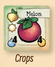 **Crops** | Parsnip, Potato | ปลูกในนา |
| 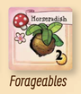 **Forageables** | Horseradish, Daffodil | เก็บระหว่างเดิน |
| 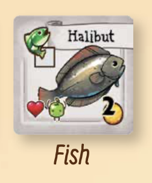 **Fish** | Halibut, Catfish | ตกปลา |
| 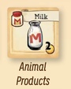 **Animal Products** | Milk, Egg | เลี้ยงสัตว์ |
| 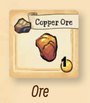 **Ore** | Copper, Iron | เหมือง |
| 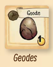 **Geodes** | Geode ชนิดต่างๆ | เหมือง |
| 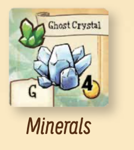 **Minerals** | Ghost Crystal | เปิด Geode |
| 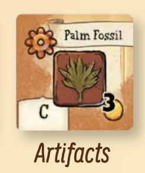 **Artifacts** | Palm Fossil | เปิด Geode |

### ของที่ไม่นับรวมใน 6 ช่อง (ถือแยก)

| ประเภท | ตัวอย่าง | ถือได้ |
|---|---|---|
| **Items** | Sword, Boots | สูงสุด 2 ใบ |
| **Epic Items** | Mermaid's Pendant | ไม่จำกัด |
| **Villager Cards** | Penny, Haley | ไม่จำกัด |
| **Profession Upgrades** | Speed Bonito | สูงสุด 2 ใบ |

### ของที่ไม่นับว่าเป็น Resource (ทิ้งได้ตลอด)

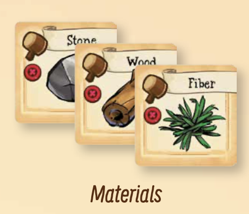 **Materials** (Stone, Wood, Fiber) — ใช้สร้าง Building เท่านั้น

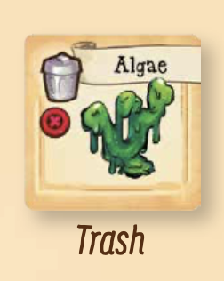 **Trash** — ไม่มีประโยชน์ ทิ้งเมื่อไรก็ได้

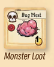 **Monster Loot / Bug Meat** — ใช้จับ Crab Pot Fish

### ของที่เป็นของทีม — วางกลางโต๊ะ

- **Gold** — ทุกคนใช้ร่วมกัน ไม่ใช่ของส่วนตัว
- **Heart Tokens** — ทุกคนใช้ร่วมกัน

---

## Setup — ตั้งเกม

**1.** วางบอร์ด วาง Stardew Dice (3 ลูก), Animal Dice (3 ลูก), Spouse Pawn ไว้ข้าง
สับแล้ววางกองคว่ำ: Villagers, Items, Epic Items, Events, Mine Events, Joja Tiles

**2.** วาง Tile Tray ข้างบอร์ด
ใส่ Artifacts & Minerals ทั้งหมดลงถุงเทา — Fish tiles ทั้งหมดลงถุงน้ำเงิน

**3.** วาง Parsnip 1 อันในช่องนา 2 — นี่คือพืชแรกของทีม

**4.** ผสม Spring Forageable tiles 11 ใบ → วางคว่ำในช่อง Foraging ทุกช่อง
วาง Spring Tree tiles 4 ใบในช่อง Tree spots

**5.** จั่ว Fish tiles 5 ใบจากถุงน้ำเงิน → วางใน Fish Track เติมจากขวาไปซ้าย

**6.** เรียง Mine Level cards 1–12 (1 บนสุด) วางหงาย
สับ Map cards → พลิก 1 ใบวางหงายข้าง

**7.** สร้าง Season Deck → วางคว่ำ
*(เกมแรก: ใช้ Standard Season Cards 16 ใบ แยกตาม Season สุ่มลำดับในแต่ละ Season)*

**8.** ทั้ง 6 Community Center Room: จั่ว Bundle card 1 ใบที่ตรงกับห้อง วางคว่ำ

**9.** สับ Goal cards → พลิก 4 ใบวางหงายที่ Grandpa's Letter

**10.** สร้างกอง Animal Tiles แยก Coop/Barn พร้อม Building Tiles

**11.** แต่ละคนเลือก Player Mat + Starting Tool Deck (Watering Can / Hoe / Fishing Rod / Pickaxe)

**12.** เลือก Starting Player → รับ Pet Token
ทีมรับ **Gold รวมกัน 3 อัน** (ไม่ใช่คนละ 3)

**13.** จั่ว Season Card แรก ทำตาม → เริ่มเกม

---

## 1 Turn มีอะไรบ้าง

ทุก Turn ทำตามลำดับนี้เสมอ:

```
① Season Phase   พลิก Season Card 1 ใบ ทำตาม
② Planning Phase  ทีมคุยกัน วางหมาก แลกของ
③ Action Phase    ทีละคน ทำ 2 Actions
```

**Action Phase แต่ละคนเลือก 1 แบบ:**

```
แบบ A: ทำ Action ที่นี่ → ทำ Action ที่นี่ (ไม่ขยับ 2 Actions)
แบบ B: ทำ Action → เดิน 1 ช่อง → ทำ Action (ไปได้ 2 ที่)
```

> ระหว่างเดิน (แบบ B เท่านั้น) หยิบ 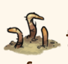 Forageable หรือ Tree tile ฟรี 1 อัน

จบ Actions ทั้งหมด → กลับ Farmhouse → ทำ **End of Turn Effect ได้ 1 ประเภท**

---

## Phase 1 — Season Card

พลิก Season Card บนสุด ทำตามสัญลักษณ์ที่ขึ้นมา:

| สัญลักษณ์ | ความหมาย | ผล |
|---|---|---|
| 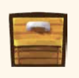 **Shipping Bin** | กล่องขนส่ง | ทีมขายของได้โดยไม่เสีย Action |
| 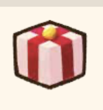 **Gift** | กล่องของขวัญ | ทุกคนใช้ Gift Ability ของ Villager เพื่อนตัวเอง |
| 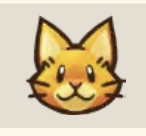 **Pet Wanders** | หน้าแมว/หมา | Starting Player ส่ง Pet Token ไปคนถัดไป |
| 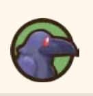 **Green Crow** | กาสีเขียว | ทิ้ง Crop 1 ต้นในนาสีเขียว |
|  **Red Crow** | กาสีแดง | ทิ้ง Crop 1 ต้นในนาสีแดง |
|  **Event** | ฟองคำถาม | Starting Player จั่ว Event Card |
| 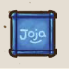 **Joja** | กล่อง Joja | จั่ว Joja Tile วางบน Location |
| ☔ **Rain** | ฝน | พืชทุกต้นเลื่อนขึ้น 1 ช่อง |
| ⭐ **Quality** | ดาว | พืช 1 ต้นกลายเป็น Quality |
| 🐟 **Fish Move** | ปลาเคลื่อน | ทิ้ง Fish 2 อันขวาสุด เติมใหม่จากถุง |

### Season End Card

เมื่อพลิกแล้วเจอ Season End Card:
1. เปลี่ยน Forageables + Trees เป็นของ Season ใหม่
2. ทุกคนจั่ว Profession Upgrade 2 ใบ เก็บ 1 (มีได้สูงสุด 2 ใบ)
3. พลิก Season Card ถัดไปแล้วเล่นต่อ

---

## Phase 2 — Planning

ทีมคุยกันได้เต็มที่ ไม่จำกัดเวลา แต่ละคนวางหมากที่ตำแหน่งที่เลือก

**สำคัญมาก:**
- แลกหรือให้ของกัน **ตอนนี้เท่านั้น** — ระหว่าง Action Phase ห้าม
- **Gold + Hearts = ของทีม** วางกลางโต๊ะ ทุกคนใช้ได้

---

## Phase 3 — Actions

ทีละคนจาก Starting Player ทำ 2 Actions

ตำแหน่งบนบอร์ดแบ่งตาม Location:
- **Farm** — รดน้ำพืช, เก็บของจากสัตว์
- **Town** — ซื้อเมล็ด ขายของ ทำเพื่อน กู้ Community Center
- **Ranch** — ซื้อสัตว์
- **Mountain** — ลงเหมือง สร้าง Building
- **Forge** — เปิด Geode บริจาค Museum
- **River / Ocean / Lake** — ตกปลา

---

## Farm — ทำฟาร์ม

### 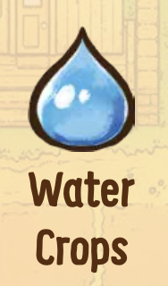 Water Crops

เลื่อน Crop tiles **ทุกต้น** 1 ช่องไปขวา — ต้นที่หลุดออก = เก็บเกี่ยวแล้ว

**นาทำงานอย่างไร:**
```
ปลูก                                              เก็บ
[ช่อง 5][ช่อง 4][ช่อง 3][ช่อง 2][ช่อง 1] → ออก!
```

ตัวเลขบน Crop tile = **ช่องที่ต้องปลูก = จำนวนครั้งที่ต้องรดก่อนเก็บ**
- Parsnip (ช่อง 2) → รดน้ำ **2 ครั้ง** จึงเก็บได้
- Pumpkin (ช่อง 6) → รดน้ำ **6 ครั้ง** (ช้ามาก)

**กฎสำคัญ:**
- เลื่อนทุกต้นพร้อมกัน เลือกไม่ได้
- พืชไม่เหี่ยวตายเมื่อเปลี่ยน Season
- ฝน (Season Card) เลื่อนพืชฟรี ไม่ต้องเสีย Action นี้

---

### 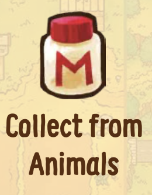 Collect from Animals

ทอย Animal Dice 3 ลูก — แต่ละสัตว์ผลิต 1 อันต่อลูกที่ตรงกับ icon

**ตัวอย่าง:**
มีวัว 2 ตัว ทอยได้ icon วัว 1 ลูก → ได้ Milk **2 อัน**
มีวัว 2 ตัว ทอยได้ icon วัว 2 ลูก → ได้ Milk **4 อัน**


สัตว์ด้าน **Happy** → ผลผลิตเป็น **Quality** (ขายได้ราคาสูงกว่า)
ทำให้ Happy ได้โดยใช้ End of Turn Effect "Pet Animals"

| สัตว์ | ต้องการ | ผลิต |
|---|---|---|
| Chicken, Duck, Rabbit | Coop | Egg, Duck Egg, Rabbit's Foot |
| Cow, Goat | Barn | Milk, Goat Milk |
| Sheep | Barn | Wool |
| Pig | Barn | Truffle |

---

## Town — ในเมือง

### 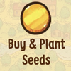 Buy & Plant Seeds *(Pierre's)*

- จ่าย **1 Gold ต่อเมล็ด** → ปลูกลงช่องนาทันที
- ตัวเลขบน Crop = ช่องนาที่ต้องปลูก
- ปลูกได้เฉพาะ Crop ของ Season ปัจจุบันเท่านั้น
- 1 ช่อง = 1 Crop เท่านั้น

**ขายของได้ที่นี่ด้วย:** ขายกี่อันก็ได้ใน Action เดียว
*(ขายได้ฟรีเมื่อ Season Card แสดง )*

---

###  Make a Friend *(Town)*

พลิก Villager Card บนสุด → ถ้าอยากเป็นเพื่อน ให้ของ 1 อัน รับ Hearts เก็บไพ่ไว้

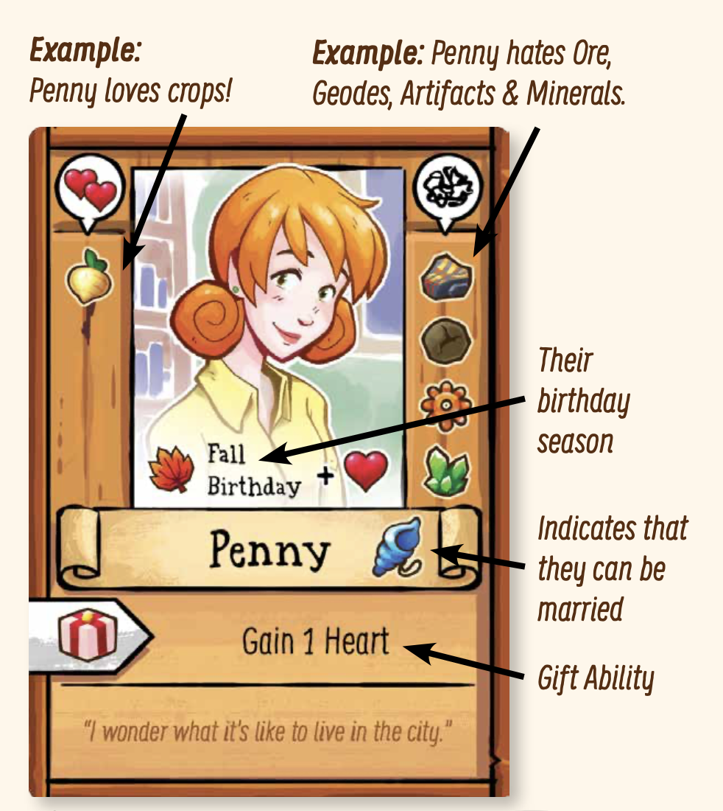

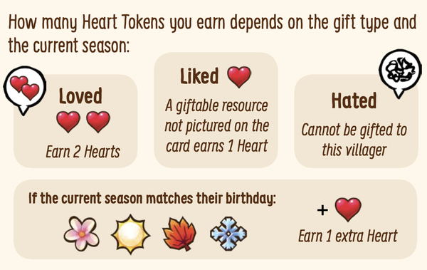

**ของที่ให้ไม่ได้ (ทุก Villager):** Trash, Stone, Bug Meat, ของที่มี No Gift icon

**Gift Ability:**
เมื่อ Season Card แสดง  → ทุกคนเลือก Villager เพื่อนของตัวเอง 1 คน ใช้ Gift Ability บนไพ่

---

### 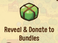 Reveal & Donate to Bundles *(Community Center)*

ทำได้ 2 อย่างในคราวเดียว:

**เปิด Bundle:** ทิ้ง Hearts = จำนวนผู้เล่น → พลิกหงาย (รู้ว่าต้องส่งอะไร)

**บริจาค:** วาง Resource ลงบน Bundle ที่เปิดแล้ว
Bundle ครบตามจำนวนผู้เล่น = **ห้องกู้คืน!** รับ Item reward

> Bundle 5 ห้องแรก = Item Card | Bundle ห้องสุดท้าย = **Epic Item**

ดูรายละเอียดทุกห้องที่ [Community Center](#community-center)

---

## Ranch — เลี้ยงสัตว์

### 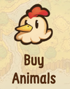 Buy Animals *(Marnie's Ranch)*

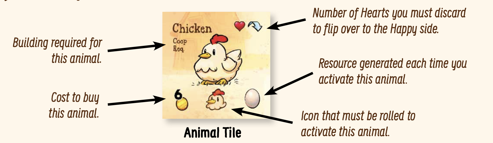

จ่าย Gold ตามราคาบน Animal Tile ต้องมี Building ก่อน:
- **Coop** → ซื้อสัตว์เล็กได้
- **Barn** → ซื้อสัตว์ใหญ่ได้

ซื้อได้หลายตัวใน Action เดียว

---

## Mountain — ภูเขา

### 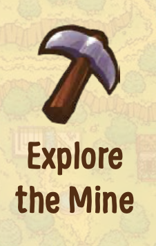 Explore the Mine

ทอย **Stardew Dice 2 ลูก** → เลือกว่าลูกไหนเป็นแถว ลูกไหนเป็นคอลัมน์ → ดูผลจาก Map Card

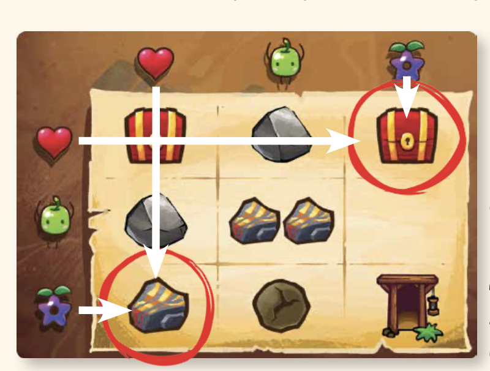

| ผล | ทำอะไร |
|---|---|
| 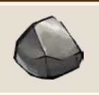 Stone | รับ Stone tile |
| Bug Meat | รับ Bug Meat tile |
| Ore | รับ Ore ตาม Mine Level ปัจจุบัน |
| Geode | รับ Geode ตาม Mine Level ปัจจุบัน |
| **Staircase** | ลงชั้นถัดไป เปิด Mine Level ใหม่ |
| Item | รับ Item Card |
|  Monster | ทำตาม Monster Ability บน Mine Level Card |
| Mine Event | จั่ว Mine Event Card |

**Mine Level Cards:**

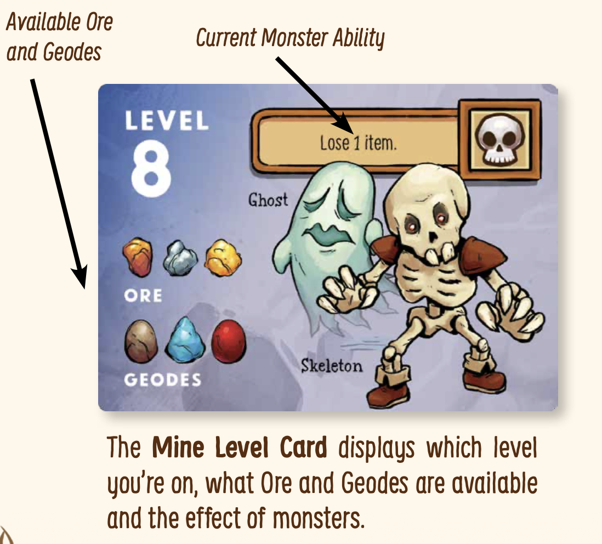

แต่ละ Level บอกว่ามี Ore และ Geode ชนิดไหน
Level สูงกว่า = ของดีกว่า แต่ Monster แรงกว่า

```
Level  1–3  → Copper Ore, Geode ธรรมดา
Level  4–7  → Iron Ore, Frozen Geode
Level  8–10 → Gold Ore, Magma Geode
Level 11–12 → Iridium Ore, Omni Geode
```

ลงถึง Level 12 = Goal "Reach bottom of Mine" สำเร็จ

**ลงชั้นโดยไม่ทอย:** End of Turn Effect "Build Staircase" ทิ้ง Stone = จำนวนผู้เล่น

---

### 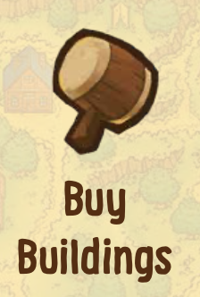 Buy Buildings *(Robin's)*

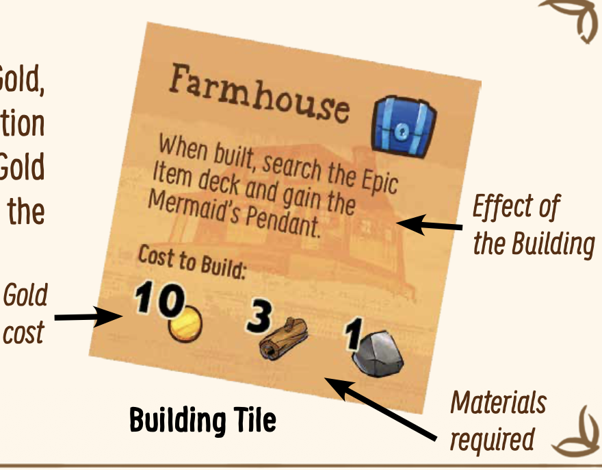

จ่าย Wood + Stone + Gold ตามที่ Building Tile ระบุ

| Building | เปิดให้ซื้อสัตว์ |
|---|---|
| **Coop** | Chicken, Duck, Rabbit, Dinosaur |
| **Barn** | Cow, Goat, Sheep, Pig |

Wood ได้จาก Tree tiles (Forage ระหว่างเดิน) — Stone ได้จากเหมือง

---

## Forge — ตีเหล็ก/พิพิธภัณฑ์

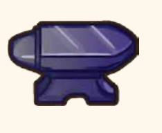

### 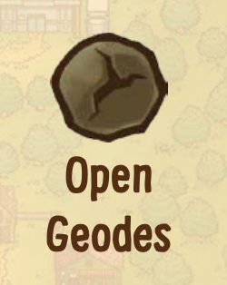 Open Geodes *(Clint's)*

ทอย Stardew Die **1 ลูกต่อ Geode 1 อัน** — ดูผลจาก Geode Chart บนบอร์ด

| ผลที่ได้ | ทำอะไร |
|---|---|
| Stone | รับ Stone tile |
| Ore | **พลิก Geode tile เป็นด้าน Ore** — ไม่ต้องทิ้ง |
| Mineral | จั่วจากถุงเทา |
| Artifact | จั่วจากถุงเทา |
| Item | รับ Item Card |

Minerals และ Artifacts → บริจาค Museum → ได้ Hearts
*(เปิด Geode แล้วเดิน A→B บริจาคทันทีในเทิร์นเดียว)*

---

###  Donate to Museum *(Gunther's)*

บริจาค Artifact หรือ Mineral ลงช่อง A–H ที่ตรงกับตัวอักษรบน tile
ได้ **1 Heart ต่อใบที่บริจาค** — tile ที่มี "?" วางได้ทุกช่อง

```
คอลัมน์ซ้าย: A B C D    เติมครบ 4 ใบ = Epic Item
คอลัมน์ขวา: E F G H    เติมครบ 4 ใบ = Epic Item
```

---

## Fishing — ตกปลา

มี 3 Location ตกปลาได้:

| Location | สัญลักษณ์ | ปลาที่หาได้ |
|---|---|---|
| 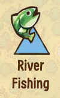 **River** | สามเหลี่ยม | ปลาน้ำจืด |
| 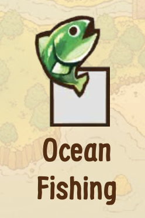 **Ocean** | สี่เหลี่ยม | ปลาทะเล |
| 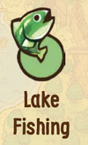 **Lake** | วงกลม | ปลาทะเลสาบ |

ทอย **Stardew Dice 3 ลูก** → ได้สัญลักษณ์ 3 อัน:  Heart, 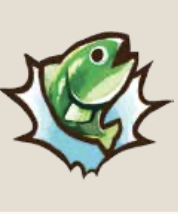 Junimo, 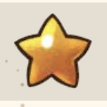 Stardrop

ดู Fish Track — ปลาแต่ละตัวแสดงสัญลักษณ์ที่ต้องการ ถ้าตรง → รับปลา

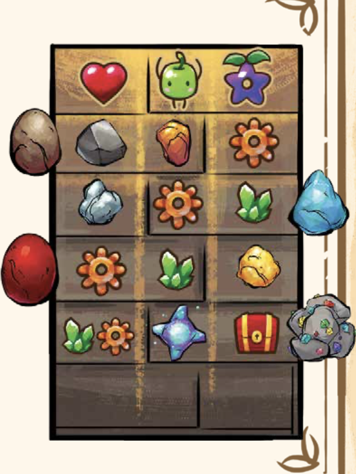

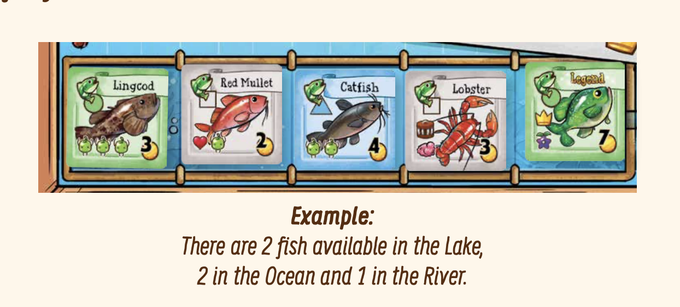

**กฎ:**
- จับได้หลายตัวใน Action เดียวถ้าสัญลักษณ์พอ
- ลูกเต๋า **1 ลูก = ปลา 1 ตัวเท่านั้น**
- ต้องอยู่ที่ Location ที่ตรงกับสีปลา

**ชนิดพิเศษ:**

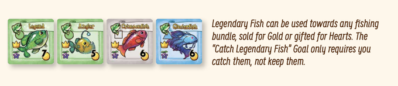

| ชนิด | วิธีได้ | สิ่งที่ต้องรู้ |
|---|---|---|
| **Legendary Fish** | ทอยเหมือนปกติ | ไม่ถูกทิ้งจาก Fish Move (คืนถุง) |
| **Crab Pot Fish** | ทิ้ง Bug Meat 1 = ได้ 1 ตัว | ไม่ต้องทอย ทำพร้อมกันได้ |
| **Trash** | ไม่ได้ปลาเลย | รับได้ 1 อัน ทิ้งได้ตลอด |
| 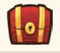 **Treasure Chest** | จับปลาซ้ายมือ Chest tile | รับ Item Card ทันที |

หลัง Action: เลื่อน tile ไปขวา เติมจากถุงน้ำเงิน

---

## End of Turn Effects

กลับ Farmhouse เลือก **1 ประเภท** ทำซ้ำได้ไม่จำกัด:

---

### 🪜 Build Staircase

ทิ้ง  Stone จำนวนเท่ากับจำนวนผู้เล่น → ลงเหมือง 1 ชั้น
เปิด Mine Level ใหม่ + สับ Map Card ใหม่

ทำซ้ำได้ถ้ามี Stone พอ ลงได้หลายชั้นในคืนเดียว

> ถ้า Goal ต้องลงถึง Level 12 ให้ทีมขุด Stone สม่ำเสมอ + Staircase ทุกคืน

---

###  Pet Animals

ทิ้ง Hearts ตามที่ Animal Tile ระบุ → พลิกสัตว์นั้นเป็นด้าน **Happy**
สัตว์ Happy ผลิต **Quality** เมื่อ Collect from Animals

---

### 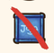 Remove Joja

ทิ้ง **Heart 1 อัน หรือ Gold 5** → ลบ Joja Tile ออกจาก Location ใดก็ได้
Joja Tile บล็อกหรือลด Action ของ Location นั้น

> จำเป็นใน Artisan mode — ต้อง Remove Joja ทั้งหมดก่อนชนะได้

---

### 🔧 Upgrade Starting Tool

ทิ้ง Resource ตามที่ Tool Card กำหนด → พลิกขึ้น Level ถัดไป
เริ่มที่ Level 0 — Level สูงกว่าให้ความสามารถเพิ่ม

Goal "Upgrade Starting Tool 2 times per player" — ทุกคนต้อง Upgrade ของตัวเอง 2 ครั้ง

---

## Community Center

ต้องกู้คืน **6 ห้อง** ด้วยการทำ Bundle ของแต่ละห้อง

```
Bundle ทุกห้องเริ่มคว่ำ (ไม่รู้ว่าต้องส่งอะไร)
  ↓ ไปที่ Community Center ทิ้ง Hearts = จำนวนผู้เล่น
เปิด Bundle รู้แล้วว่าต้องส่งอะไร
  ↓ หาของ + บริจาคสะสม (ทุกคนช่วยกันได้)
บริจาคครบตามจำนวนผู้เล่น = ห้องกู้คืน รับ Item
```

| ห้อง | ต้องการอะไร | หาจาก |
|---|---|---|
| **Crafts Room** | Forageables หรือวัสดุ | Foraging + เหมือง |
| **Pantry** | Crops หรือ Animal Products | ฟาร์ม + Ranch |
| **Fish Tank** | ปลาหลายชนิด | Fishing (Legendary ใช้ได้) |
| **Bulletin Board** | Resource + Hearts รวมกัน | ทำเพื่อน + หาของ |
| **Vault** | Gold (คูณด้วยจำนวนผู้เล่น) | ขายของสม่ำเสมอ |
| **Boiler Room** | Ore, Mineral, Bug Meat | เหมืองทั้งหมด |

> Bundle ห้องสุดท้ายที่กู้ = **Epic Item** — เลือกเองว่าจะเก็บห้องไหนไว้เป็นห้องสุดท้าย

---

## Grandpa's Goals

สุ่ม 4 ใบจาก 8 ใบตอน Setup — ทีมต้องทำครบทั้ง 4

**"× ผู้เล่น" = ตัวเลขคูณด้วยจำนวนคนในทีม**
เช่น เกม 3 คน + Goal Gold → ต้องมี Gold **30** รวมกัน

| Goal | ต้องทำอะไร | วิธีทำ |
|---|---|---|
| **Gold** | Gold รวม 10 × ผู้เล่น | ขาย Crops + Animal Products |
| **Mine** | ลงถึง Level 12 | Build Staircase ทุกคืน |
| **Museum** | บริจาค 2 × ผู้เล่น | เปิด Geode + Donate ทริปเดียว |
| **Animals** | มีสัตว์ 2 × ผู้เล่น | สร้าง Coop/Barn ก่อน ซื้อทีหลัง |
| **Friends** | มีเพื่อน 3 × ผู้เล่น | รวมทั้งทีม ไม่ต้องคนละ 3 |
| **Legendary Fish** | จับ 1 × ผู้เล่น | ตกปลาปกติ จับแล้วนับ ไม่ต้องเก็บ |
| **Buildings** | สร้าง 1 × ผู้เล่น | Coop + Barn นับด้วย |
| **Tool Upgrade** | Upgrade 2 ครั้ง × ผู้เล่น | ทุกคนต้อง Upgrade ของตัวเอง |

---

## Inventory และของในเกม

| สิ่งที่ถือ | สูงสุด |
|---|---|
| **Resources** (ดูตารางข้างบน) | **6 อัน** |
| **Items** | **2 อัน** |
| **Epic Items** | ไม่จำกัด |
| **Profession Upgrades** | **2 ใบ** |
| **Villager cards** | ไม่จำกัด |

**ของทีมวางกลางโต๊ะ:** Gold, Hearts
**ทิ้งได้ตลอด:** Trash, Stone, Wood, Fiber, Bug Meat

---

## เกร็ดช่วยเล่น

🔸 **Gold + Hearts เป็นของทีม** ไม่มีกระเป๋าส่วนตัว

🔸 **เริ่มต้นมี Gold 3 อัน ทั้งทีม** ไม่ใช่คนละ 3

🔸 **พืชไม่เหี่ยวเมื่อเปลี่ยน Season**

🔸 **"Catch Legendary Fish"** — จับได้นับแล้ว ไม่ต้องเก็บไว้

🔸 **"Make Friends"** — รวมทั้งทีม ไม่ต้องทุกคนมีครบ

🔸 **Foraging** — เกิดเฉพาะตอนเดินจริง (แบบ B) ไม่ใช่ตอนวางหมากใน Planning

---

**Checklist เริ่มเกม:**
```
Turn 1–3:   รดน้ำ Parsnip, ซื้อเมล็ด 2–3, เริ่มลงเหมือง
Turn 4–6:   เปิด Bundle อย่างน้อย 2–3 ห้อง, สร้าง Coop/Barn
กลาง S2:   Bundle 3+ ห้อง, Mine Level 5+, เพื่อน 3–4 คน
```
