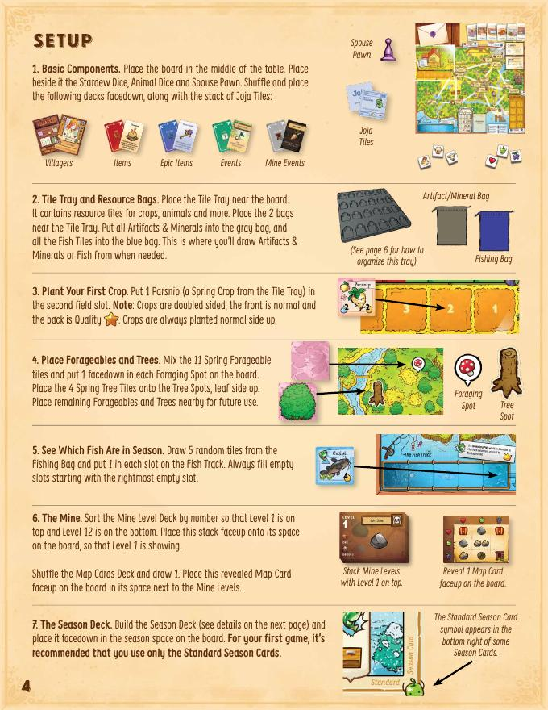
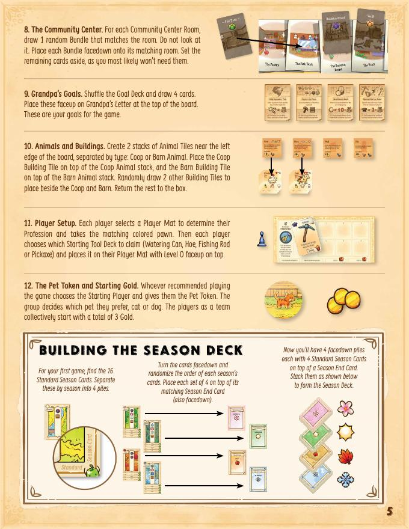

# Stardew Valley: The Board Game — คู่มือเล่นฉบับสมบูรณ์

> **Cooperative 1–4 คน** — ทุกคนชนะหรือแพ้พร้อมกัน
> สรุปจาก Official Rulebook พร้อมเกร็ดช่วยเล่น

---

## Table of Contents

- [เกมนี้คืออะไร](#เกมนี้คืออะไร)
- [ชนะและแพ้](#ชนะและแพ้)
- [Setup](#setup)
- [โครงสร้างเกมและ Turn](#โครงสร้างเกมและ-turn)
- [Phase 1 — Season Card](#phase-1--season-card)
- [Phase 2 — Planning](#phase-2--planning)
- [Phase 3 — Action Phase](#phase-3--action-phase)
- [Actions ทั้งหมด](#actions-ทั้งหมด)
- [End of Turn Effects](#end-of-turn-effects)
- [Community Center](#community-center)
- [Grandpa's Goals](#grandpas-goals)
- [Inventory](#inventory)
- [Movement และ Foraging](#movement-และ-foraging)
- [เล่นให้ Smooth](#เล่นให้-smooth)

---

## เกมนี้คืออะไร

ทุกคนเป็นชาวบ้านใน Stardew Valley ที่ต้องช่วยกันทำฟาร์ม ตกปลา ลงเหมือง และสร้างความสัมพันธ์กับคนในเมือง ทั้งหมดนี้เพื่อกู้ **Community Center** คืนจากบริษัท Joja ก่อนสิ้นปี

เกมดำเนินผ่าน **Season Cards** ที่พลิกทีละใบ แต่ละใบบอกว่าเกิดอะไรขึ้น แล้วทีมก็ตัดสินใจว่าใครจะไปทำอะไร ก่อนลงมือทีละคน เกมเป็นการแข่งกับเวลา — Season Deck มีไพ่จำกัด เมื่อหมด = หมดปี = Joja ชนะ

---

## ชนะและแพ้

**ชนะ (Honest Farmer — standard):**
ทำ **Grandpa's Goals 4 ข้อ** และกู้ **Community Center ครบ 6 ห้อง** ก่อน Season Deck หมด

**แพ้:** Season Deck หมดก่อนทำครบ

| Mode | เงื่อนไขชนะ | เหมาะสำหรับ |
|---|---|---|
| **Seedling** | Goals 4 ข้อ | เล่นครั้งแรก |
| **Honest Farmer** | Goals 4 ข้อ + Community Center 6 ห้อง | เล่นปกติ |
| **Artisan** | Goals + 6 ห้อง + ไม่มี Joja Tile เหลือ | เล่นจนชำนาญ |

---

## Setup





**1.** วางบอร์ด วาง Stardew Dice (3 ลูก), Animal Dice (3 ลูก), Spouse Pawn ไว้ข้าง
สับแล้ววางกองคว่ำ: **Villagers, Items, Epic Items, Events, Mine Events, Joja Tiles**

**2.** วาง Tile Tray ข้างบอร์ด
→ ใส่ **Artifacts & Minerals ทั้งหมด** ลงถุงเทา
→ ใส่ **Fish tiles ทั้งหมด** ลงถุงน้ำเงิน

**3.** วาง **Parsnip 1 อัน** (Spring Crop) ในช่องนา **2** — พืชเริ่มต้นของทีม

**4.** ผสม Spring Forageable tiles 11 ใบ → วางคว่ำในช่อง Foraging spot ทุกช่อง
วาง Spring Tree tiles 4 ใบในช่อง Tree spots (หงายด้าน leaf)

**5.** จั่ว Fish tiles **5 ใบ** จากถุงน้ำเงิน → วางใน Fish Track เติมจาก **ขวาไปซ้าย** เสมอ

**6.** เรียง Mine Level cards 1–12 (1 บนสุด) วางหงาย
สับ Map cards → พลิก 1 ใบวางหงายข้างๆ

**7.** สร้าง Season Deck วางคว่ำ
*(เกมแรก: ใช้ Standard Season Cards 16 ใบ แยกตาม Season สุ่มลำดับในแต่ละ Season แล้วซ้อนกัน Spring→Summer→Fall→Winter)*

**8.** แต่ละ Community Center Room (6 ห้อง):
จั่ว Bundle card **1 ใบที่ตรงกับห้องนั้น** วางคว่ำ — ยังไม่รู้ว่าต้องส่งอะไร

**9.** สับ Goal cards → พลิก **4 ใบ** วางหงายที่ Grandpa's Letter — ทั้งทีมเห็นตั้งแต่ต้น

**10.** สร้างกอง Animal tiles แยก Coop/Barn
วาง Coop Building tile บนกอง Coop, วาง Barn Building tile บนกอง Barn
สุ่ม Building tiles เพิ่มอีก **2 ใบ** วางข้างๆ

**11.** แต่ละคนเลือก **Player Mat** (Profession) → รับตัวหมาก
เลือก **Starting Tool Deck 1 ชุด** วาง Level 0 หงายบน Mat

**12.** เลือก Starting Player → รับ **Pet Token**
ทีมรับ **Gold รวมกัน 3 อัน** — *ไม่ใช่คนละ 3 ทั้งทีมมีแค่ 3 Gold ตอนเริ่ม*

**13.** จั่ว Season Card แรก ทำตามที่สั่ง → เริ่ม Planning Phase

> Stone, Gold, Heart tokens ไม่จำกัดโดย components — ถ้าหมดให้ใช้ของแทนได้เลย

---

## โครงสร้างเกมและ Turn

```
ทุก Turn ทำตามลำดับนี้เสมอ:

  ① Season Phase   → พลิก Season Card ทำตามที่สั่ง
  ② Planning Phase → ทีมคุยกัน วางหมาก แลกของ
  ③ Action Phase   → ทีละคน ลงมือทำ 2 Actions
```

**ตัวอย่าง Turn จริงๆ:**

Season Card พลิก: ฝนตก — พืชทุกต้นเลื่อนขึ้น 1 ช่อง Parsnip หลุดออกนา Starting Player รับเข้า Inventory ทันที

ทีมคุย: *"Lin ไปซื้อเมล็ดใหม่ Sam ลงเหมืองหา Ore Alex ทำเพื่อน + เปิด Bundle"*

→ Lin: ซื้อ Potato 2 ต้น ปลูกช่อง 3 และ 4 แล้วขาย Parsnip รับ Gold
→ Sam: ลงเหมือง 2 ครั้ง ได้ Iron Ore + Stone
→ Alex: เดินไป Town หยิบ Forageable ระหว่างทาง ทำเพื่อนรับ Heart แล้วไป Community Center เปิด Bundle

---

## Phase 1 — Season Card

พลิก **Season Card บนสุด** จาก Deck ทำตามสัญลักษณ์ก่อนทำ Planning:

| สัญลักษณ์ | เกิดอะไร | ระวัง |
|---|---|---|
| ☔ **Rain** | พืชทุกต้นเลื่อนขึ้น 1 ช่อง หลุดออกนา = Starting Player รับ | เช็ค Inventory ให้พอรับ |
| ⭐ **Quality Crop** | เลือกพืช 1 ต้นพลิกเป็น Quality side | เลือกตัวที่ใกล้เก็บที่สุด |
| 🐟 **Fish Move** | ทิ้ง Fish tiles **2 อันขวาสุด** เลื่อนที่เหลือไปขวา เติมใหม่จากถุง | Legendary Fish ไม่ถูกทิ้ง คืนถุงแทน |
| 🎁 **Gift** | ทุกคนเลือก Villager 1 คน ใช้ Gift Ability | ใช้ได้เฉพาะ Villager ที่เป็นเพื่อนแล้ว |
| 🏢 **Joja** | จั่ว Joja Tile วางตามที่ระบุ | บางอัน block action บางอันลดผล |
| 🦅 **Crow** | ทิ้ง Crop 1 ต้นในนาสีที่ระบุ (เขียว/แดง) | ช่องนา 3 เป็นทั้งเขียวและแดง |
| 📦 **Shipping Bin** | ทีมขายของได้ตอนนี้ | โอกาสดีขายก่อน Inventory เต็ม |
| ⚡ **Event** | Starting Player จั่ว Event Card | Event บางอันดี บางอันแย่ |

### Season End Card — จบ 1 ฤดู

เมื่อพลิกแล้วเจอ Season End Card:

1. เปลี่ยน Forageables + Trees เป็นของ Season ใหม่
2. ทุกคนจั่ว Profession Upgrade 2 ใบ ดูแล้วเก็บ 1 ใบ *(มีได้สูงสุด 2 ใบ)*
3. พลิก Season Card ถัดไปแล้วทำตามปกติ

---

## Phase 2 — Planning

ทีมคุยกันอย่างเต็มที่ ไม่จำกัดเวลา แต่ละคนวางหมากที่ตำแหน่งที่เลือก

**กฎสำคัญ:**
- แลกหรือให้ของกันได้ **ตอนนี้เท่านั้น** — ระหว่าง Action Phase ห้าม
- **Gold และ Heart tokens เป็นของทีม** วางรวมกลางโต๊ะ
- วางหมากที่ไหนก็ได้ เปลี่ยนใจหลังวางได้ แต่เปลี่ยน Location ต้องเดิน

---

## Phase 3 — Action Phase

เริ่มจาก Starting Player ทีละคน แต่ละคนทำ **2 Actions** เลือก 1 แบบ:

```
แบบ A: Action  →  Action         (ไม่ขยับ ทำที่เดิม 2 ครั้ง)
แบบ B: Action  →  เดิน 1 ช่อง  →  Action   (ทำ 2 ที่ต่างกัน)
```

ระหว่างเดิน (แบบ B เท่านั้น): หยิบ Forageable หรือ Tree tile ได้ฟรี 1 อัน

หลังจบ Actions ทั้งหมด → กลับ Farmhouse → เลือกทำ **End of Turn Effect 1 ประเภท** ซ้ำได้

> วางหมากตอน Planning Phase ≠ การเดิน — ไม่ Forage ได้

---

## Actions ทั้งหมด

### 🌾 Water Crops *(Farm)*

เลื่อน **Crop tiles ทุกต้น** ในนา 1 ช่องไปทางขวา
ต้นที่หลุดออกจากช่อง = เก็บเกี่ยวแล้ว เข้า Inventory ทันที

**สิ่งที่ต้องรู้:**
- เลื่อนทุกต้นพร้อมกัน ไม่เลือก
- ถ้า Inventory เต็ม ต้องเลือกทิ้งก่อนรับ
- พืช **ไม่เหี่ยวตาย** เมื่อเปลี่ยน Season — ค้างในนาได้ตลอด
- ตัวเลขบน Crop = ช่องนาที่ต้องปลูก ยิ่งเลขสูงยิ่งต้องรดน้ำนานกว่าจะเก็บ

> ฝน (Rain) เลื่อนพืชฟรี ถ้าพืชใกล้หลุดนาแล้ว ให้คนอื่น Water ได้เลย ไม่ต้องเสีย Action

---

### 🐄 Collect from Animals *(Farm)*

ทอย Animal Dice 3 ลูก แต่ละสัตว์ที่มีจะผลิตของตาม icon บนตัวมัน
- ทอยได้ icon ตรงกับสัตว์ไหน → สัตว์ตัวนั้นผลิต 1 อัน
- มีสัตว์หลายตัวชนิดเดียวกัน → แต่ละตัวผลิตทีละอัน

**ตัวอย่าง:** มีวัว 2 ตัว ทอยได้ icon วัว 1 ลูก → ได้ Milk 2 อัน

สัตว์ที่อยู่ด้าน **Happy** → ผลผลิตเป็น **Quality** (มีค่ามากกว่า)
ทำให้ Happy ได้โดยใช้ End of Turn Effect

---

### 🐓 Buy Animals *(Marnie's Ranch)*

จ่าย Gold ตามราคาบน Animal Tile ต้องมี Building ที่รองรับก่อน:
- **Coop** → Chicken, Duck, Rabbit, Dinosaur
- **Barn** → Cow, Goat, Sheep, Pig

ซื้อได้หลายตัวใน Action เดียวถ้า Gold พอ

---

### 🌱 Buy & Plant Seeds *(Town — Pierre's)*

จ่าย **1 Gold ต่อเมล็ด** ปลูกลงช่องนาทันที
ช่องที่ปลูกได้ = ตัวเลขบน Crop tile (Parsnip = ช่อง 2, Potato = ช่อง 4 เป็นต้น)

ขายของใน Inventory ได้ที่นี่ด้วย (ขายกี่อันก็ได้ใน Action เดียว)

**สิ่งที่ต้องรู้:**
- ปลูกได้เฉพาะ **Crop ของ Season ปัจจุบัน** เท่านั้น
- 1 ช่องนา = 1 Crop เท่านั้น

> ช่องนา 2–3 เก็บเร็ว คุ้มกว่าถ้า Season กำลังจะจบ ช่อง 5–6 เก็บช้า ต้องวางแผนล่วงหน้า

---

### 💛 Make a Friend *(Town)*

พลิก Villager Card บนสุด → ถ้าอยากเป็นเพื่อน ให้ Resource 1 อัน รับ Heart tokens เก็บไพ่ไว้
ถ้าไม่อยาก → ทิ้งไพ่นั้น

| ระดับของที่ให้ | Hearts ที่ได้ |
|---|---|
| **Loved** (มีรูปบนไพ่) | 2 Hearts |
| **Liked** (ของทั่วไปที่ไม่ใช่ Hated) | 1 Heart |
| + Birthday ตรงกับ Season ปัจจุบัน | +1 Heart เพิ่ม |
| **Hated** (ระบุบนไพ่) | ให้ไม่ได้ |

**สิ่งที่ต้องรู้:**
- Trash, Stone, Bug Meat → ให้เป็น Gift ไม่ได้
- ของที่มี **No Gift icon** บนไพ่ → ให้ไม่ได้
- Gift Ability ของ Villager ทำงานทุกครั้งที่ Season Card แสดงสัญลักษณ์ 🎁

> ทำเพื่อนที่ Gift Ability ช่วย Goal ที่ยังขาดอยู่ — บาง Villager ให้ Gold บางคนให้ Item

---

### 🏛️ Reveal & Donate to Bundles *(Community Center)*

**เปิด Bundle:** ทิ้ง Heart tokens = จำนวนผู้เล่น → พลิก Bundle card หงาย

**บริจาค:** วาง Resource ลงบน Bundle card ที่เปิดแล้ว บริจาคได้แม้ยังไม่ครบ

Bundle ครบตามจำนวนผู้เล่น = **ห้องกู้คืน** รับ Item reward
*(Bundle 5 ห้องแรก = Item, ห้องสุดท้าย = Epic Item)*

> ไม่ต้องเปิดทุกห้องพร้อมกัน แต่ควรเปิดอย่างน้อย 3 ห้องก่อนกลาง Season 2 เพื่อรู้ว่าต้องหาอะไร

---

### 💎 Open Geodes *(Forge — Clint's)*

ทอย **Stardew Die 1 ลูกต่อ Geode 1 อัน** ทำกี่อันก็ได้ใน Action เดียว
ดูผลจาก Geode Chart บนบอร์ด: Stone / Ore / Mineral / Artifact / Item

---

### 🏺 Donate to Museum *(Forge — Gunther's)*

บริจาค Artifact หรือ Mineral ลง Museum slot ที่ตรงกับตัวอักษรบน tile (A–H)
ได้ **1 Heart ต่อใบ** — Tile ที่มี **?** ใส่ slot ไหนก็ได้

Museum มี 2 คอลัมน์ (A–D และ E–H) เติมครบ 1 คอลัมน์ = **Epic Item**

> ลง Forge สองครั้ง (Action A+A): เปิด Geode แล้วบริจาคเลยในเทิร์นเดียว

---

### 🔨 Buy Buildings *(Mountain — Robin's)*

จ่าย **Wood + Stone + Gold** ตามที่ Building Tile ระบุ

Buildings สำคัญ:

| Building | ใช้ทำอะไร |
|---|---|
| **Coop** | เลี้ยงสัตว์ขนาดเล็ก |
| **Barn** | เลี้ยงสัตว์ขนาดใหญ่ |

---

### ⛏️ Explore the Mine *(Mountain)*

ทอย **Stardew Dice 2 ลูก** เลือกว่าลูกไหนเป็นแถว ลูกไหนเป็นคอลัมน์
ดูผลจาก **Map Card ปัจจุบัน** บน board

| ผลที่ได้ | ทำอะไร |
|---|---|
| **Stone / Bug Meat** | รับ tile นั้น |
| **Ore / Geode** | รับ tile ตามที่ Mine Level Card ระบุว่ามีอะไร |
| **Staircase** | ลงชั้นถัดไป เปิด Mine Level ใหม่ + เปลี่ยน Map Card |
| **Item** | รับ Item Card |
| **Monster** | ทำตาม Monster Ability บน Mine Level Card ปัจจุบัน |
| **Mine Event** | จั่ว Mine Event Card |

**Mine Level Cards:** แต่ละ Level ระบุ Ore และ Geode ที่มีในชั้นนั้น Level สูงกว่า = ของดีกว่า แต่ Monster แรงกว่า ลงถึง Level 12 = Goal "Reach bottom" สำเร็จ

> ลงชั้นโดยไม่ทอย: ใช้ End of Turn Effect "Build Staircase" ทิ้ง Stone = จำนวนผู้เล่น

---

### 🎣 Go Fishing *(River / Ocean / Lake)*

ทอย **Stardew Dice 3 ลูก** ดูสัญลักษณ์ที่ได้ (Heart / Junimo / Stardrop)
ถ้าสัญลักษณ์ตรงตามที่ Fish tile ต้องการ → รับ Fish tile นั้น

- จับได้หลายตัวใน Action เดียวถ้าสัญลักษณ์พอ
- ลูกเต๋า **1 ลูกใช้กับปลา 1 ตัวเท่านั้น**
- ต้องอยู่ที่ Location ที่ตรงกับสี Fish tile (River/Ocean/Lake)

| ชนิดพิเศษ | วิธีได้ | ข้อสังเกต |
|---|---|---|
| **Legendary Fish** | ทอยเหมือนปกติ | ไม่ถูกทิ้งจาก Fish Move (คืนถุง) |
| **Crab Pot Fish** | ทิ้ง Bug Meat 1 = ได้ 1 ตัว *(ไม่ต้องทอย)* | ทำพร้อมกับทอยได้ |
| **Trash** | ถ้าจับปลาไม่ได้เลย | รับได้ 1 อัน ทิ้งได้ตลอดเวลา |
| **Treasure Chest** | จับปลาที่อยู่ **ซ้ายมือ** ของ Chest tile | ได้ Item Card แถม |

หลัง Action: เลื่อน tile ไปขวา เติมช่องว่างจากถุง

> Legendary Fish: จับได้ก็นับสำหรับ Goal แล้ว ไม่ต้องเก็บไว้

---

## End of Turn Effects

กลับ Farmhouse เลือก **1 ประเภท** ทำซ้ำได้ไม่จำกัด:

| Effect | วิธีทำ | ใช้เมื่อ |
|---|---|---|
| **Build Staircase** | ทิ้ง Stone = จำนวนผู้เล่น | ต้องการลงเหมืองโดยไม่เสีย Action |
| **Pet Animals** | ทิ้ง Hearts ตามที่ Animal Tile ระบุ | ต้องการให้สัตว์ Happy เพื่อ Quality products |
| **Remove Joja** | ทิ้ง Heart 1 **หรือ** Gold 5 | Joja บล็อก Location สำคัญ |
| **Upgrade Tool** | ทิ้ง Resource ตามที่ Tool กำหนด | Tool Level สูงขึ้นเปิด ability ใหม่ |

---

## Community Center

เป้าหมายร่วมของทีม ต้องกู้คืน **6 ห้อง** โดยทำ Bundle ของแต่ละห้อง

```
ยังไม่รู้ต้องส่งอะไร
    ↓
ไปที่ CC → ทิ้ง Hearts = จำนวนผู้เล่น → เปิด Bundle
    ↓
รู้แล้ว เริ่มหาของ + บริจาคสะสม
    ↓
บริจาคครบ = ห้องกู้คืน รับ Item reward
```

| ห้อง | ต้องการอะไร | หาได้จาก |
|---|---|---|
| **Crafts Room** | Forageables หรือวัสดุ | Foraging + เหมือง |
| **Pantry** | Crops หรือ Animal Products | ฟาร์ม |
| **Fish Tank** | ปลาหลายชนิด | Fishing *(Legendary ใช้กับห้องนี้ได้)* |
| **Bulletin Board** | Resource + Heart Tokens รวมกัน | ทำทั้งสองอย่าง |
| **Vault** | Gold | ขายของสม่ำเสมอ |
| **Boiler Room** | Ore, Mineral, Bug Meat | เหมืองทั้งหมด |

> Bundle ที่กู้คืนเป็นห้องสุดท้าย = **Epic Item** เลือกเองได้ว่าจะกู้ห้องไหนเป็นห้องสุดท้าย

---

## Grandpa's Goals

สุ่ม 4 ข้อจาก 8 ข้อตอน Setup ทีมต้องทำครบทั้ง 4:

| Goal | ต้องทำอะไร | เกร็ด |
|---|---|---|
| **Gold** | Gold รวม 10 × ผู้เล่น | ขาย Crops + Animal Products บ่อยๆ |
| **Mine** | ลงถึง Level 12 | Build Staircase ทุกคืน + ลงเหมืองทุกเทิร์น |
| **Museum** | บริจาค 2 × ผู้เล่น tile | เปิด Geode + Donate ในทริปเดียว |
| **Animals** | มีสัตว์ 2 × ผู้เล่น | สร้าง Building ก่อน ซื้อทีหลัง |
| **Friends** | มีเพื่อน 3 × ผู้เล่น | รวมของทีม ไม่ต้องคนละ 3 |
| **Legendary Fish** | จับ 1 × ผู้เล่น | จับแล้วนับ ไม่ต้องเก็บ |
| **Buildings** | สร้าง 1 × ผู้เล่น | Coop + Barn นับด้วย |
| **Tool Upgrade** | Upgrade 2 ครั้ง × ผู้เล่น | ทุกคนต้อง Upgrade ของตัวเอง |

---

## Inventory

| สิ่งที่ถือ | สูงสุด | หมายเหตุ |
|---|---|---|
| **Resources** | 6 อัน | Crop, Fish, Animal Products, Ore, Geode, Artifact, Mineral, Forageable |
| **Items** | 2 อัน | ได้จาก Event, เหมือง, Geode ฯลฯ |
| **Epic Items** | ไม่จำกัด | — |
| **Profession Upgrades** | 2 ใบ | รับปลาย Season |
| **Villager cards** | ไม่จำกัด | — |

**ของทีม (วางกลางโต๊ะ ทุกคนใช้ร่วมกัน):** Gold, Heart tokens

**ทิ้งได้ตลอดเวลา:** Trash, Stone, Bug Meat, Items *(แต่ทิ้ง Item ไม่สามารถใช้ Discard ability ได้)*

---

## Movement และ Foraging

ระหว่างเดิน 1 ช่อง (เฉพาะ **แบบ B**): หยิบ tile คว่ำ **1 อัน ฟรี** จาก Foraging/Tree spot ที่ติดกับ Path

- หยิบ **Forageable หรือ Tree tile** อย่างใดอย่างหนึ่ง ไม่ใช่ทั้งคู่
- ไม่บังคับ
- บาง tile ติดได้หลาย Path หยิบจาก Path ไหนก็ได้

**พลิก tile ดู:**
- Forageable / Wood → เก็บเข้า Inventory
- **Artifact/Mineral icon มุมล่างขวา** → ทิ้ง tile นั้น จั่วจากถุงเทาแทน

---

## เล่นให้ Smooth

**เรื่องที่คนมักเข้าใจผิด:**

🔸 **Gold + Hearts เป็นของทีม** ไม่มีกระเป๋าส่วนตัว วางรวมกลางโต๊ะ

🔸 **เริ่มต้นมีแค่ Gold 3 อัน ทั้งทีม** ไม่ใช่คนละ 3

🔸 **Crops ไม่เหี่ยว** เมื่อเปลี่ยน Season ค้างในนาได้ตลอด

🔸 **Pet Token เคลื่อนที่เฉพาะเมื่อ Season Card สั่ง** ไม่ได้เดินเองทุก Turn

🔸 **"Catch Legendary Fish"** จับแล้วนับ ไม่ต้องเก็บไว้

🔸 **"Make Friends"** รวมทั้งทีม ไม่ต้องทุกคนมีเพื่อนครบ

🔸 **Stone, Gold, Heart tokens ไม่จำกัด** ถ้า component หมด ใช้ของแทนได้

---

**กลยุทธ์:**

🔹 **เปิด Bundle ก่อน** อย่ารอสะสม Heart เยอะค่อยเปิด ต้องรู้เป้าหมายก่อนถึงจะหาได้ถูก ควรเปิดอย่างน้อย 3 ห้องก่อนปิด Season 1

🔹 **Shipping Bin บน Season Card** คือโอกาสขายของโดยไม่เสีย Action ถ้า Inventory กำลังจะเต็มอย่าพลาด

🔹 **Build Staircase ทรงพลังมาก** ถ้า Goal ต้องลงถึง Level 12 ให้คนหนึ่งขุด Stone สม่ำเสมอ แล้ว Staircase ทุกคืน ไม่ต้องเสีย Action ลงเหมืองเลย

🔹 **Legendary Fish หาเจอเองระหว่างตกปลา** ไม่ต้องไปหาโดยเฉพาะ ตกปลาปกติแล้วเจอไปเอง

🔹 **Profession Upgrade อ่านให้ครบก่อนเลือก** เลือกอันที่ช่วย Goal หรือ Bundle ที่ยังขาดอยู่มากที่สุด

🔹 **แบ่ง Roles ตั้งแต่ต้น** คนหนึ่งดูแล Farm คนหนึ่งลงเหมือง คนหนึ่งทำเพื่อน/Community Center ถ้าทุกคนทำอย่างเดียวกันจะเสียเวลามาก

---

**Checklist เทิร์นแรกๆ:**

```
Turn 1–3:
  ✓ รดน้ำ Parsnip ให้เก็บได้เร็ว
  ✓ ซื้อเมล็ดอย่างน้อย 2–3 ต้น
  ✓ เริ่มลงเหมืองหา Stone + Ore

Turn 4–6:
  ✓ เปิด Bundle อย่างน้อย 2–3 ห้อง
  ✓ เริ่มสร้าง Coop หรือ Barn ถ้า Goal ต้องการสัตว์
  ✓ ตกปลา + สะสม Bug Meat สำหรับ Crab Pot

กลาง Season 2:
  ✓ Bundle ครบอย่างน้อย 3 ห้อง
  ✓ ลงถึง Mine Level 5+
  ✓ มีเพื่อนรวมกันอย่างน้อย 3–4 คน
```
