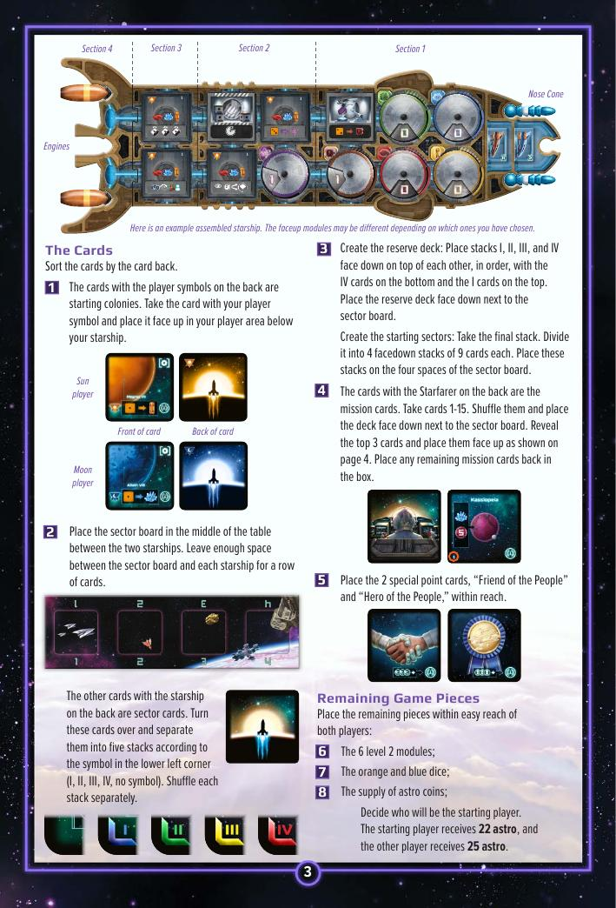
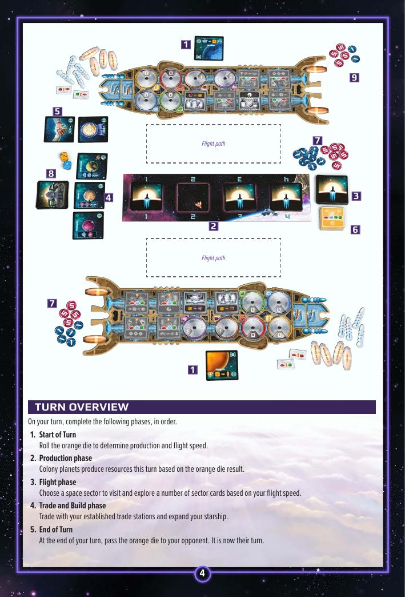
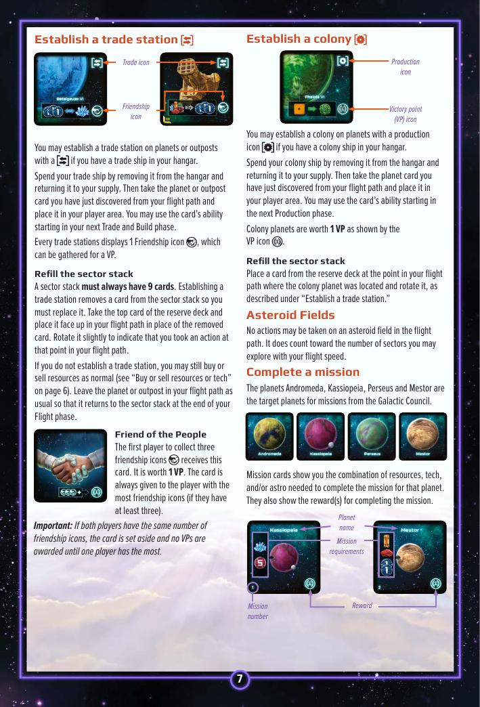
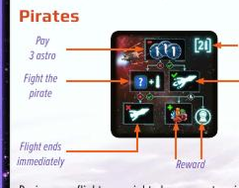

# CATAN – Starfarers Duel — วิธีเล่น

> สรุปจาก Official Rulebook ไม่มีเติมเอง
> ⚠️ รายละเอียด Module แต่ละอัน **อยู่บน Overview Sheet ในกล่อง** ไม่ได้อยู่ใน Rulebook

---

## Table of Contents
- [Before You Play — 3 Things to Know](#before-you-play-3-things-to-know)
- [Objective](#objective)
- [Know Your Ship](#know-your-ship)
- [6 Modules — สรุปรวม](#6-modules--สรุปรวม)
- [Setup](#setup)
- [Turn Order](#turn-order)
- [Phase 1 — Start of Turn](#phase-1-start-of-turn)
- [Phase 2 — Production](#phase-2-production)
- [Phase 3 — Flight](#phase-3-flight)
- [Flight Actions](#flight-actions)
- [Pirates](#pirates)
- [Phase 4 — Trade and Build](#phase-4-trade-and-build)
- [Friend & Hero of the People](#friend-hero-of-the-people)
- [Example Turn](#example-turn)
- [Winning](#winning)
- [Balancing for New Players](#balancing-for-new-players)

---

## Before You Play — 3 Things to Know

### 1. Your Ship Is Everything

ยานของคุณคือ "ตัวละคร" ในเกมนี้ ยิ่งอัพเกรดยาน → บินได้ไกลขึ้น, สู้ได้แรงขึ้น, เก็บของได้มากขึ้น

### 2. One Die, Two Uses

```
ทอยลูกเต๋าส้ม → ผลที่ได้ใช้ทั้งคู่พร้อมกัน:
  ① กำหนดว่าโคโลนีไหนผลิต Resource ในรอบนี้
  ② กำหนดว่าจะบินได้ไกลแค่ไหน (Flight Speed)
```

### 3. Flight Phase — Your Opponent Is the Dealer

ระหว่าง Flight คู่ต่อสู้เป็นคนพลิกไพ่ให้ทีละใบ คุณตัดสินใจว่าจะทำ Action หรือผ่าน
เหมือนเล่นไพ่ที่คุณไม่รู้ว่าใบถัดไปจะเป็นอะไร

---

## Objective

สะสม **10 VP** ก่อนคู่ต่อสู้ → ชนะทันที

**VP ได้จาก:**
- Colony Planet = 1 VP ต่อโคโลนี
- Level-2 Module = 1 VP ต่ออัน
- Mission Cards = ดูตัวเลขบนใบ
- Friend of the People (Friendship icon ≥ 3) = 1 VP
- Hero of the People (Fame icon ≥ 3) = 1 VP

---

## Know Your Ship



### Ship Components

| ส่วน | ใช้ทำอะไร | จุได้ |
|---|---|---|
| **Cargo Bays** (Section 1) | เก็บ Resource | ปกติ 2 ต่อ Bay |
| **Lab** (Section 2) | เก็บ Tech | สูงสุด 4 เสมอ |
| **Modules** (Section 3–4) | ความสามารถพิเศษ | 6 ช่อง |
| **Nose Cone** | ใส่ Cannon | 3 ช่อง |
| **Engines** | ใส่ Booster | 3 ช่อง |
| **Hangar** | จอดยาน | สูงสุด 2 ลำรวมกัน |

### Resources vs Tech

| | Ore | Fuel | Carbon | Food | Trade goods | Tech |
|---|---|---|---|---|---|---|
| เป็น Resource? | ✓ | ✓ | ✓ | ✓ | ✓ | ✗ |
| จุได้ตาม Cargo Bay | ✓ | ✓ | ✓ | ✓ | ✓ | ✗ |
| Tech จุได้สูงสุด | — | — | — | — | — | 4 |

### Dial on Your Ship
หมุนขวา = เพิ่ม, หมุนซ้าย = ลด
ถ้า Cargo Bay เต็ม → Resource ที่ได้เกินหายไปทันที

---

## 6 Modules — สรุปรวม

Module แต่ละอันติดตั้งบนยานได้ 6 ช่อง เริ่มต้น Active 2 อัน ที่เหลือต้องสร้างก่อนใช้ได้

**ราคา:**
- Activate L1 (พลิกหงาย): 1 Ore + 1 Carbon + 1 Food
- Upgrade เป็น L2 (วาง L2 ทับ L1): 1 Ore + 1 Carbon + 2 Food → ได้ **+1 VP**
- L2 มีแค่ชนิดละ 1 อัน — ถ้าคนหนึ่งสร้างแล้ว อีกคนสร้างไม่ได้

| Module | เมื่อ Active L1 | เมื่อ Upgrade เป็น L2 | ใช้ใน Phase ไหน |
|---|---|---|---|
| **Storage** | Cargo Bay จุได้ **3** ต่อ Bay (แทน 2) | Cargo Bay จุได้ **4** ต่อ Bay | ตลอดเวลา |
| **Production** | แสดงตัวเลข 1 ค่า — เมื่อลูกเต๋าส้มตรง ผลิต Trade good +1 | แสดง **2 ตัวเลข** — trigger ได้บ่อยขึ้น | Production Phase |
| **Science** | แสดงตัวเลข 1 ค่า — เมื่อลูกเต๋าส้มตรง ได้ Tech +1 | แสดง **2 ตัวเลข** — trigger ได้บ่อยขึ้น | Production Phase |
| **Command** | Flight actions สูงสุด **3** (แทน 2) | Flight actions สูงสุด **4** | Flight Phase |
| *(2 อันที่เหลือ)* | *ดูบน Overview Sheet ในกล่อง* | *ดูบน Overview Sheet* | — |

> ⚠️ Production และ Science Module ของ **ทั้งสองผู้เล่น** ทำงานจากลูกเต๋าที่ทอยในรอบนั้น — ไม่ใช่แค่คนที่ทอย

---

## Setup

### Assemble Your Ship (First Game Only)
ประกอบ Dial 6 อันเข้ากับยานด้วยหมุดพลาสติก ใส่ให้ตรงช่องสี

---

### Before Each Game

**1.** ตั้งค่า Dial: **Trade goods = 1**, Resource อื่น = **0**, Tech = **1**

**2.** รับ Colony ship 2 + Trade ship 2 → วาง **Colony ship 1 + Trade ship 1** ใน Hangar, วาง 2 ลำที่เหลือคว่ำด้านราคาไว้ข้างยาน

**3.** รับ Level-1 Module ทั้ง 6 ที่ตรงกับสัญลักษณ์ผู้เล่น → **เลือก 2 อัน** วางหงาย (Active), **อีก 4 อัน** วางคว่ำด้านราคา

**4.** รับ Level-1 Booster 3 + Level-2 Booster 3 → **เสียบ Level-1 Booster 2 อัน** ที่ Engine, วางที่เหลือข้างยาน

**5.** รับ Level-1 Cannon 3 + Level-2 Cannon 3 → **เสียบ Level-1 Cannon 2 อัน** ที่ Nose Cone, วางที่เหลือข้างยาน

**6.** วาง Sector Board ตรงกลางโต๊ะ เว้นพื้นที่ระหว่างบอร์ดกับยานแต่ละฝั่ง

**7.** จัดไพ่ตามหลังไพ่:
- **สัญลักษณ์ผู้เล่น** = Starting Colony → แต่ละคนรับ 1 ใบ วางหงายหน้าตัวเอง
- **รูปยาน** = Sector Cards → แยกเป็น 5 กอง (I, II, III, IV, ไม่มีสัญลักษณ์) สับแต่ละกอง → กอง I+II+III+IV ซ้อนกัน (IV ล่าง I บน) = **Reserve Deck** วางคว่ำ; กอง "ไม่มีสัญลักษณ์" แบ่งเป็น **4 กองๆ ละ 9 ใบ** วางบน 4 ช่องของ Sector Board
- **รูป Starfarer** = Mission Cards → ใช้ใบ **1–15** สับวางคว่ำ พลิก **3 ใบบนสุด** หงาย

**8.** วาง **"Friend of the People"** + **"Hero of the People"** ไว้กลาง

**9.** ตัดสิน Starting player: คนเริ่มก่อน = **22 Astro**, อีกคน = **25 Astro**


## Turn Order



```
1. ทอยลูกเต๋าส้ม
2. โคโลนีผลิต (Production)
3. บินสำรวจ (Flight)
4. ซื้อขายและสร้าง (Trade & Build)
5. ส่งลูกเต๋าให้คู่ต่อสู้
```

---

## Phase 1 — Start of Turn

ทอยแล้วจำตัวเลขไว้ — ใช้ทั้งใน Phase 2 และ Phase 3

---

## Phase 2 — Production

### Your Colonies Produce Resources

โคโลนีที่มี **เลขตรงกับลูกเต๋า** = ผลิตได้รอบนี้
เลือกได้ **1 โคโลนีเท่านั้น** แม้ตรงหลายอัน

> ตัวอย่าง: มีโคโลนี Ore เลข 3 และ Carbon เลข 3 ทอยได้ 3 → เลือกได้แค่อันใดอันหนึ่ง

### Modules Also Produce

Production Module และ Science Module ทำงานใน Phase นี้ด้วย — ดูรายละเอียดใน [6 Modules — สรุปรวม](#6-modules--สรุปรวม)

> ⚠️ Module ของ**ทั้งสองคน**ทำงานจากลูกเต๋าที่ทอยในรอบนั้น ไม่ใช่แค่คนที่ทอย

### Cargo Bay Capacity

ดูความจุตาม Storage Module ได้ที่ [6 Modules — สรุปรวม](#6-modules--สรุปรวม)

---

## Phase 3 — Flight

นี่คือ Phase ที่สำคัญและซับซ้อนที่สุด

### Step 1 — Calculate Flight Speed

```
Flight Speed = กำลังรวม Booster + ผลลูกเต๋าส้ม

Level-1 Booster = +1 ต่ออัน
Level-2 Booster = +2 ต่ออัน
```

> ตัวอย่าง: มี L1×2 + L2×1 = base 4, ทอยได้ 3 → Flight Speed = **7**
> → พลิกไพ่ได้สูงสุด 7 ใบใน Flight นี้

### Step 2 — Choose a Sector

เลือก **1 ใน 4 กอง** บน Sector Board ที่ต้องการสำรวจ

### Step 3 — Fly (Opponent Reveals Cards)

```
คู่ต่อสู้หยิบกองที่เลือก → แอบดูบนสุด:
  ถ้าเป็น Pirate → เก็บความลับ ถามคุณก่อน (ดูหัวข้อ Pirate)
  ถ้าไม่ใช่ → พลิกวางใน Flight Path

คุณตัดสินใจ:
  ทำ Action → หมุนการ์ดนั้นเล็กน้อย แล้วทำ
  ผ่าน → ไม่ได้ Action ใบนั้นอีกแล้วใน Flight นี้

คู่ต่อสู้พลิกใบถัดไป → วนซ้ำ
```

### Step 4 — Flight Ends When

- พลิกครบตามจำนวน Flight Speed
- ทำ Action ครบตามที่อนุญาต (ดูตาราง)
- แพ้ Pirate
- คุณหยุดเองสมัครใจ

| Module | Action สูงสุดต่อ Flight |
|---|---|
| ไม่มี Command Module | **2** |
| Level-1 Command Module | **3** |
| Level-2 Command Module | **4** |

→ รายละเอียด Command Module ดูที่ [6 Modules — สรุปรวม](#6-modules--สรุปรวม)

### After Flight Ends
คู่ต่อสู้เก็บไพ่ทั้งหมดใน Flight Path กลับ สับรวมกับที่เหลือ วางคว่ำกลับที่บอร์ด

---

## Flight Actions

### Buy / Sell Resources or Tech

**ที่ Trade Planet:**
- ซื้อ: จ่าย Astro ตามราคาบนการ์ด → รับ Resource/Tech
- ขาย: คืน Resource/Tech → รับ Astro
- ซื้อขายกี่ครั้งก็ได้ใน Action เดียว = **นับเป็น 1 Action**

**ที่ Outpost:**
- บางอันซื้อหรือขาย Resource ใดก็ได้ในราคา 3 Astro
- มีข้อจำกัด 1x หรือ 2x แต่ยังนับเป็น **1 Action**

---

### Establish a Trade Station



**เงื่อนไข:** มี Trade Ship ใน Hangar + การ์ดนั้นมีสัญลักษณ์ Trade

**ขั้นตอน:**
1. เอา Trade Ship ออกจาก Hangar คืนวางข้างยาน
2. หยิบการ์ดนั้นจาก Flight Path วางในพื้นที่ตัวเอง
3. ใช้ความสามารถได้ตั้งแต่ **Trade & Build Phase ถัดไป**
4. Trade Station มี **Friendship icon 1 อัน**
5. ดึงไพ่จาก Reserve Deck มาแทนที่ทันที (หมุนการ์ดใหม่ด้วย)

> ⚠️ ต้องเติม Reserve Deck ทันที — กองบน Sector Board ต้องมี 9 ใบเสมอ

---

### Establish a Colony

**เงื่อนไข:** มี Colony Ship ใน Hangar + การ์ดนั้นเป็น Planet ที่มีสัญลักษณ์ผลิต

**ขั้นตอน:**
1. เอา Colony Ship ออกจาก Hangar คืนวางข้างยาน
2. หยิบการ์ดนั้นจาก Flight Path วางในพื้นที่ตัวเอง
3. ใช้ความสามารถได้ตั้งแต่ **Production Phase ถัดไป**
4. Colony Planet = **1 VP**
5. ดึงไพ่จาก Reserve Deck มาแทนที่ทันที

---

### Complete a Mission

**เงื่อนไข:** เจอ Target Planet (Andromeda / Kassiopeia / Perseus / Mestor) + มีของครบตาม Mission Card ที่หงายอยู่

**ขั้นตอน:**
1. จ่าย Resource/Tech/Astro ตามที่ Mission Card กำหนด
2. รับรางวัล:
   - **One-time:** Resource, Tech หรือ Astro (รับทันที)
   - **Ongoing:** VP icon, Friendship icon, Fame icon (เก็บบนการ์ด)
3. หยิบ Mission Card วางในพื้นที่ตัวเอง
4. พลิก Mission Card ใหม่ทันที (รักษา 3 ใบหงายเสมอ)

> ⚠️ ถ้าใบใหม่เป็นดาวเดียวกับที่เพิ่งทำ → ทำอีกไม่ได้ใน Flight นี้
> ⚠️ ถ้ามีหลาย Mission Card ดาวเดียวกัน → ทำได้ทุกใบ แต่ละใบนับเป็น **1 Action แยกกัน**

---

### Asteroid Field

ทำ Action ไม่ได้ แต่ **นับเป็น 1 ใบ** ของ Flight Speed — ผ่านไปเฉยๆ

---

## Pirates



คู่ต่อสู้แอบเห็น Pirate → เก็บความลับ แล้วถามคุณว่าจะทำอะไร:

### Option A — Pay 3 Astro
- บินต่อได้ ไม่นับเป็น Action
- คู่ต่อสู้ดึงไพ่จาก Reserve Deck มาวางแทน (ไม่หมุนการ์ดใหม่)

### Option B — Fight

**คำนวณ Combat Strength:**

```
ของคุณ   = กำลังรวม Cannon + ลูกเต๋าน้ำเงิน (คุณทอย)
ของ Pirate = Cannon บนการ์ด + ลูกเต๋าน้ำเงิน (คู่ต่อสู้ทอยแทน Pirate)

Level-1 Cannon = +1 ต่ออัน
Level-2 Cannon = +2 ต่ออัน

ชนะถ้า: คะแนนคุณ ≥ คะแนน Pirate
```

**If you win:**
- รับ Resource 1 อันตามที่คุณเลือก
- รับ Fame icon ตามที่บนการ์ด → วาง Pirate card ในพื้นที่ตัวเอง
- บินต่อได้ ไม่นับเป็น Action

**If the Pirate wins:**
- Flight Phase จบทันที
- รับผลกรรมตามที่การ์ดบอก:

| ผลกรรม | เลือกทำ |
|---|---|
| Booster ถูกทำลาย | เอา L1 ออก **หรือ** แทน L2 ด้วย L1 |
| Cannon ถูกทำลาย | เอา L1 ออก **หรือ** แทน L2 ด้วย L1 |
| Module ถูกทำลาย | เอา L2 ออก (L1 โผล่มา) **หรือ** ปิด L1 ที่ Active — **ห้ามปิด L1 ที่อยู่ใต้ L2** |

---

## Phase 4 — Trade and Build

ทำ Trade และ Build สลับกันได้ไม่จำกัด ตราบที่มี Resource พอ

### Trade

- เยี่ยม Trade Station ของตัวเองได้ **สูงสุด 2 สถานี** ต่อ Turn
- ห้ามกลับสถานีเดิมใน Turn เดียวกัน
- **Planet:** ซื้อ/ขายได้เท่าที่มี
- **Outpost:** มีข้อจำกัดตามลูกศรและ 1x/2x บนการ์ด

### Build — Cost Table

| สร้างอะไร | ราคา | เงื่อนไข |
|---|---|---|
| Colony Ship | 1 Ore + 1 Fuel + 1 Food | Hangar มีช่องว่าง |
| Trade Ship | 1 Ore + 1 Fuel + 1 Trade good | Hangar มีช่องว่าง |
| Level-1 Cannon | 2 Carbon | ช่อง Cannon ว่าง |
| Level-2 Cannon | 2 Carbon + 1 Tech + คืน L1 | มี L1 active |
| Level-1 Booster | 2 Fuel | ช่อง Booster ว่าง |
| Level-2 Booster | 2 Fuel + 1 Tech + คืน L1 | มี L1 active |
| Level-1 Module (Activate) | 1 Ore + 1 Carbon + 1 Food | พลิก Module คว่ำให้หงาย ใช้ได้ทันที |
| Level-2 Module (Upgrade) | 1 Ore + 1 Carbon + 2 Food | วาง L2 ทับ L1 Active → **+1 VP** |

> ⚠️ Hangar จุได้สูงสุด 2 ลำรวมกัน
> ⚠️ L2 Module มีแค่ชนิดละ 1 อัน — ถ้าคนหนึ่งสร้างแล้ว อีกคนสร้างไม่ได้

---

## Friend & Hero of the People

### Friend of the People
- มาจาก: สร้าง Trade Station (ทุกอันให้ 1 icon) + บาง Mission Card
- คนแรกที่มี **≥ 3** รับการ์ดนี้ = **1 VP**
- การ์ดย้ายไปหาคนที่มีมากกว่าเสมอ (ต้องมีอย่างน้อย 3)
- ถ้าเสมอ → วางข้าง ไม่มีใครได้ VP

### Hero of the People
- มาจาก: ชนะ Pirate + บาง Mission Card
- กฎเดียวกับ Friend of the People

---

## Example Turn

> ยานมี L1×2 Booster, ทอยได้ 3

```
1. ทอยลูกเต๋าส้ม → ได้ 3

2. Production:
   โคโลนี Ore เลข 3 ผลิต → หมุน Dial Ore +1
   Science Module แสดงเลข 3 → หมุน Dial Tech +1

3. Flight: Flight Speed = (1+1) + 3 = 5
   เลือก Sector 2
   คู่ต่อสู้พลิก:
   ใบ 1: Trade Planet (ขาย Ore ได้ 4 Astro) → ทำ! (Action 1/2)
   ใบ 2: Asteroid → ผ่าน (ทำอะไรไม่ได้)
   ใบ 3: Pirate! → จ่าย 3 Astro บินต่อ
   ใบ 4: Colony Planet → สร้าง Colony! (Action 2/2) → Flight จบ

4. Trade & Build:
   เยี่ยม Trade Station → ซื้อ Fuel 2 อัน
   สร้าง L1 Cannon ราคา 2 Carbon
```

---

## Winning

ถึง **10 VP ระหว่าง Turn ของตัวเอง** → ชนะทันที

---

## Balancing for New Players

| ผู้เล่น | Astro เริ่มต้น | Booster เริ่มต้น |
|---|---|---|
| มือใหม่ | 30 | Level-1 จำนวน 3 |
| มือเก่า | 20 | Level-1 จำนวน 2 |
