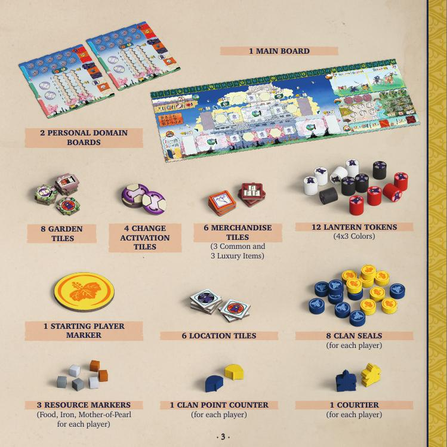
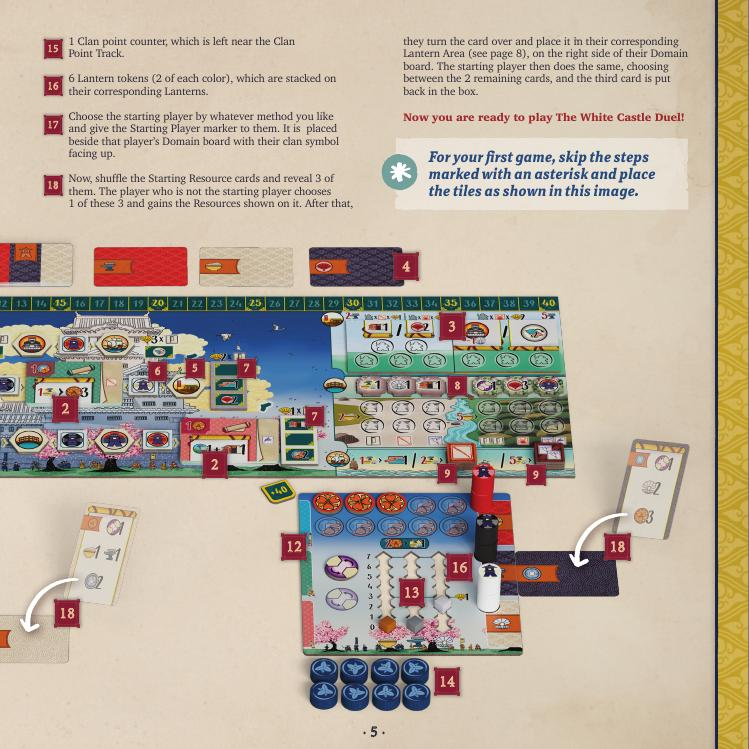
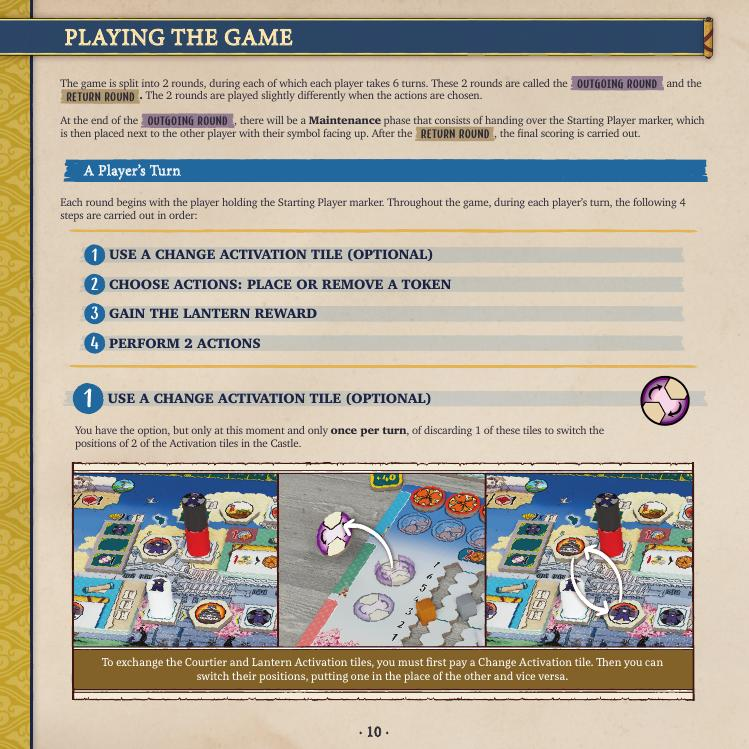

# The White Castle Duel — วิธีเล่น

> สรุปจาก Official Rulebook ไม่มีเติมเอง
> ธีม: ญี่ปุ่นยุค Nanban Period — แข่งกันสะสมอิทธิพลในราชสำนัก

---

## Table of Contents
- [Overview](#overview)
- [ของในกล่อง](#ของในกล่อง)
- [Setup](#setup)
- [Resources & Key Items](#resources-key-items)
- [Turn Order (4 Steps)](#turn-order-4-steps)
- [6 Actions](#6-actions)
- [End of Round 1 — Maintenance](#end-of-round-1-maintenance)
- [Final Scoring](#final-scoring)
- [Tiebreaker](#tiebreaker)
- [Summary](#summary)

---

## Overview

2 คนแข่งกันสะสม **Clan Points (CP)** ตลอดเกมและรอบสรุปคะแนน
ใครมี CP มากกว่าตอนจบ = ชนะ

เกมแบ่งเป็น **2 รอบ** รอบละ **6 Turn ต่อคน**:
```
รอบ 1 — OUTGOING ROUND (วาง Token ลงบอร์ด)
รอบ 2 — RETURN ROUND  (เก็บ Token กลับ)
จบรอบ 2 → นับคะแนนสุดท้าย
```

---

## Components



**บอร์ดและไพ่:**
- Main board 1 อัน
- Personal Domain board 1 อันต่อคน
- ไพ่ Influence 36 ใบ (Weapon สีเขียว 12 / Flag สีน้ำเงิน 12 / Origami สีปะการัง 12)
- ไพ่ Lantern 15 ใบ

**Token และ Marker:**
- Lantern tokens 12 อัน (3 สี สีละ 4 อัน) — ต่อคน: 6 อัน (สีละ 2)
- Clan Seals 8 อันต่อคน
- Resource markers 3 อัน (Food / Iron / Mother-of-Pearl) ต่อคน
- Clan Point counter 1 อันต่อคน
- Courtier 1 ตัวต่อคน

**Tiles:**
- Activation tiles 6 อัน
- Location tiles 6 อัน
- Garden tiles 8 อัน
- Training Yard tiles (Basic 4 / Elite 4)
- Social Climbing tiles 6 อัน
- Merchandise tiles (Common 3 / Luxury 3)
- Change Activation tiles 4 อัน

**เงิน:**
- Coins 20 เหรียญ
- Daimyo Seals 20 อัน

---

## Setup



### Board Setup

**1.** วาง Main board ตรงกลางโต๊ะ

**2.** สับ Influence cards 36 ใบทั้งหมดรวมกัน แบ่งเป็น **3 กองๆ ละ 12 ใบ** วางบน Castle 3 ช่อง คว่ำด้านราคาขึ้น

**3.** สับ Training Yard tiles แยกกัน (Basic/Elite) → เลือกสุ่ม **1 Basic + 1 Elite** วางบอร์ด ที่เหลือเก็บกล่อง

**4.** สับ Lantern cards → พลิก **3 ใบ** วางหงายข้างกองไพ่

**5.** วาง Activation tiles **6 อัน** สุ่มตำแหน่งบนบอร์ด

**6.** วาง Location tiles **6 อัน** สุ่มตำแหน่งบนบอร์ด

**7.** สุ่มวาง Social Climbing tiles **2 อันแต่ละข้าง** ของ Castle (สีตรงกับบอร์ด) เหลือ 2 อันเก็บกล่อง

**8.** สุ่มวาง Garden tiles **3 อันด้านหิน + 3 อันด้านพืช** เหลือ 2 อันเก็บกล่อง

**9.** สุ่ม Merchandise tiles แต่ละชนิด → วางหงายด้านรางวัล: Common ซ้าย, Luxury ขวา

**10.** วาง Courtier ทั้งสองตัวที่ Castle Gate

**11.** วางกอง Coins, Daimyo Seals และ Change Activation tiles รวมเป็น Common reserve

### Player Setup

**12.** แต่ละคนรับ: Domain board, Resource markers 3 อัน (วางที่ 0), Clan Point counter, Lantern tokens 6 อัน (สีละ 2), Clan Seals 8 อัน, Courtier 1 ตัว

**13.** วาง Courtier ที่ Castle Gate

**14.** ตัดสิน Starting player ด้วยวิธีใดก็ได้ → รับ Starting Player marker

**15.** สับ Starting Resource cards → พลิก **3 ใบ** — คนไม่ได้เริ่มก่อนเลือก 1 ใบรับ Resource, คนเริ่มก่อนเลือกจาก 2 ใบที่เหลือ รับ Resource จากนั้นแต่ละคนพลิกไพ่ที่ได้วางในช่อง Lantern Area ฝั่งขวาของ Domain board

## Turn Order (4 Steps)



```
ขั้น 1 — (ไม่บังคับ) ใช้ Change Activation tile
ขั้น 2 — วาง หรือ เก็บ Lantern token
ขั้น 3 — รับ Lantern Reward
ขั้น 4 — ทำ 2 Actions
```

### Step 1 — Change Activation (optional)
ทิ้ง Change Activation tile 1 อัน → สลับตำแหน่ง Activation tiles 2 อันบน Castle
(ทำได้ครั้งเดียวต่อ Turn และทำก่อนขั้นอื่นเท่านั้น)

---

### Step 2 — Place or Collect a Token

**Outgoing Round — Place Token**
เลือก Lantern token 1 อันจาก Domain board ของตัวเอง วางบน Location tile บนบอร์ด

กฎการวาง:
- Location ยังไม่มี token → วางสีที่ **ต่างจากสีของ Location tile** นั้น
- Location มี token อยู่แล้ว → วางสีที่ **ต่างจากทุก token ที่อยู่แล้ว**
- วางได้สูงสุด **3 token ต่อ Location** (คนละสีกันทั้ง 3)

**Return Round — Collect Token**
หยิบ Lantern token 1 อันจากบนสุดของ stack ใดก็ได้บนบอร์ด วางบน Domain board ตัวเอง
- ต้องวางในช่อง Lantern Area ที่ตรงสีกัน
- ไม่มีลิมิตการซ้อนบน Domain board

---

### Step 3 — Gain Lantern Reward

หลังวาง/เก็บ token → รับรางวัลในช่อง **Lantern Area สีเดียวกับสีที่เพิ่งถูกทับ**
(รับทั้งที่อยู่บน Domain board และที่อยู่บน Lantern cards ที่ซ้อนอยู่)

---

### Step 4 — Perform 2 Actions

ทำ Action **2 อัน** ที่อยู่ติดกับ Location ที่วาง/เก็บ token
- Activation tile → ทำ action บนนั้น
- Influence card → ซื้อได้ถ้าต้องการ
- ไม่อยากหรือทำไม่ได้ → รับ **Well's Benefit** แทน 1 อัน

> **ย้ำสำคัญ:** ถ้าเลือก **ไม่ทำ Scroll action** ตอนซื้อไพ่ Influence → **ไม่ได้ Well's Benefit** เป็นการข้ามกฎเฉยๆ

**Well's Benefit** (เลือก 1 อย่าง):
Resource ใดก็ได้ 1 อัน / Daimyo Seal 1 อัน / Coin 1 เหรียญ / Change Activation tile 1 อัน / CP 1 คะแนน

---

## 6 Actions

### Garden (Pay Food)
- จ่าย Food **2 อัน** → วาง Clan Seal ในช่องราคาถูก + รับรางวัลเหนือคอลัมน์นั้น
- จ่าย Food **5 อัน** → วาง Clan Seal ในช่องราคาแพง + รับรางวัลเหนือคอลัมน์นั้น
- ปลายเกม: Clan Seals ใน Garden ให้ icons สำหรับนับคะแนน

### Training (Pay Iron)
- จ่าย Iron **2 อัน** → วาง Clan Seal ในช่อง Basic/Elite Training Yard + เลือกรับรางวัล 1 ใน 2
- จ่าย Iron **5 อัน** → เช่นกันแต่ช่องแพงกว่า
- ปลายเกม: Basic TY คูณคะแนน Katana + Kabuto / Elite TY คูณแค่ Kabuto (แต่ทรงพลังกว่า)

### Courtier (Pay Mother-of-Pearl)
- จ่าย **2** → เลื่อน Courtier ขึ้น 1 ช่องบน Social Climbing path
- จ่าย **5** → เลื่อนขึ้น 2 ช่อง
- รับรางวัลทุกช่องที่ **หยุด** เท่านั้น — **ไม่รับรางวัลช่องที่กระโดดข้าม**
- ครั้งแรกที่ทำ Action นี้ → เลือกเส้นทาง ซ้าย หรือ ขวา

> **ย้ำสำคัญ:** เลือกเส้นทางแล้ว **เปลี่ยนไม่ได้ตลอดเกม** และคู่ต่อสู้ต้องใช้เส้นที่เหลือเสมอ

### Trade (Pay Resources)
เลือก 1 อย่าง:
- จ่าย Resource **1 อัน** → ซื้อไพ่ Influence บนสุดจากกองใดก็ได้ (ราคาปกติ) + ทำ Scroll action
- จ่าย Resource **2 อัน** → รับ Common Merchandise tile บนสุด
- จ่าย Resource **5 อัน** → รับ Luxury Merchandise tile บนสุด

### Lantern
เลือก Lantern ของตัวเอง 1 อัน → รับรางวัลที่มองเห็นทั้งหมด

### Improve
พลิก Influence cards ที่มีอยู่แล้วได้สูงสุด **2 ใบ** ต่อ Action
(พลิกแล้ว icons หลังไพ่นับคะแนนปลายเกมได้)

---

## End of Round 1 — Maintenance

หลังทุกคนเล่นครบ 6 Turn ใน OUTGOING ROUND:
- ส่ง Starting Player marker ให้คู่ต่อสู้ พลิกให้เห็นสัญลักษณ์ของเขา
- คนที่เล่น Turn สุดท้ายใน OUTGOING ROUND จะได้เล่น **2 Turn ติดกัน** (Turn 6 ของรอบแรก + Turn 1 ของรอบสอง)

---

## Final Scoring

หลังจบ RETURN ROUND นับคะแนนเพิ่มจาก CP ที่สะสมระหว่างเกม:

### 1. Remaining Resources
- ทุก 5 Coins/Daimyo Seals (รวมกัน) → +1 CP
- Resource ชนิดใดก็ได้ที่มี 3–6 อัน → +1 CP ต่อชนิด
- Resource ชนิดที่มีครบ 7 อัน → +2 CP

### 2. Nobori Flags
นับ Flag icons ทั้งหมด (จากไพ่ที่ Improve แล้ว + Garden + Merchandise)
× ระดับที่ Courtier อยู่ (1, 2 หรือ 3) = CP

### 3. Katanas
นับ Katana icons ทั้งหมด
× จำนวน Clan Seals ใน **Basic Training Yard** = CP

### 4. Kabutos
นับ Kabuto icons ทั้งหมด
× (Clan Seals ใน Basic TY + **Clan Seals ใน Elite TY ×2**) = CP

### 5. Origami Cranes
(จำนวน Blue cranes) × (จำนวน White cranes) = CP

---

## Tiebreaker
1. ใครวาง Clan Seals มากกว่า
2. ใคร Courtier อยู่สูงกว่าบน Social Climbing path
3. ยังเสมอ → แบ่งชนะกัน

---

## Summary

```
แต่ละ Turn:
  1. (ไม่บังคับ) สลับ Activation tiles
  2. วาง Token ลงบอร์ด (รอบ 1) หรือ เก็บ Token กลับ (รอบ 2)
  3. รับ Lantern Reward ตามสีที่ถูกทับ
  4. ทำ 2 Actions ที่อยู่ติดกับ Location นั้น

ทำ 6 Turn × 2 รอบ = 12 Turn ต่อคน จากนั้นนับคะแนน

คะแนนปลายเกมมาจาก:
  ทรัพยากรเหลือ + Flags × ระดับ Courtier
  + Katanas × Basic Seals
  + Kabutos × (Basic + Elite×2 Seals)
  + Blue cranes × White cranes
```
